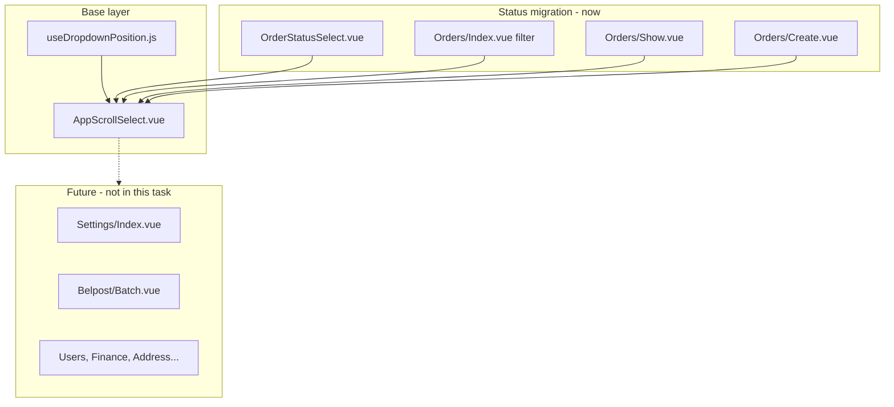

# AppScrollSelect — viewport-aware dropdown (вариант A)

**Дата:** 25.07.2026  
**Статус:** done  
**Контекст:** Нативный `<select>` для статусов заказа (20 пунктов) выходит за границы окна браузера — особенно в inline-выборе в таблице `/orders`. Нижние статусы (`Возврат`, `Отказ`, `Дубль`) иногда недоступны.

## Цель

Создать универсальный компонент `AppScrollSelect` с viewport-aware позиционированием (Teleport + flip + прокрутка), вынести общую логику в composable и мигрировать все 4 места выбора статуса заказа. Остальные `<select>` в приложении оставить на потом — компонент будет готов к переиспользованию.

## Текущее состояние

- Все выборы статуса — нативный HTML `<select>`:
  - [`OrderStatusSelect.vue`](../resources/js/Components/OrderStatusSelect.vue) — inline в таблице (PATCH при выборе)
  - [`Orders/Index.vue`](../resources/js/Pages/Orders/Index.vue) — фильтр «Статус»
  - [`Orders/Show.vue`](../resources/js/Pages/Orders/Show.vue) — смена статуса + кнопка «Применить»
  - [`Orders/Create.vue`](../resources/js/Pages/Orders/Create.vue) — статус при создании
- Whitelist статусов — [`Order::STATUSES`](../app/Models/Order.php) (20 пунктов), передаётся через Inertia props
- Цвета бейджей — [`OrderStatusBadge.vue`](../resources/js/Components/OrderStatusBadge.vue), `colorMap` локально в компоненте
- Таблица заказов обёрнута в `overflow-hidden` / `overflow-x-auto` — нативный popup не контролируется CSS
- Новых npm-зависимостей нет; frontend unit-тests для Vue отсутствуют

## Архитектура



## Затронутые файлы

| Файл | Изменение |
|------|-----------|
| [`resources/js/utils/orderStatusColors.js`](../resources/js/utils/orderStatusColors.js) | новый — общий `colorMap` |
| [`resources/js/Components/OrderStatusBadge.vue`](../resources/js/Components/OrderStatusBadge.vue) | импорт цветов из utils |
| [`resources/js/composables/useDropdownPosition.js`](../resources/js/composables/useDropdownPosition.js) | новый composable |
| [`resources/js/Components/AppScrollSelect.vue`](../resources/js/Components/AppScrollSelect.vue) | новый базовый компонент |
| [`resources/js/Components/OrderStatusSelect.vue`](../resources/js/Components/OrderStatusSelect.vue) | замена `<select>` на `AppScrollSelect` |
| [`resources/js/Pages/Orders/Index.vue`](../resources/js/Pages/Orders/Index.vue) | фильтр статуса |
| [`resources/js/Pages/Orders/Show.vue`](../resources/js/Pages/Orders/Show.vue) | select статуса |
| [`resources/js/Pages/Orders/Create.vue`](../resources/js/Pages/Orders/Create.vue) | select статуса |

Бэкенд, маршруты, миграции — **без изменений**.

## Реализация

### 1. Composable `useDropdownPosition`

**Файл:** [`resources/js/composables/useDropdownPosition.js`](../resources/js/composables/useDropdownPosition.js)

Ответственность:
- Принимает ref на trigger-элемент
- Возвращает `{ menuStyle, openUp, updatePosition, attachListeners, detachListeners }`
- Расчёт через `getBoundingClientRect()`:
  - `maxMenuHeight = 240px` (константа, переопределяемая prop'ом)
  - Сравнение `spaceBelow` vs `spaceAbove` → auto-flip
  - `height = min(maxMenuHeight, availableSpace)` с минимумом ~120px
  - `position: fixed`, `left`, `width: max(triggerWidth, minWidth)`, `top`, `maxHeight`, `overflowY: auto`, `zIndex: 60`
- Слушатели: `window.resize`, `window.scroll` (capture), `scroll` на ближайших scroll-контейнерах → **закрывать меню** (проще и надёжнее, чем live-reposition в таблице с `overflow-x-auto`)

### 2. Базовый компонент `AppScrollSelect`

**Файл:** [`resources/js/Components/AppScrollSelect.vue`](../resources/js/Components/AppScrollSelect.vue)

#### API

| Prop | Тип | Назначение |
|------|-----|------------|
| `modelValue` | `String \| Number \| null` | v-model |
| `options` | `Array<string \| {value, label}>` | пункты списка |
| `disabled` | `Boolean` | блокировка |
| `placeholder` | `String` | текст когда value пустой |
| `size` | `'sm' \| 'md'` | компактный (таблица) / обычный (формы) |
| `minWidth` | `Number` | мин. ширина меню (default 160) |
| `maxHeight` | `Number` | max высота меню (default 240) |
| `emptyOption` | `{value, label} \| null` | опциональный пункт «Все» / «— не выбрано —» |
| `optionClassFn` | `(value) => string` | опциональная подсветка пунктов (статусы) |

| Emit | Когда |
|------|-------|
| `update:modelValue` | выбор пункта |
| `change` | после выбора (для filter `@change`) |

#### Поведение

- Trigger: кнопка, стилизованная как существующий `select` (Tailwind + dark mode из [`app.css`](../resources/css/app.css))
- Меню: `<Teleport to="body">` — не обрезается `overflow-hidden` таблицы
- Закрытие: click outside, Escape, scroll, выбор пункта
- Клавиатура: ArrowUp/Down, Enter, Escape (минимальный a11y без новых зависимостей)
- Один открытый dropdown: при открытии нового — закрывать предыдущий через module-level ref или `document` custom event `scrollselect:open`
- `@click.stop` / `@mousedown.stop` на корне — для использования внутри кликабельных строк таблицы

#### Стили trigger по `size`

- `sm`: как текущий `OrderStatusSelect` — `text-xs py-1 max-w-[140px] truncate`
- `md`: как `.input` / `w-full` — для форм и фильтров

### 3. Общие цвета статусов (DRY)

**Файл:** [`resources/js/utils/orderStatusColors.js`](../resources/js/utils/orderStatusColors.js)

- Экспорт `statusColorClass(status)` — перенести `colorMap` из `OrderStatusBadge.vue`
- Обновить `OrderStatusBadge.vue` — импортировать из utils (без изменения внешнего API)

### 4. Миграция статусов заказа (4 места)

#### 4.1 `OrderStatusSelect.vue`

Заменить `<select>` на `<AppScrollSelect>`:
- `size="sm"`, `:options="statuses"`, `v-model="selectedStatus"`
- `@change="onChange"` — сохранить текущую логику PATCH `/orders/{id}/status`
- `:option-class-fn="statusColorClass"` — визуальная связь с бейджами
- Обёртка `@click.stop @mousedown.stop` — оставить

#### 4.2 `Orders/Index.vue` — фильтр

```vue
<!-- было -->
<select v-model="filters.status" class="w-full" @change="applyFilters">

<!-- станет -->
<AppScrollSelect
  v-model="filters.status"
  :options="statusFilterOptions"
  placeholder="Все статусы"
  :empty-option="{ value: '', label: 'Все статусы' }"
  @change="applyFilters"
/>
```

#### 4.3 `Orders/Show.vue`

Заменить `<select v-model="newStatus">` на `<AppScrollSelect>` с `:option-class-fn="statusColorClass"`. Кнопка «Применить» и `changeStatus()` — без изменений.

#### 4.4 `Orders/Create.vue`

Заменить `<select v-model="form.status">` на `<AppScrollSelect>` с `:option-class-fn="statusColorClass"`.

## Что сознательно не входит в задачу

| Компонент | Причина |
|-----------|---------|
| Settings, Belpost, Users, Finance, Address `<select>` | Компонент готов; подключение отдельными PR |
| Headless UI / Floating UI | Не нужны — реализация на Vue 3 + Tailwind |
| Frontend unit-tests | В проекте нет test runner для Vue |

## Риски и митигация

| Риск | Митигация |
|------|-----------|
| Меню «прыгает» при scroll таблицы | Закрывать dropdown на scroll |
| Несколько открытых меню | Global singleton / event bus на open |
| Клик по статусу открывает карточку заказа | `@click.stop` на trigger и wrapper |
| z-index конфликт с модалками (`z-50`) | Меню `z-[60]`, backdrop не нужен |

## Тест-план (ручной)

1. **Таблица заказов** — открыть статус в последней видимой строке → список в viewport, прокрутка до «Дубль»/«Отказ»
2. **Таблица** — выбор статуса → PATCH без перехода на карточку
3. **Фильтр** — выбор статуса → фильтрация; «Все статусы» сбрасывает
4. **Show / Create** — выбор и сохранение статуса
5. **Dark mode** — читаемость trigger и пунктов
6. **Узкое окно** (~768px) — меню не выходит за правый край (clamp `left` при необходимости)
7. **Escape / click outside** — закрытие без side effects

## Порядок реализации

- [x] `utils/orderStatusColors.js` + рефакторинг `OrderStatusBadge.vue`
- [x] `composables/useDropdownPosition.js` + `AppScrollSelect.vue`
- [x] Миграция `OrderStatusSelect.vue`
- [x] Миграция Index / Show / Create
- [x] `npm run build` + smoke на prod

## Acceptance Criteria

| # | Критерий |
|---|----------|
| AC1 | Dropdown статусов не выходит за границы viewport |
| AC2 | Все 20 статусов доступны через прокрутку внутри списка |
| AC3 | Inline PATCH в таблице работает как раньше |
| AC4 | `AppScrollSelect` переиспользуем для любых `<select>` (options API универсален) |
| AC5 | Dark mode и компактный режим таблицы сохранены |
