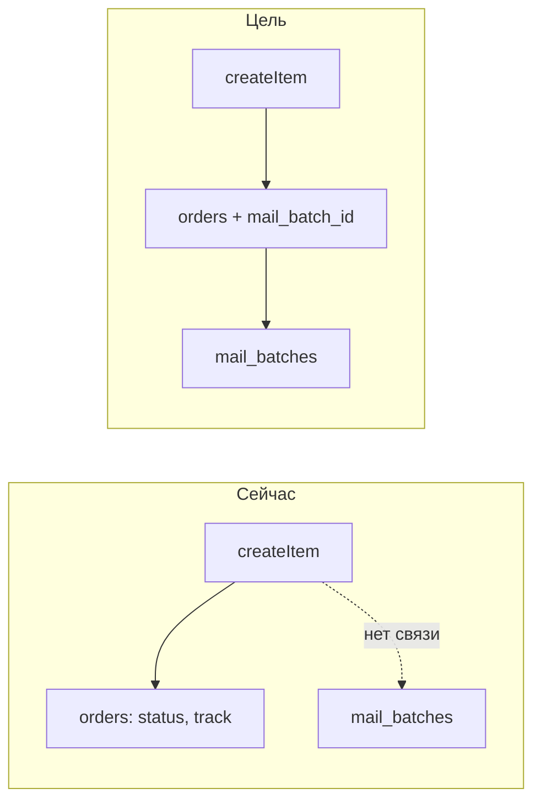

# Белпочта — бланки в партии, предупреждение при редактировании, колонка «Партия»

**Дата:** 20.07.2026  
**Статус:** planned  
**Контекст:** Страница партий Белпочты (`Belpost/Batch.vue`), карточка заказа (`Orders/Show.vue`), список заказов (`Orders/Index.vue`)

## Цель

1. Отображать в партии список бланков, созданных в ней (персистентно, после перезагрузки и commit).
2. При попытке редактирования заказа со статусом «Оформлен» — показывать предупреждение с кнопками «Продолжить» и «Отмена» (для **всех** типов доставки).
3. Добавить в список заказов колонку «Партия» с номером партии Белпочты и ссылкой на страницу партии.

## Контекст проблемы

Сейчас [`BelpostService::createItem`](../app/Services/BelpostService.php) при успехе обновляет заказ (`status = Оформлен`, `track_number`), но **не сохраняет связь с партией**. Список оформленных бланков живёт только в `results` ref в [`Belpost/Batch.vue`](../../resources/js/Pages/Belpost/Batch.vue) и теряется после перезагрузки. После commit секция «Заявки для оформления» скрывается (`v-if="status === 'draft'"`).



## Решение: FK `orders.mail_batch_id`

Один заказ оформляется в одной партии — достаточно nullable FK на [`mail_batches.id`](../app/Models/MailBatch.php) (не путать с `batch_id` — это номер на стороне API Белпочты).

---

## 1. База данных и модели

**Миграция** `hosting/database/migrations/2026_07_20_000001_add_mail_batch_id_to_orders.php`:

- `orders.mail_batch_id` — `unsignedBigInteger`, nullable, index
- FK → `mail_batches.id`, `nullOnDelete()`

**[`Order.php`](../app/Models/Order.php):**

- добавить `mail_batch_id` в `$fillable`
- relation `mailBatch(): BelongsTo`

**[`MailBatch.php`](../app/Models/MailBatch.php):**

- relation `orders(): HasMany`

**Backfill:** не делаем — старые заказы покажут `—` в колонке «Партия».

---

## 2. Сохранение связи при оформлении бланка

**[`BelpostService::createItem`](../app/Services/BelpostService.php)** — в блоке успешного update (~строка 223):

```php
$order->update([
    'status'            => 'Оформлен',
    'status_changed_at' => now(),
    'track_number'      => $s10code,
    'mail_batch_id'     => $batch->id,
]);
```

---

## 3. Отображение бланков в партии

### Backend

**[`BelpostController::index`](../app/Http/Controllers/BelpostController.php):**

- загрузить для всех партий tenant'а связанные заказы одним запросом:

```php
$batchOrders = Order::whereIn('mail_batch_id', $batches->pluck('id'))
    ->orderBy('status_changed_at')
    ->get(['id', 'mail_batch_id', 'full_name', 'phone', 'city', 'street', 'building', 'track_number', 'status_changed_at'])
    ->groupBy('mail_batch_id');
```

- передать в Inertia prop `batchOrders` (объект `{ [mailBatchId]: Order[] }`)
- принять query-параметр `?batch={id}` (внутренний id `mail_batches.id`) и передать `selectedBatchId` для авто-выбора партии

### Frontend

**[`Batch.vue`](../../resources/js/Pages/Belpost/Batch.vue):**

1. Новые props: `batchOrders`, `selectedBatchId`
2. При mount: если `selectedBatchId` — вызвать `selectBatch()` для соответствующей партии
3. Новая секция **«Оформленные бланки»** — видна для любой выбранной партии (не только `draft`):
   - колонки: #, ФИО/телефон, адрес, трек, дата оформления
   - ссылка на `/orders/{id}` (клик по строке)
4. В режиме `draft`: сохранить текущую таблицу «Заявки для оформления» + секция «Оформленные бланки» ниже (или над commit-блоком)
5. После успешного `processOne`: обновлять локальный `batchOrders` для активной партии (optimistic) + опционально `Inertia.reload({ only: ['batchOrders', 'eligibleOrders'] })`

---

## 4. Предупреждение при редактировании (все «Оформлен»)

**Scope:** любой заказ с `status === 'Оформлен'` (belpost, europochta, курьер и т.д.).

**[`Orders/Show.vue`](../../resources/js/Pages/Orders/Show.vue):**

1. Заменить прямой `@click="editing = true"` на `startEdit()`
2. `startEdit()`:
   - если `order.status !== 'Оформлен'` → `editing = true`
   - иначе → открыть модалку (паттерн из [`Products/Index.vue`](../../resources/js/Pages/Products/Index.vue): `modal-backdrop` + `modal-box`)
3. Текст модалки:

   > Заявка уже оформлена. Изменение данных может не совпадать с оформленным бланком или отправлением.

4. Кнопки:
   - **Продолжить** → закрыть модалку, `editing = true`
   - **Отмена** → закрыть модалку, остаться в просмотре
5. Серверную блокировку **не добавляем** — только UX-предупреждение.

---

## 5. Колонка «Партия» в списке заказов

### Backend

**[`OrderController::index`](../app/Http/Controllers/OrderController.php):**

```php
$orders = $query
    ->with('mailBatch:id,batch_id')
    ->paginate(50)
    ->withQueryString();
```

### Frontend

**[`Orders/Index.vue`](../../resources/js/Pages/Orders/Index.vue):**

Новая колонка после «Доставка» (или перед «Трек»):

```js
columnHelper.display({
    id: 'batch',
    header: 'Партия',
    cell: info => {
        const row = info.row.original
        const batch = row.mail_batch
        if (!batch?.batch_id) return h('span', { class: 'text-gray-400' }, '—')
        return h(Link, {
            href: `/belpost?batch=${batch.id}`,
            class: 'text-indigo-600 dark:text-indigo-400 font-mono text-xs hover:underline',
            onClick: (e) => e.stopPropagation(),
        }, () => batch.batch_id)
    },
})
```

- Показывать номер только если есть `mail_batch.batch_id`
- Для заказов без партии (не belpost или старые) — `—`
- `@click.stop` на ссылке, чтобы клик по номеру партии не триггерил переход на карточку заказа (`goToOrder`)

---

## 6. Deep-link на партию

**URL:** `/belpost?batch={mail_batches.id}`

**[`BelpostController::index`](../app/Http/Controllers/BelpostController.php):**

```php
'selectedBatchId' => ($batchId = (int) $request->query('batch')) > 0 ? $batchId : null,
```

**[`Batch.vue`](../../resources/js/Pages/Belpost/Batch.vue):**

```js
import { onMounted } from 'vue'

onMounted(() => {
    if (props.selectedBatchId) {
        const b = batchList.value.find(b => b.id === props.selectedBatchId)
        if (b) selectBatch(b)
    }
})
```

---

## Затрагиваемые файлы

| Файл | Изменение |
|------|-----------|
| `hosting/database/migrations/2026_07_20_000001_add_mail_batch_id_to_orders.php` | новый |
| [`hosting/app/Models/Order.php`](../app/Models/Order.php) | FK, relation |
| [`hosting/app/Models/MailBatch.php`](../app/Models/MailBatch.php) | hasMany orders |
| [`hosting/app/Services/BelpostService.php`](../app/Services/BelpostService.php) | save mail_batch_id |
| [`hosting/app/Http/Controllers/BelpostController.php`](../app/Http/Controllers/BelpostController.php) | batchOrders, selectedBatchId |
| [`hosting/app/Http/Controllers/OrderController.php`](../app/Http/Controllers/OrderController.php) | eager load mailBatch |
| [`hosting/resources/js/Pages/Belpost/Batch.vue`](../../resources/js/Pages/Belpost/Batch.vue) | секция бланков, deep-link |
| [`hosting/resources/js/Pages/Orders/Show.vue`](../../resources/js/Pages/Orders/Show.vue) | модалка редактирования |
| [`hosting/resources/js/Pages/Orders/Index.vue`](../../resources/js/Pages/Orders/Index.vue) | колонка «Партия» |

---

## Acceptance Criteria

- [ ] После успешного `createItem` заказ имеет `mail_batch_id`; список бланков виден после перезагрузки и после commit
- [ ] У committed/ready-партии отображаются все оформленные в ней бланки
- [ ] Клик «Редактировать» на заказе со статусом `Оформлен` (любой delivery_type) показывает модалку; «Отмена» не включает edit; «Продолжить» включает
- [ ] В списке заказов колонка «Партия» показывает номер Белпочты; клик ведёт на `/belpost?batch={id}` с авто-выбором партии
- [ ] Старые заказы без `mail_batch_id` — `—`, без ошибок

## Ручная проверка

1. Создать партию → оформить 2 бланка → перезагрузить `/belpost` → бланки на месте
2. Commit партии → секция «Оформленные бланки» всё ещё видна
3. `/orders` → колонка «Партия» → клик → открывается `/belpost` с выбранной партией
4. Заказ `Оформлен` (belpost и europochta) → «Редактировать» → модалка → оба сценария кнопок
5. Заказ `Отправить` → «Редактировать» → модалки нет

## Риски

- **Старые данные:** колонка «Партия» пустая для заказов до деплоя — ожидаемо
- **Клик по ссылке в таблице заказов:** обязателен `@click.stop` на Link
- **Draft + оформленные:** две секции в одной партии — не дублировать уже оформленные заказы в таблице «К оформлению» (они уже отфильтрованы по `status = Отправить`)

## Задачи реализации

- [ ] Миграция `orders.mail_batch_id` + relations в Order и MailBatch
- [ ] `BelpostService::createItem` — сохранять `mail_batch_id` при успехе
- [ ] `BelpostController`: `batchOrders`, `selectedBatchId` из query `?batch=`
- [ ] `Batch.vue`: секция «Оформленные бланки», deep-link, обновление после `processOne`
- [ ] `Orders/Show.vue`: модалка предупреждения для всех `status=Оформлен`
- [ ] `OrderController::index` eager load + `Orders/Index.vue` колонка «Партия» со ссылкой
