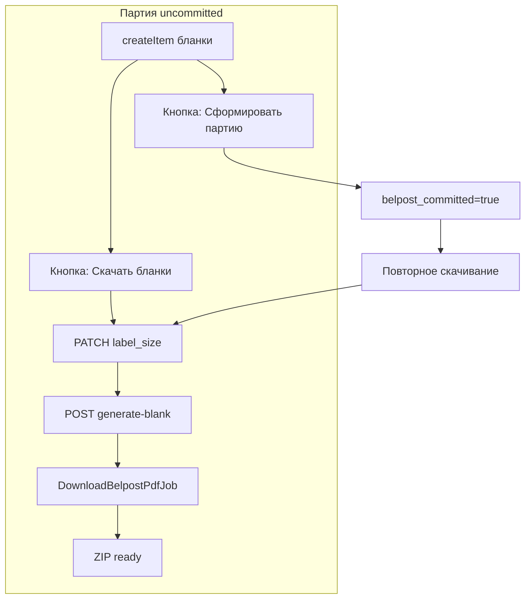

# Белпочта — скачивание бланков до формирования партии

**Дата:** 26.07.2026  
**Статус:** planned  
**Контекст:** Страница партий Белпочты ([`Belpost/Batch.vue`](../../resources/js/Pages/Belpost/Batch.vue)), сервис [`BelpostService.php`](../app/Services/BelpostService.php), контроллер [`BelpostController.php`](../app/Http/Controllers/BelpostController.php)

## Цель

1. Разделить операции **«Скачать бланки»** и **«Сформировать партию»** в карточке партии — две независимые кнопки (как в GS и новом ЛК Белпочты).
2. Поддержать новый API Белпочты: скачивание PDF **до** commit (`status: uncommitted`).
3. Добавить выбор размера бланка: 210×150, 150×100, 120×80 (default в настройках tenant, override в карточке партии).

## Контекст проблемы

Сейчас [`BelpostController::commit`](../app/Http/Controllers/BelpostController.php) вызывает `commitActiveList` и **сразу** диспатчит [`DownloadBelpostPdfJob`](../app/Jobs/DownloadBelpostPdfJob.php). Скачивание возможно только после commit, т.к. `id_to_download` берётся из ответа commit.

В GS ([`backend/SaveItems.gs`](../../../backend/SaveItems.gs)) `commitActiveList` и `downloadBlanksActiveList` — **разные функции**. В новом ЛК Белпочты при «Скачать бланки» отправляются два запроса, затем — существующий download.

### Новый API Белпочты (перехват ЛК, 26.07.2026)

| # | Метод | URL | Payload | Результат |
|---|-------|-----|---------|-----------|
| 1 | PATCH | `/api/v2/batch-mailing/list/{id}` | `{ "label_size": "150x100" }` | Размер бланка |
| 2 | POST | `/api/v1/batch-mailing/list/{id}/generate-blank` | `{}` | `documents.id`, `status: "uncommitted"` |
| 3 | GET | `/api/v1/batch-mailing/documents/{id}/download` | — | ZIP (существующий endpoint) |

**Порядок запросов:** PATCH → generate-blank.  
**Время генерации:** ~10 с (1 бланк); для 20+ — polling/retry в job.



---

## 1. База данных и модель

**Миграция** `hosting/database/migrations/2026_07_26_000001_add_belpost_blank_fields_to_mail_batches.php`:

| Колонка | Тип | Назначение |
|---------|-----|------------|
| `label_size` | `string(10)`, default `150x100` | Размер бланка для этой партии |
| `belpost_committed` | `boolean`, default `false` | Партия сформирована на Белпочте (commit вызван) |

Backfill для существующих записей: `belpost_committed = (status === 'committed')`.

**[`MailBatch.php`](../app/Models/MailBatch.php):**

- Константа `LABEL_SIZES = ['210x150', '150x100', '120x80']`
- Добавить поля в `$fillable`, cast `belpost_committed` → bool
- Хелперы:
  - `isBelpostCommitted(): bool`
  - `canProcessItems(): bool` — `!belpost_committed && status !== downloading`
  - `isPdfInProgress(): bool` — status in (`downloading`, `committed` при ожидании job)

Обновить комментарии к статусам: `committed` = «партия сформирована на Белпочте», PDF может быть в любом статусе.

---

## 2. Настройки tenant — размер по умолчанию

**[`TenantSettingController.php`](../app/Http/Controllers/TenantSettingController.php)** — группа `belpost`, новый ключ:

```php
'belpost_label_size' => [
    'Размер бланка по умолчанию', 'select', '', '',
    ['210x150' => '210×150', '150x100' => '150×100', '120x80' => '120×80'],
],
```

Default при создании партии: `TenantSetting::get('belpost_label_size', '150x100')`.

---

## 3. BelpostService — новые методы API

**Файл:** [`BelpostService.php`](../app/Services/BelpostService.php)

Новые константы:

```php
private const LIST_PATCH_V2      = '/api/v2/batch-mailing/list/{id}';
private const GENERATE_BLANK_V1  = '/api/v1/batch-mailing/list/{id}/generate-blank';
```

Новые методы:

| Метод | Действие |
|-------|----------|
| `setLabelSize(MailBatch $batch, string $labelSize): void` | PATCH v2, валидация по `MailBatch::LABEL_SIZES` |
| `generateBlank(MailBatch $batch): string` | POST generate-blank, парсинг `documents.id`, лог `documents.status` |
| `prepareBlankDownload(MailBatch $batch, string $labelSize): string` | Оркестратор: PATCH → generate-blank → return `id_to_download` |

`commitActiveList` — без изменений логики API; обновление `belpost_committed` — в контроллере.

`downloadDocuments` — без изменений.

---

## 4. BelpostController — разделение операций

### 4.1 Изменить `commit()`

- Убрать `DownloadBelpostPdfJob::dispatch(...)`
- После `commitActiveList`: `belpost_committed = true`, `status = committed`
- Ответ: «Партия сформирована на Белпочте» (без упоминания PDF)

### 4.2 Новый `downloadBlanks(Request, MailBatch)`

`POST /belpost/batches/{batch}/download-blanks`

Body: `{ label_size?: string }` (optional override)

Проверки:

- Повторное скачивание после commit — разрешено
- В партии ≥ 1 оформленный заказ (`orders()->exists()`)
- `status !== downloading` (dedupe через `hasPendingPdfDownloadJob`)

Логика:

1. Resolve `label_size`: request → `$batch->label_size` → tenant default
2. `$service->prepareBlankDownload($batch, $labelSize)`
3. `$batch->update(['id_to_download' => ..., 'label_size' => ..., 'status' => 'downloading', 'error_message' => null, 'pdf_path' => null])`
4. `DownloadBelpostPdfJob::dispatch(...)->delay(now()->addSeconds(15))`

### 4.3 Изменить `processOrder()`

Заменить проверку `status !== draft` на:

```php
if ($batch->isBelpostCommitted() || $batch->status === MailBatch::STATUS_DOWNLOADING) { ... }
```

Разрешить оформление при `status = ready | failed | draft` (пока партия не committed).

### 4.4 Изменить `retryDownload()`

- Разрешить статусы: `failed`, `downloading`, `committed`, `ready`, `draft` (если есть `id_to_download`)
- Обновить текст ошибки: «нет ID для скачивания — сначала нажмите Скачать бланки»
- При retry **не** вызывать generate-blank (только повтор job); полный цикл — через `downloadBlanks`

### 4.5 Изменить `batchStatus()`

Добавить в JSON: `label_size`, `belpost_committed`, `pdf_ready`

### 4.6 Изменить `index()`

Передать props: `labelSizes`, `defaultLabelSize` (из tenant setting)

### 4.7 Route

[`web.php`](../routes/web.php):

```php
Route::post('/batches/{batch}/download-blanks', [BelpostController::class, 'downloadBlanks'])
    ->name('batches.downloadBlanks');
```

---

## 5. DownloadBelpostPdfJob — устойчивость к async-генерации

**Файл:** [`DownloadBelpostPdfJob.php`](../app/Jobs/DownloadBelpostPdfJob.php)

- Увеличить `$timeout` до **300** с (20+ бланков)
- В `handle()` перед `downloadDocuments`: начальная пауза **10** с на первой попытке
- При HTTP-ошибке download (документ ещё `processing`) — `throw $e` для retry через `$backoff` [60, 120, 240]
- После успеха: `status = ready`; **не менять** `belpost_committed`

---

## 6. Frontend — Batch.vue

**Файл:** [`Batch.vue`](../../resources/js/Pages/Belpost/Batch.vue)

### Новая секция «Бланки PDF» (вместо «Commit → PDF»)

```
[Размер бланка: select 210×150 | 150×100 | 120×80]

[Скачать бланки]       — enabled: есть оформленные items, !downloading
[Сформировать партию]  — enabled: есть items, !belpost_committed, !downloading
```

### Убрать / заменить

- Секцию «Зафиксировать партию» с кнопкой `Commit → PDF`
- Текст «После фиксации Белпочта сформирует PDF»

### PDF status block

Показывать при `status in (downloading, ready, failed)` **независимо** от `belpost_committed`.

Badge в шапке: `belpost_committed` → «Сформирована», иначе «Черновик».

### Новые методы JS

- `downloadBlanks()` → `POST /belpost/batches/{id}/download-blanks` с `{ label_size }`
- `commitBatch()` — обновить UX-тексты; после успеха `belpost_committed = true`
- Polling: читать `belpost_committed`, `label_size`

### «Заявки для оформления»

Показывать пока `!belpost_committed` (не только `status === draft`).

---

## Зависимости операций

| Действие | Требует commit? | Требует generate-blank? | Требует items? |
|----------|-----------------|-------------------------|----------------|
| Скачать бланки (новый путь) | **Нет** | **Да** | Да |
| Сформировать партию | — | **Нет** | Да |
| Повторное скачивание | Нет | Нет (если `id_to_download` есть) | — |

---

## Acceptance Criteria

- [ ] «Скачать бланки» работает **до** «Сформировать партию» (партия `uncommitted` на Белпочте)
- [ ] «Сформировать партию» **не** запускает скачивание автоматически
- [ ] Размер бланка: default в настройках tenant, override в карточке партии (210×150 / 150×100 / 120×80)
- [ ] После скачивания без commit можно дооформить новые бланки и скачать снова
- [ ] После commit нельзя добавлять items; скачивание доступно отдельной кнопкой
- [ ] «Повторить скачивание» работает при `failed` / зависании
- [ ] ZIP скачивается через существующий `GET /belpost/batches/{id}/pdf`

## Ручной тест-план

1. Настройки → выбрать default `150x100` → создать партию → оформить 1 бланк
2. «Скачать бланки» (без commit) → через ~15–30 с статус `ready` → скачать ZIP, проверить размер
3. Дооформить ещё 1 бланк → скачать с размером `210x150` → ZIP обновился
4. «Сформировать партию» → `belpost_committed`, нельзя оформлять новые
5. «Скачать бланки» после commit → ZIP скачивается
6. Симуляция ошибки (invalid token) → `failed` → «Повторить скачивание»
7. Партия 20+ бланков — проверить timeout job

## Риски

| Риск | Митигация |
|------|-----------|
| PDF не готов за 10 с | sleep + job retry/backoff |
| Очередь не работает | retry-кнопка + [belpost-pdf-hang-and-settings-mask.md](../fix/belpost-pdf-hang-and-settings-mask.md) |
| Повторный generate-blank при смене размера | `downloadBlanks` всегда вызывает полный цикл PATCH→generate |
| Старые партии без `belpost_committed` | backfill в миграции |

## Затрагиваемые файлы

| Файл | Изменение |
|------|-----------|
| `database/migrations/2026_07_26_000001_add_belpost_blank_fields_to_mail_batches.php` | новый |
| [`MailBatch.php`](../app/Models/MailBatch.php) | константы, хелперы |
| [`BelpostService.php`](../app/Services/BelpostService.php) | setLabelSize, generateBlank, prepareBlankDownload |
| [`BelpostController.php`](../app/Http/Controllers/BelpostController.php) | downloadBlanks, refactor commit/processOrder/retry/status/index |
| [`DownloadBelpostPdfJob.php`](../app/Jobs/DownloadBelpostPdfJob.php) | sleep, timeout |
| [`TenantSettingController.php`](../app/Http/Controllers/TenantSettingController.php) | belpost_label_size |
| [`Batch.vue`](../../resources/js/Pages/Belpost/Batch.vue) | UI: 2 кнопки, select размера |
| [`web.php`](../routes/web.php) | route download-blanks |

## Связанные документы

- [`belpost-batch-ux.md`](belpost-batch-ux.md) — список бланков в партии, колонка «Партия»
- [`belpost-retry-download-who-pays.md`](../fix/belpost-retry-download-who-pays.md) — повторное скачивание, who_pays
- [`belpost-pdf-hang-and-settings-mask.md`](../fix/belpost-pdf-hang-and-settings-mask.md) — зависание PDF, очередь

## Задачи реализации

- [ ] Миграция `label_size`, `belpost_committed` + обновление `MailBatch`
- [ ] `belpost_label_size` в настройках tenant
- [ ] `BelpostService`: setLabelSize, generateBlank, prepareBlankDownload
- [ ] `BelpostController`: downloadBlanks, refactor commit/processOrder/retry; route
- [ ] `DownloadBelpostPdfJob`: sleep(10), timeout 300
- [ ] `Batch.vue`: select размера, две кнопки, polling
- [ ] Ручной прогон AC
