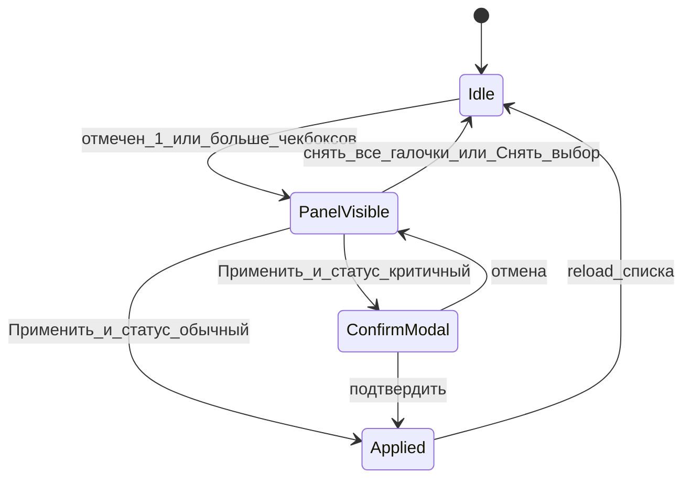
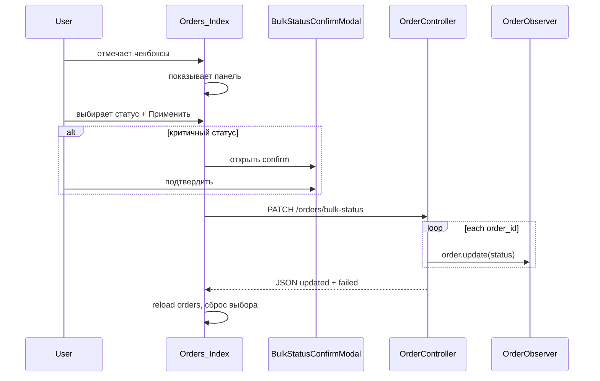

# Массовая смена статуса + Белпочта по умолчанию

**Дата:** 14.08.2026  
**Статус:** implemented  
**Контекст:** Список заказов `/orders` — операторам нужно менять статус сразу у нескольких заявок; при создании заказа вид доставки должен совпадать с GS («Белпочта»)

## Цель

1. Добавить выбор нескольких заказов чекбоксами в списке и массовую смену статуса (панель варианта A: появляется при выборе ≥1 заказа).
2. Для критичных статусов (`Отправлено`, `Возврат`, `Завершен`) — модалка подтверждения с описанием side effects.
3. Установить «Белпочта» (`belpost`) по умолчанию при создании заказа.

## Текущее состояние

- Список [`Index.vue`](../resources/js/Pages/Orders/Index.vue) — TanStack Table, одиночная смена статуса через [`OrderStatusSelect.vue`](../resources/js/Components/OrderStatusSelect.vue) → `PATCH /orders/{id}/status`.
- Side effects при смене статуса: [`OrderObserver.php`](../app/Observers/OrderObserver.php) (история, склад при `Отправлено`/`Возврат`, выручка при `Завершен`).
- Создание заказа: [`Create.vue`](../resources/js/Pages/Orders/Create.vue) — `delivery_type: ''`; [`OrderController::store()`](../app/Http/Controllers/OrderController.php) — без default.
- В Google Sheets уже стоит «Белпочта» по умолчанию ([`General.gs:1463`](../../../backend/General.gs)).

## Затронутые файлы

| Файл | Изменение |
|------|-----------|
| [`Order.php`](../app/Models/Order.php) | константа `BULK_CONFIRM_STATUSES` |
| [`OrderController.php`](../app/Http/Controllers/OrderController.php) | `bulkUpdateStatus()`, default `belpost` в `store()` |
| [`web.php`](../routes/web.php) | `PATCH /orders/bulk-status` (до `/{order}`) |
| [`Index.vue`](../resources/js/Pages/Orders/Index.vue) | чекбоксы, панель массовых действий, вызов API |
| [`BulkStatusConfirmModal.vue`](../resources/js/Components/BulkStatusConfirmModal.vue) | новый компонент |
| [`Create.vue`](../resources/js/Pages/Orders/Create.vue) | `delivery_type: 'belpost'` |
| [`OrderBulkStatusUpdateTest.php`](../tests/Feature/OrderBulkStatusUpdateTest.php) | новый feature-тест |
| [`OrderValidationTest.php`](../tests/Feature/OrderValidationTest.php) | тест default delivery |

CSV-импорт **не меняем** — `delivery_type` маппится из колонки или остаётся `null`.

---

## Задача 1: массовая смена статуса (вариант A + confirm)

### UX-поток



**Панель** (над таблицей / над карточками на mobile) появляется при `selectedIds.size >= 1`:

- «Выбрано: N»
- `AppScrollSelect` со статусами (`props.statuses` — store или call-center)
- «Применить» (disabled если статус не выбран, `readOnly`, или идёт запрос)
- «Снять выбор»

**Чекбоксы:**

- Колонка в desktop-таблице + чекбокс «выбрать все на странице» в header
- Чекбокс в mobile [`ListCard`](../resources/js/Components/ListCard.vue)
- `@click.stop` — не открывать карточку заказа
- При смене страницы пагинации — сброс выбора

**Модалка подтверждения** (новый компонент по образцу [`DeleteOrderModal.vue`](../resources/js/Components/DeleteOrderModal.vue)):

| Статус | Текст предупреждения |
|--------|---------------------|
| `Отправлено` | Списание товаров со склада для всех выбранных заказов |
| `Возврат` | Возврат товаров на склад (для заказов, ранее отправленных) |
| `Завершен` | Учёт выручки по товарам (Белпочта/Европочта) |

Константа критичных статусов — в [`Order.php`](../app/Models/Order.php):

```php
public const BULK_CONFIRM_STATUSES = ['Отправлено', 'Возврат', 'Завершен'];
```

Для остальных статусов — «Применить» сразу вызывает API.

После успеха: `Inertia.reload({ only: ['orders'] })`, сброс `selectedIds`, сообщение «Обновлено N заказов» (если `failed.length > 0` — «Обновлено N из M»).

### Поток данных



### Backend

**Маршрут** в [`web.php`](../routes/web.php) — **до** `/{order}`:

```php
Route::patch('/bulk-status', [OrderController::class, 'bulkUpdateStatus'])->name('bulkUpdateStatus');
```

**Метод** `OrderController::bulkUpdateStatus()`:

```php
// validate: order_ids (array, min:1, max:100, distinct integers), status
// allowed = isCallCenter() ? CALL_CENTER_STATUSES : STATUSES
// foreach order_id:
//   find Order (TenantScope applies)
//   authorize('updateStatus', $order)
//   $order->update(['status' => ..., 'last_updated_by_user_id' => Auth::id()])
// return JSON: { updated: int, failed: [{ id, reason }] }
```

- Переиспользует [`OrderPolicy::updateStatus`](../app/Policies/OrderPolicy.php) — call-center не сможет массово поставить `Оформлен` и т.п.
- `OrderObserver` срабатывает на каждый `update()` — отдельная логика не нужна.
- Ответ JSON (не redirect) — вызов через `apiFetch` как удаление заказа в Index.

### Frontend — `Index.vue`

Ключевые state/refs:

- `selectedIds = ref(new Set())`
- `bulkStatus = ref('')`
- `bulkApplying = ref(false)`
- `confirmModalOpen = ref(false)`

Колонка `display` с id `select` — первой в `columns`. Header: indeterminate checkbox «все на странице».

Mobile: чекбокс слева в шапке `ListCard`, панель между фильтрами и списком.

API-вызов:

```js
apiFetch('/orders/bulk-status', 'PATCH', {
  order_ids: [...selectedIds.value],
  status: bulkStatus.value,
})
```

---

## Задача 2: «Белпочта» по умолчанию

1. [`Create.vue`](../resources/js/Pages/Orders/Create.vue) — `delivery_type: 'belpost'` (select сразу показывает «Белпочта»).
2. [`Order.php`](../app/Models/Order.php) — hook `creating`: если `delivery_type` пустой → `belpost`.

Default применяется ко **всем** источникам `Order::create()`: ручное создание, webhook, CSV-импорт. Явно указанная доставка (Европочта и т.д.) не перезаписывается.

Существующие заказы с `delivery_type = null` в БД **не** мигрируются.

См. также: [`default-delivery-belpost-all-sources.md`](../fix/default-delivery-belpost-all-sources.md).

## Тесты

Новый файл [`OrderBulkStatusUpdateTest.php`](../tests/Feature/OrderBulkStatusUpdateTest.php):

| Тест | Что проверяет |
|------|---------------|
| `test_bulk_update_status_success` | 3 заказа → один статус, history записана |
| `test_bulk_update_partial_forbidden` | 1 заказ чужого tenant → `updated=1`, `failed` с `forbidden` |
| `test_bulk_update_rejects_invalid_status` | 422 validation |
| `test_call_center_bulk_rejects_mail_status` | `Оформлен` → ни один не обновлён |
| `test_bulk_update_respects_readonly` | middleware `tenant.writable` → 403 (если покрыто существующим паттерном) |

Дополнить [`OrderValidationTest.php`](../tests/Feature/OrderValidationTest.php):

| Тест | Что проверяет |
|------|---------------|
| `test_store_defaults_delivery_type_to_belpost` | POST без `delivery_type` → `belpost` в БД |

---

## Риски и ограничения

| Ситуация | Поведение |
|----------|-----------|
| Лимит 100 ID за запрос | Защита от таймаута |
| Pagination | Выбор только на текущей странице; при смене страницы — сброс |
| Массовый `Отправлено` | Реальное списание склада; модалка обязательна |
| Inline select в строке | Остаётся без изменений; bulk и single не конфликтуют |
| `readOnly` | Чекбоксы и панель disabled |

---

## Проверка (manual test plan)

1. Отметить 1 заказ → панель появилась; снять галочку → панель скрылась.
2. Выбрать 3 заказа, статус «Перезвонить» → без модалки, все обновились.
3. Выбрать 2 заказа, статус «Отправлено» → модалка → подтверждение → склад/история корректны.
4. Call-center: bulk только с `CALL_CENTER_STATUSES`.
5. `readOnly`: чекбоксы/panel disabled.
6. Создание заказа: «Белпочта» выбрана по умолчанию.
7. `php artisan test --filter=OrderBulkStatusUpdateTest`

---

## Чеклист реализации

- [x] `BULK_CONFIRM_STATUSES` в `Order.php`
- [x] `PATCH /orders/bulk-status` + `bulkUpdateStatus()` в `OrderController`
- [x] `BulkStatusConfirmModal.vue`
- [x] Чекбоксы, панель, API в `Orders/Index.vue` (desktop + mobile)
- [x] `delivery_type: 'belpost'` в `Create.vue` + default в `store()`
- [x] `OrderBulkStatusUpdateTest.php` + тест default delivery
