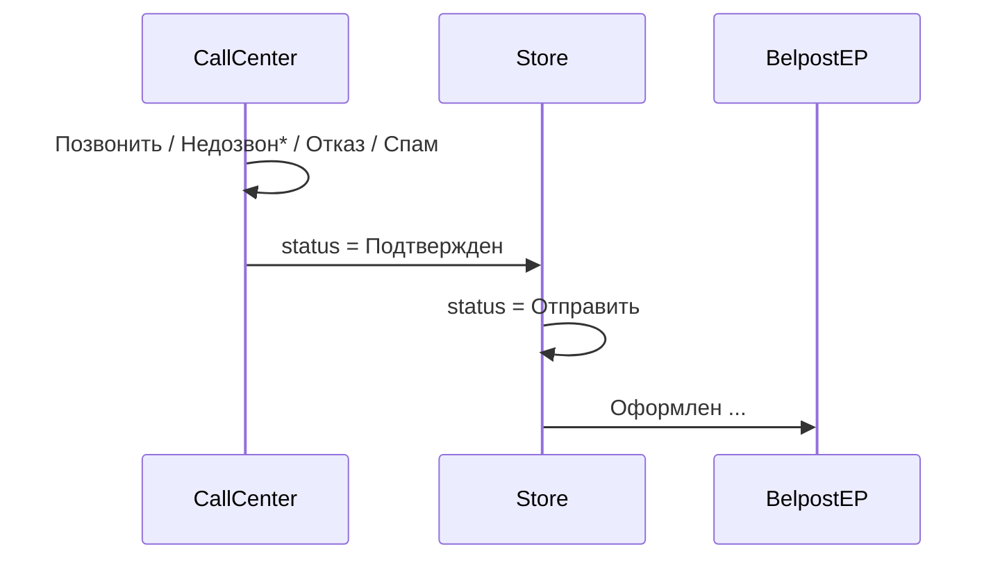
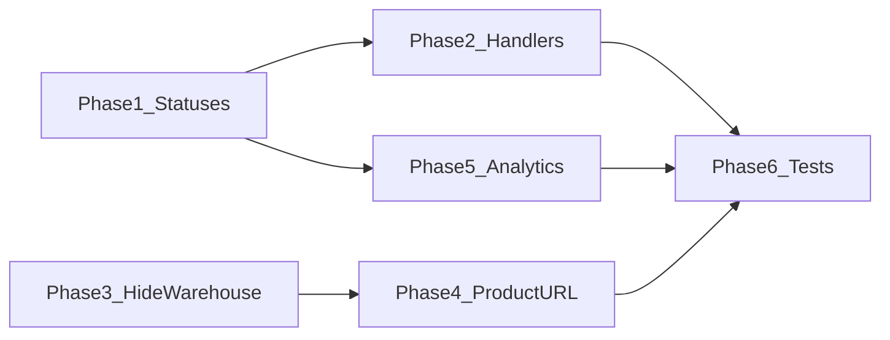

# Доработки колл-центра: статусы, обработчики, товары, аналитика

**Дата:** 01.08.2026  
**Статус:** planned  
**Контекст:** Расширение встроенного колл-центра ([`internal-call-center.md`](internal-call-center.md)) после базовой реализации подключений и маршрутизации заказов.

## Цель

1. **Новые статусы** — `Подтвержден` (успешная обработка CC) и `Спам` (отдельно от `Дубль`); store переводит `Подтвержден → Отправить` перед почтой.
2. **Колонка «Обработали»** — список менеджеров CC по значимым сменам статуса (несколько менеджеров на заказ).
3. **Склад скрыт у CC** — редактирование товаров только в карточке заказа.
4. **URL страницы товара** — store задаёт в каталоге; CC видит актуальную ссылку из каталога магазина.
5. **Аналитика CC** — по менеджерам и магазинам; operator видит только свои метрики.

## Контекст (текущее состояние)

- Базовый CC: типы тенантов, connections, `call_center_tenant_id`, polling feed — см. [`internal-call-center.md`](internal-call-center.md).
- «Кто обновил» — только `last_updated_by_user_id` (последний редактор).
- История статусов — [`order_status_history`](../database/migrations/2026_06_27_000006_create_order_status_history_table.php) с `user_id` ([`OrderObserver.php`](../app/Observers/OrderObserver.php)).
- CC видит read-only **Склад** ([`AppLayout.vue`](../resources/js/Layouts/AppLayout.vue), [`ProductController.php`](../app/Http/Controllers/ProductController.php)).
- У товара нет поля URL ([`Product.php`](../app/Models/Product.php)).
- CC может ставить статус `Отправить` ([`Order::CALL_CENTER_STATUSES`](../app/Models/Order.php)) — нужно изменить.

## Целевой поток статусов



**Ключевое правило:** CC завершает успешную обработку статусом **«Подтвержден»**; **«Отправить»** выставляет только интернет-магазин перед планированием отправки. Белпочта/Европочта ([`BelpostController.php`](../app/Http/Controllers/BelpostController.php), [`EvropostController.php`](../app/Http/Controllers/EvropostController.php)) остаются на фильтре `status = Отправить`.

---

## 1. Статусы «Подтвержден» и «Спам»

### Модель [`Order.php`](../app/Models/Order.php)

Добавить в `STATUSES` (после `Заказать`, перед `Отправить`):

- `Подтвержден` — подтверждённая CC заявка
- `Спам` — отдельное закрытие (не `Дубль`)

Новая константа **`WORK_STATUSES`** — статусы, фиксирующие работу менеджера (колонка «Обработали», аналитика):

```php
['Подтвержден', 'Заказать', 'Отказ', 'Отказ(Ошибка)', 'Спам', 'Недозвон', 'Недозвон1', 'Недозвон2']
```

Обновить **`CALL_CENTER_STATUSES`**:

- добавить: `Подтвержден`, `Спам`
- **убрать:** `Отправить` (только store)

Добавить `Подтвержден` в **`NON_DELETABLE_STATUSES`**.

### Frontend

[`orderStatusColors.js`](../resources/js/utils/orderStatusColors.js) — цвета для `Подтвержден` и `Спам`.

### Store UX

[`Orders/Index.vue`](../resources/js/Pages/Orders/Index.vue) — store видит `Подтвержден` в фильтре; менеджер переводит в `Отправить` вручную (Belpost-логика без изменений).

---

## 2. Колонка «Обработали»

### Источник данных

`order_status_history` + `user_id` — **без новой таблицы**.

- Relation `user()` в [`OrderStatusHistory.php`](../app/Models/OrderStatusHistory.php)
- Миграция: индекс `(order_id, to_status, user_id)`

### Сервис `OrderHandlerService`

```php
handlersForOrders(Collection $orderIds): array<int, HandlerSummary[]>
// HandlerSummary: user_id, name, last_status, last_at
```

Логика: DISTINCT `user_id` из history где `to_status IN Order::WORK_STATUSES`, группировка по `order_id`.

### UI

- [`OrderController::index()`](../app/Http/Controllers/OrderController.php) — batch-загрузка, prop `orderHandlers`
- [`Orders/Index.vue`](../resources/js/Pages/Orders/Index.vue) (CC) — колонка «Обработали» + tooltip
- [`Orders/Show.vue`](../resources/js/Pages/Orders/Show.vue) — блок «Участвовали»

---

## 3. Склад скрыт у CC, товары в заказе

### Навигация

- [`AppLayout.vue`](../resources/js/Layouts/AppLayout.vue) — убрать «Склад» для `call_center`
- [`web.php`](../routes/web.php) — `/products` с middleware `tenant.type:store`

### Редактор товаров

[`Orders/Show.vue`](../resources/js/Pages/Orders/Show.vue) — для CC: add/remove строк, qty, price; select по каталогу магазина (`order.tenant_id`); без ссылки «добавить на склад».

Опционально: `GET /api/products/search?tenant_id=&q=` для autocomplete.

### Cleanup

Удалить CC read-only ветку в [`ProductController.php`](../app/Http/Controllers/ProductController.php).

---

## 4. URL страницы товара (живой каталог)

### БД

```php
// products
$table->string('page_url', 500)->nullable();
```

### Store

[`Products/Index.vue`](../resources/js/Pages/Products/Index.vue) — поле «Ссылка на страницу товара»; validation `nullable|url|max:500`.

### CC — резолв из каталога

Helper `ProductLinkResolver::forOrder(Order $order)` — match по `products.name` + `order.tenant_id`; **без snapshot** в заказе.

[`OrderController::show()`](../app/Http/Controllers/OrderController.php) → prop `productLinks`.

[`Orders/Show.vue`](../resources/js/Pages/Orders/Show.vue) — название + `↗` (`target="_blank"`, `rel="noopener"`) если URL есть.

---

## 5. Аналитика колл-центра

### Gates [`AuthServiceProvider.php`](../app/Providers/AuthServiceProvider.php)

```php
view-analytics      → CC tenant: admin, manager, operator
view-team-analytics → CC tenant: admin, manager
```

### API

`GET /analytics?tab=managers|stores&date_from=&date_to=&store_id=&user_id=`

Middleware: `auth`, `tenant`, `tenant.type:call_center`, `can:view-analytics`

### Service `AnalyticsService`

Источник: `order_status_history` + orders через [`CallCenterOrderQuery`](../app/Support/CallCenterOrderQuery.php).

| Вкладка | Метрики (MVP) |
|---------|---------------|
| **Менеджеры** | касаний, подтверждений, отказов, спама, недозвонов, уникальных заказов |
| **Магазины** | лидов, подтверждено, отказов, спама, недозвонов, конверсия % |

**Operator:** только `history.user_id = auth()->id()`; магазины — только заказы, где operator в history.

**Admin/manager:** полная команда + фильтры.

### UI

[`Pages/Analytics/Index.vue`](../resources/js/Pages/Analytics/Index.vue) — вкладки, период, таблицы, summary-карточки.

[`AppLayout.vue`](../resources/js/Layouts/AppLayout.vue) — пункт «Аналитика» для CC.

---

## 6. Этапы реализации



| Фаза | Deliverable |
|------|-------------|
| **1** | `Подтвержден`/`Спам`, `WORK_STATUSES`, CC без `Отправить`, colors, tests |
| **2** | `OrderHandlerService`, колонка «Обработали», блок на Show |
| **3** | Скрыть Склад, middleware `/products`, редактор товаров CC |
| **4** | `products.page_url`, ссылки ↗ в заказе |
| **5** | `/analytics`, gates, operator scope |
| **6** | Feature tests |

### Чеклист задач

- [ ] **Phase 1:** статусы + `WORK_STATUSES` + `CALL_CENTER_STATUSES` + colors + tests
- [ ] **Phase 2:** `OrderHandlerService` + UI «Обработали»
- [ ] **Phase 3:** скрыть Склад + CC order goods editor
- [ ] **Phase 4:** `page_url` + `ProductLinkResolver` + links in Show
- [ ] **Phase 5:** `AnalyticsController` + `Analytics/Index.vue`
- [ ] **Phase 6:** feature tests (handlers, URL, analytics, CC restrictions)

---

## 7. Тесты (Feature)

| Тест | Проверка |
|------|----------|
| `OrderStatusesTest` | новые статусы в whitelist и порядке |
| `CallCenterOrderRestrictionsTest` | CC: `Подтвержден`/`Спам` ok, `Отправить` forbidden |
| `OrderHandlersTest` | два менеджера → оба в handlers |
| `ProductPageUrlTest` | store saves URL, CC show resolves link |
| `AnalyticsAccessTest` | operator — только себя; admin — всех |
| `TenantTypeMiddlewareTest` | CC 403 на `/products` |

---

## Риски и решения

| Риск | Mitigation |
|------|------------|
| Старые заказы в `Заказать` без `Подтвержден` | Оба в `WORK_STATUSES`; постепенный переход workflow |
| Переименование товара → нет ссылки | Живой каталог (variant A); текст без ↗ |
| N+1 handlers в index | Batch-query в `OrderHandlerService` |
| Operator видит чужие данные | Scope в `AnalyticsService` + feature-test |

---

## Вне scope (следующие итерации)

- Bulk «Подтвержден → Отправить» для store
- Графики в аналитике
- Snapshot URL в заказе
