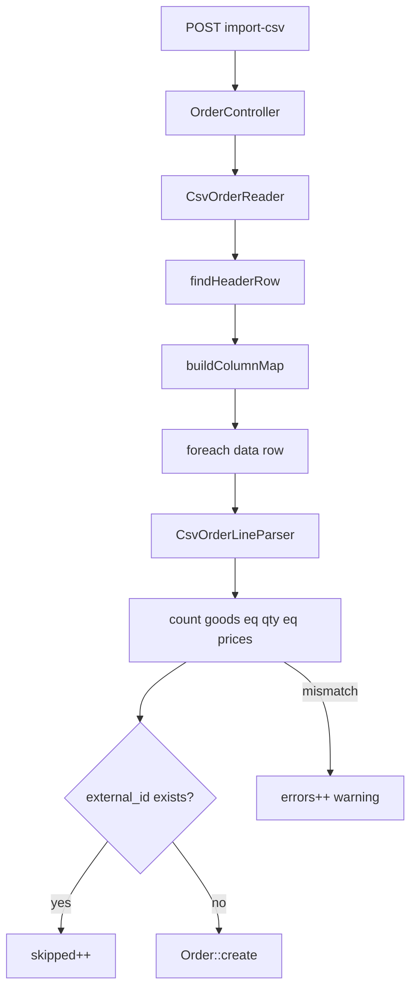

# Импорт CSV заказов — вариант A

**Дата:** 23.07.2026  
**Статус:** planned  
**Контекст:** Импорт заказов из экспорта Google Sheets (лист «Заказы»)

## Цель

Импортировать заказы из экспорта Google Sheets по правилу **1 строка CSV = 1 заказ**. Строка с несколькими товарами (пример: Михеева — «Триммер…, Культиватор…», qty `3 3`, цены `135 123`) сохраняется как один `Order` с параллельными массивами `goods`, `quantities`, `prices`.

Дубликаты по `external_id` в рамках tenant — **пропуск** (текущее поведение).

## Текущее состояние

- Модель [`Order.php`](../app/Models/Order.php) уже хранит несколько товаров в JSON.
- UI ([`Show.vue`](../resources/js/Pages/Orders/Show.vue), [`Index.vue`](../resources/js/Pages/Orders/Index.vue)) уже отображает массивы.
- Импорт в [`OrderController::importCsv()`](../app/Http/Controllers/OrderController.php) **не подходит** под формат Sheets:
  - `goods`, `quantities`, `prices` режутся одинаково по запятой;
  - нет маппинга колонок `№ п/п`, `Штук`, `Цена за ед.`, `БелПочта - …`, `Вид доставки`, `Сайт`;
  - первая строка файла (шаблон этикетки) ошибочно считается заголовком;
  - `доставка` замаплена на `delivery_type`, но в Sheets это стоимость доставки (`1`, `Бесплатно`), а тип — колонка `Вид доставки`.

Эталон парсинга — GAS [`backend/General.gs`](../../../backend/General.gs) (строки 152–156): `goods.split(',')`, `quantities/prices.split(' ')`.

## Архитектура



## Затронутые файлы

| Файл | Изменение |
|------|-----------|
| [`app/Support/CsvOrderLineParser.php`](../app/Support/CsvOrderLineParser.php) | новый — парсинг позиций заказа |
| [`app/Support/CsvOrderReader.php`](../app/Support/CsvOrderReader.php) | новый — чтение CSV Google Sheets |
| [`app/Http/Controllers/OrderController.php`](../app/Http/Controllers/OrderController.php) | рефакторинг `importCsv()` |
| [`tests/Unit/CsvOrderLineParserTest.php`](../tests/Unit/CsvOrderLineParserTest.php) | новый — unit-тесты парсера |
| [`tests/Feature/OrderCsvImportTest.php`](../tests/Feature/OrderCsvImportTest.php) | новый — feature-тест импорта |
| [`resources/js/Pages/Orders/Import.vue`](../resources/js/Pages/Orders/Import.vue) | обновление подсказки формата |

## Реализация

### 1. Класс `CsvOrderLineParser`

**Файл:** [`app/Support/CsvOrderLineParser.php`](../app/Support/CsvOrderLineParser.php)

Ответственность — только разбор позиций заказа:

```php
public static function parse(string $goodsRaw, ?string $qtyRaw, ?string $pricesRaw): array
// returns ['goods' => [...], 'quantities' => [...], 'prices' => [...]]
```

Логика:

- **goods** — `explode(',', $goodsRaw)` + `trim` + фильтр пустых (после `fgetcsv` кавычки уже сняты).
- **quantities / prices** — `preg_split('/\s+/', trim($value))`.
- Нормализация чисел: пробелы убрать, запятая как десятичный разделитель (`260,55` → `260.55`).
- Если 1 товар и qty/price одиночные — ок.
- Если 1 товар и qty пусто — default `[1]`; price пусто — `[0]`.
- Если `count(goods) !== count(quantities) !== count(prices)` — `\InvalidArgumentException` с понятным текстом.

### 2. Класс `CsvOrderReader`

**Файл:** [`app/Support/CsvOrderReader.php`](../app/Support/CsvOrderReader.php)

Ответственность — чтение файла Google Sheets:

1. Открыть файл, определить delimiter (`;` vs `,`) по первой строке.
2. **Поиск строки заголовка:** читать записи через `fgetcsv` до строки, где нормализованные заголовки содержат `фио` и `товар`. Строки до неё (шаблон этикетки) пропускать. Многострочный заголовок (`"Цена\nза ед."`) обрабатывается стандартным `fgetcsv`.
3. **Нормализация заголовков:** `mb_strtolower`, схлопнуть пробелы, убрать переносы строк.
4. **Расширенный `aliasMap`** (ключевые добавления):

| Заголовок Sheets | Поле |
|------------------|------|
| `№ п/п`, `no`, `номер` | `external_id` |
| `дата создания` | `created_at` |
| `фио` | `full_name` |
| `статус` | `status` |
| `товар`, `товары` | `goods` |
| `штук`, `кол-во`, `количество` | `quantities` |
| `цена за ед.`, `цена`, `цены` | `prices` |
| `белпочта - город, район`, `город` | `city` |
| `белпочта - название улицы...`, `улица` | `street` |
| `дом` | `building` |
| `кор.`, `корпус` | `housing` |
| `кв.`, `квартира` | `apartment` |
| `телефон` | `phone` |
| `сайт`, `источник` | `source` |
| `трек номер`, `трек` | `track_number` |
| `вид доставки` | `delivery_type` |

Колонку **`доставка`** (стоимость) **не маппить** — в модели нет поля.

5. **Маппинг `delivery_type`** — расширить существующий map + опечатка из Sheets:

```php
'самомвывоз' => 'pickup',  // частая опечатка в данных
'самовывоз'  => 'pickup',
// + belpost, europochta, courier, personal (как сейчас)
```

6. Итератор данных: пустые строки пропускать, для каждой строки возвращать `['rowNum' => N, 'fields' => [...]]`.

### 3. Рефакторинг `OrderController::importCsv()`

**Файл:** [`app/Http/Controllers/OrderController.php`](../app/Http/Controllers/OrderController.php)

Для каждой data-строки:

1. Собрать scalar-поля из `colMap`.
2. Вызвать `CsvOrderLineParser::parse($goods, $quantities, $prices)`.
3. `PhoneNormalizer::normalize()` для телефона (как в `store()`).
4. `created_at` — парсить `d.m.Y` и `d.m.Y H:i` через `Carbon::createFromFormat`; при ошибке — не задавать (Laravel поставит now).
5. `status` — если не из `Order::STATUSES`, fallback `'Позвонить'`.
6. Пропуск без `full_name`.
7. Дедупликация по `external_id` + `tenant_id` — `skipped++`.
8. `Order::create($data)` — `created++`.

Ответ JSON расширить полем `warnings` (массив `{row, message}`) для строк с ошибками парсинга позиций — без прерывания всего импорта.

### 4. Unit-тесты парсера

**Файл:** [`tests/Unit/CsvOrderLineParserTest.php`](../tests/Unit/CsvOrderLineParserTest.php)

Кейсы:

- Михеева: 2 товара, `3 3`, `135 123`.
- Один товар с `;` в названии (`Сучкорез Makita 6"; 8"`) — 1 позиция.
- Цена с запятой: `260,55`.
- Несовпадение counts → exception.
- Пустое qty для одного товара → `[1]`.

### 5. Feature-тест импорта

**Файл:** [`tests/Feature/OrderCsvImportTest.php`](../tests/Feature/OrderCsvImportTest.php)

- Подготовить fixture CSV (фрагмент из реального файла: header + строка Михеевой + пустая строка).
- POST `/orders/import-csv` от authenticated tenant user.
- Assert: `created=1`, order имеет 2 goods, quantities `[3,3]`, prices `[135,123]`.
- Assert: повторный импорт того же `external_id` → `skipped=1`.

### 6. Обновление подсказки UI

**Файл:** [`resources/js/Pages/Orders/Import.vue`](../resources/js/Pages/Orders/Import.vue)

- Указать: формат — **экспорт Google Sheets** (лист «Заказы»).
- Несколько товаров в одной строке: **товары через запятую**, **штуки и цены через пробел**.
- Пример: `Триммер..., Культиватор...` / `3 3` / `135 123`.
- Дубликат `external_id` (№ п/п) пропускается.

## Acceptance Criteria

| # | Критерий |
|---|----------|
| AC1 | Строка Михеевой → 1 заказ, 2 позиции (3×135 + 3×123) |
| AC2 | Один товар с `;` в названии → 1 позиция, корректные qty/price |
| AC3 | Несовпадение товар/qty/price → строка в `warnings`/`errors`, остальные импортируются |
| AC4 | Заголовки Google Sheets распознаются; строка-шаблон (строка 1) игнорируется |
| AC5 | Повторный `external_id` → `skipped`, без дублей в БД |
| AC6 | `Вид доставки: Белпочта` → `delivery_type = belpost`; колонка «Доставка» (стоимость) не ломает импорт |

## Риски и ограничения

- **Не объединяем** несколько строк одного клиента (Гапоненко, Кацевичус) — вторая строка с тем же `external_id` будет пропущена. Это осознанное ограничение варианта A.
- **external_id не глобально уникален** в Sheets (у Петрова две строки с `7`) — вторая будет skipped; оператору может понадобиться ручная правка № п/п перед импортом.
- Статусы обзвона (`Недозвон`, `Недозвон1`, `Недозвон2`, `Сомнения`, `Отдал заявку`) добавлены в `Order::STATUSES` — см. [`order-call-statuses.md`](../fix/order-call-statuses.md).

## Порядок реализации

- [ ] `CsvOrderLineParser` + unit-тесты (ядро логики)
- [ ] `CsvOrderReader` + расширенный aliasMap + header detection
- [ ] Рефакторинг `importCsv()` в контроллере
- [ ] Feature-тест на fixture
- [ ] Обновление `Import.vue`
