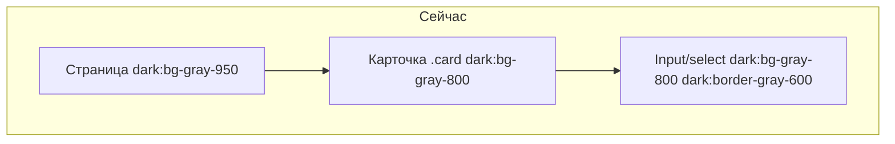
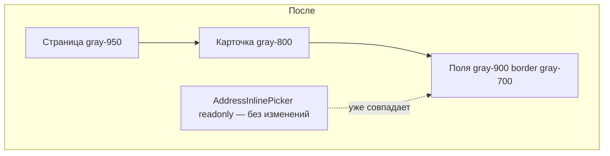

# Контраст полей ввода в тёмной теме

**Дата:** 25.07.2026  
**Статус:** implemented  
**Контекст:** Laravel + Inertia + Vue 3 + Tailwind — карточка заказа и другие формы в dark mode; эталон — зафиксированный адрес Белпочты в [`AddressInlinePicker.vue`](../resources/js/Components/AddressInlinePicker.vue)

## Цель

Унифицировать фон и границы полей ввода в тёмной теме по эталону зафиксированного адреса Белпочты (`dark:bg-gray-900`, `dark:border-gray-700`), чтобы поля визуально отличались от карточек (`dark:bg-gray-800`).

**Принятые решения:**
- Эталон — readonly-строки Город/Улица в `AddressInlinePicker` при подтверждённом адресе Белпочты
- Изменения централизовать в [`app.css`](../resources/css/app.css), не дублировать inline-классы на каждой странице
- Light mode: `bg-gray-50` + `border-gray-200` — как у эталона Белпочты

## Контекст проблемы

В тёмной теме поля в карточках заказа **сливаются с фоном карточки**:



| Элемент | Класс сейчас | Файл |
|---------|--------------|------|
| Карточка | `dark:bg-gray-800` | [`app.css`](../resources/css/app.css) `.card` |
| Поля (base + `.input`) | `dark:bg-gray-800`, `dark:border-gray-600` | [`app.css`](../resources/css/app.css) |
| Эталон (Белпочта, зафикс. адрес) | `dark:bg-gray-900`, `dark:border-gray-700` | [`AddressInlinePicker.vue`](../resources/js/Components/AddressInlinePicker.vue) строки 81–92 |

Фон страницы [`AppLayout.vue`](../resources/js/Layouts/AppLayout.vue) — `dark:bg-gray-950`, поэтому `gray-900` для полей на карточках `gray-800` даст корректную иерархию: **карточка светлее, поле темнее (вдавленный эффект)**.

## Целевое состояние

Эталон из `AddressInlinePicker` (readonly Город/Улица):

```
bg-gray-50 dark:bg-gray-900
border border-gray-200 dark:border-gray-700
rounded-lg
```

Применить те же значения ко **всем интерактивным полям** (input, select, textarea, кастомные селекты-триггеры).



---

## Шаг 1: Центральные стили — [`app.css`](../resources/css/app.css)

### 1.1 Base layer (строки 6–14)

Обновить селекторы `[type='text']`, `[type='email']`, `[type='password']`, `[type='tel']`, `[type='date']`, `select`, `textarea`:

- **Dark:** `dark:bg-gray-800` → `dark:bg-gray-900`, `dark:border-gray-600` → `dark:border-gray-700`
- **Light:** добавить `bg-gray-50`, `border-gray-200` (сейчас белый фон + `border-gray-300`)

### 1.2 Добавить `[type='number']` в base layer

Сейчас `type="number"` **не покрыт** base layer — поля кол-ва/цены в [`Orders/Show.vue`](../resources/js/Pages/Orders/Show.vue) и [`Orders/Create.vue`](../resources/js/Pages/Orders/Create.vue) могут выглядеть иначе.

При необходимости добавить `[type='month']` для month input на странице Финансов.

### 1.3 Класс `.input` (строка 47)

Те же изменения: `bg-gray-50 border-gray-200` (light), `dark:bg-gray-900 dark:border-gray-700` (dark).

> Затронутые страницы автоматически: Settings, Users, Finance, Products, AddressInlinePicker (поиск), AddressSearchModal.

---

## Шаг 2: Кастомный селект — [`AppScrollSelect.vue`](../resources/js/Components/AppScrollSelect.vue)

Обновить **только trigger** (`triggerClass`, строка 108):

```
dark:bg-gray-800  →  dark:bg-gray-900
dark:border-gray-600  →  dark:border-gray-700
```

При необходимости добавить `bg-gray-50 border-gray-200` для light mode.

**Не менять** выпадающее меню (строка 26, `dark:bg-gray-800`) — оно плавает над страницей, не на фоне карточки.

Используется в карточке заказа: смена статуса, вид доставки; также Create, Index.

---

## Шаг 3: Убрать дублирование inline-стилей

### [`Finance/Index.vue`](../resources/js/Pages/Finance/Index.vue) (строка 12)

Month input дублирует старые классы inline. Заменить на класс `.input` (или удалить dark-override, если base layer покроет `type="month"`).

---

## Что НЕ менять

| Элемент | Причина |
|---------|---------|
| `.card`, `.modal-box`, `.btn-secondary` | Не поля ввода |
| Readonly div в `AddressInlinePicker` | Уже эталон |
| Dropdown/modal панели (`dark:bg-gray-800`) | Контекст не карточка |
| Пагинация в `Orders/Index.vue` | Кнопки, не поля |
| Drag-zone в `Orders/Import.vue` | Drop area, не input |
| Checkbox в Login (`dark:bg-gray-700`) | Отдельный паттерн |

---

## Шаг 4: Проверка

```bash
cd hosting && npm run dev
```

**Ручной чеклист (тёмная тема):**

1. **Карточка заказа** (`/orders/{id}`) → «Редактировать»: ФИО, телефон, адрес, товары (select + number), вид доставки — поля темнее карточки, граница `gray-700`
2. **Белпочта + подтверждённый адрес** → readonly Город/Улица визуально совпадают с editable полями (корпус, квартира, дом)
3. **Создание заказа** (`/orders/create`) — те же поля
4. **Светлая тема** — поля `bg-gray-50`, карточка белая; без регрессий
5. **Settings, Users, Finance, Products, Login** — spot-check полей на карточках

**Grep-контроль после PR:**

```bash
rg "dark:bg-gray-800" hosting/resources --glob "*.vue" | rg -i "input|select|textarea|triggerClass|border-gray-600"
```

Не должно остаться field-like элементов со старыми цветами на карточках.

---

## Критерии приёмки

- Поля в карточке заказа в dark mode **отличимы** от фона карточки (как строки адреса Белпочты)
- Границы полей: `dark:border-gray-700`
- `type="number"` покрыт общими стилями
- `AppScrollSelect` trigger совпадает с input
- Светлая тема без регрессий
- Один атомарный PR, ~3 файла

## Риски

| Риск | Митигация |
|------|-----------|
| Поля на `gray-950` странице без карточки (фильтры Index) | `gray-900` всё равно светлее `gray-950` — контраст сохранится |
| Перебор с light mode (`bg-gray-50`) | Эталон Белпочты уже использует `bg-gray-50`; при необходимости light можно не трогать |

## Единая высота полей

**Эталон:** триггер [`AppScrollSelect`](../resources/js/Components/AppScrollSelect.vue) size `md` — `text-sm px-3 py-2 rounded-md`.

**Реализация:** [`input-field-height.md`](../fix/input-field-height.md) — `px-3 py-2` добавлен в base layer [`app.css`](../resources/css/app.css); класс `.input` приведён к `rounded-md`.

Компактные поля с явным `py-1` / `py-1.5` (Склад, Finance month, AppScrollSelect sm) не затронуты.

## Checklist

- [x] Base layer + `.input` в `app.css` (`gray-900` / `gray-700`, `[type='number']`, `[type='month']`)
- [x] `AppScrollSelect.vue` — trigger
- [x] `Finance/Index.vue` — убрать inline-дубли
- [x] npm run build + grep на пропуски
