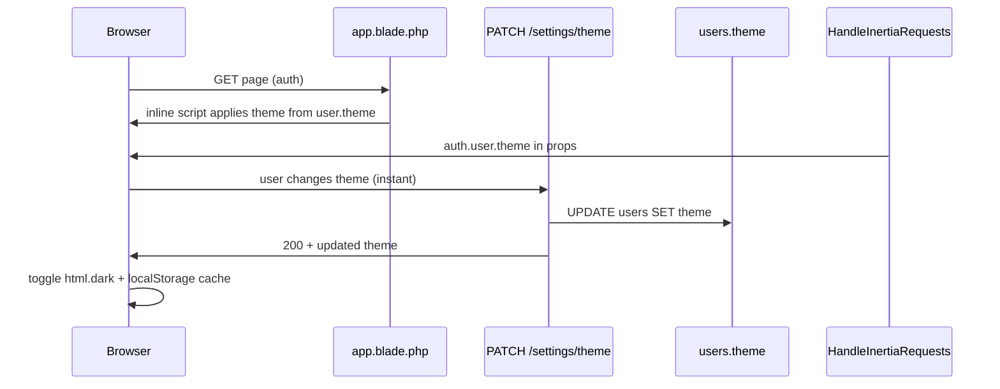

# Тёмная тема с синхронизацией профиля

**Дата:** 29.06.2026  
**Статус:** implemented  
**Контекст:** Laravel + Inertia + Vue 3 + Tailwind — персонализация UI, комфорт при длительной работе

## Цель

Добавить тёмную тему с переключателем (светлая / тёмная / системная) на странице «Настройки», синхронизацию с полем `users.theme`, затемнённый navbar в dark mode и role-based UI: операторы видят только блок оформления, admin/manager — полные tenant-настройки.

**Принятые решения:**
- Переключатель — на странице «Настройки»
- Navbar — затемнить в dark mode
- Хранение — синхронизация с профилем пользователя в БД
- Доступ — «Настройки» видны всем; оператор видит только выбор темы

## Контекст

Стек: Laravel + Inertia + Vue 3 + Tailwind. Сейчас тема не реализована — светлые цвета захардкожены в `hosting/resources/css/app.css`, `hosting/resources/views/app.blade.php` и ~15 Vue-файлах. Tenant-настройки (API-ключи) хранятся в `tenant_settings` через `TenantSettingController`; пользовательские предпочтения в БД отсутствуют.

## Архитектура



**Стратегия хранения:**
- **Источник истины:** `users.theme` (`light` | `dark` | `system`, default `system`)
- **localStorage** (`crm-theme`) — кэш для anti-FOUC и страницы логина (до авторизации — `system`)
- **Tailwind:** `darkMode: 'class'` на `<html>`

---

## Часть 1: Backend

### 1.1 Миграция

Новая миграция: колонка `theme` в `users`:

```php
$table->string('theme', 10)->default('system');
```

Файл: новая миграция рядом с `hosting/database/migrations/2026_06_27_000002_create_users_table.php`.

### 1.2 Модель User

В `hosting/app/Models/User.php`:
- добавить `theme` в `$fillable`
- константа `THEMES = ['light', 'dark', 'system']`
- helper `resolvedTheme(): string` — для `system` возвращает `light`/`dark` (на backend для blade; на FE — через `matchMedia`)

### 1.3 API сохранения темы

Новый endpoint в `hosting/routes/web.php`:

```
PATCH /settings/theme  →  TenantSettingController@updateTheme (или отдельный UserPreferenceController)
```

- Middleware: `auth`, `tenant`
- **Без** gate `manage-settings` — доступен всем ролям
- Validation: `theme` in `light,dark,system`
- Response: JSON `{ theme: '...' }` или Inertia redirect back

### 1.4 Защита tenant-настроек

В `TenantSettingController`:
- `index()` — добавить prop `canManageSettings: Gate::check('manage-settings')`; для операторов передавать пустой `schema` (или отфильтрованный)
- `update()` и `generateWebhookSecret()` — добавить `Gate::authorize('manage-settings')` (сейчас gate объявлен в `AuthServiceProvider`, но **не применяется** на POST)

### 1.5 Inertia shared data

В `HandleInertiaRequests` расширить `auth.user`:

```php
'theme' => $request->user()->theme ?? 'system',
```

### 1.6 Anti-FOUC в blade

В `hosting/resources/views/app.blade.php`:
- inline `<script>` в `<head>` **до** CSS
- для авторизованных: читать `$request->user()->theme` (через `@auth`)
- для гостей: `localStorage.getItem('crm-theme') || 'system'`
- toggling `document.documentElement.classList.add('dark')`
- перенести базовые классы body (`bg-gray-50 text-gray-900`) на `dark:` варианты

---

## Часть 2: Frontend — инфраструктура темы

### 2.1 Tailwind config

`hosting/tailwind.config.js`:

```js
darkMode: 'class',
```

### 2.2 Composable `useTheme`

Новый файл: `hosting/resources/js/composables/useTheme.js`

- Состояние: `preference` (`light` | `dark` | `system`)
- `resolvedTheme` computed (учитывает `prefers-color-scheme`)
- `applyTheme()` — toggle `html.dark`, обновить `localStorage`
- `setTheme(value)` — PATCH `/settings/theme`, затем apply + обновить Inertia props
- `initTheme()` — вызов из `app.js` при старте; подписка на `matchMedia` change для режима `system`
- Синхронизация: при login Inertia props перезаписывают localStorage

### 2.3 Общие стили

`hosting/resources/css/app.css` — добавить `dark:` для:
- base inputs (строки 6–14)
- `.btn`, `.btn-primary`, `.btn-secondary`, `.btn-danger`
- `.card`, `.table-cell`
- централизовать `.label`, `.input` (убрать дубли из scoped-стилей 4 страниц)

**Dark-палитра (ориентир):**

| Элемент | Light | Dark |
|---------|-------|------|
| Body | `bg-gray-50 text-gray-900` | `dark:bg-gray-950 dark:text-gray-100` |
| Card | `bg-white border-gray-200` | `dark:bg-gray-800 dark:border-gray-700` |
| Navbar | `bg-indigo-700` | `dark:bg-indigo-950 dark:border-b dark:border-indigo-900` |
| Header | `bg-white border-gray-200` | `dark:bg-gray-900 dark:border-gray-700` |
| Table head | `bg-gray-50` | `dark:bg-gray-800/50` |

---

## Часть 3: UI — страница «Настройки»

### 3.1 Navbar — доступ для всех

`AppLayout.vue`:
- убрать `v-if="canManageSettings"` с ссылки «Настройки» — показывать всем авторизованным
- добавить `dark:` классы layout, header, flash-сообщений
- navbar: `bg-indigo-700 dark:bg-indigo-950`

### 3.2 Блок «Оформление»

`Settings/Index.vue`:

- Новая карточка **«Оформление»** вверху страницы (вне tenant-form)
- Segmented control / radio group: **Светлая | Тёмная | Системная**
- **Мгновенное сохранение** при выборе (PATCH `/settings/theme`), без кнопки «Сохранить настройки»
- Prop `canManageSettings` — tenant-карточки и submit рендерятся только если `true`
- Оператор видит только карточку «Оформление»

```
┌─────────────────────────────────┐
│ Оформление                      │
│ Тема: [Светлая][Тёмная][Систем] │
└─────────────────────────────────┘
┌─────────────────────────────────┐  ← только admin/manager
│ Магазин / Белпочта / …          │
└─────────────────────────────────┘
```

---

## Часть 4: Dark-стили по страницам

Обновить все Vue-файлы в `hosting/resources/js/` (~15 файлов):

| Файл | Что менять |
|------|-----------|
| `Layouts/AppLayout.vue` | layout, navbar, header, flash |
| `Pages/Auth/Login.vue` | фон, карточка формы |
| `Pages/Orders/Index.vue` | таблица, фильтры, пагинация |
| `Pages/Orders/Create.vue`, `Show.vue`, `Import.vue` | формы, карточки |
| `Pages/Finance/Index.vue` | таблицы, модалки |
| `Pages/Products/Index.vue` | таблицы, модалки |
| `Pages/Users/Index.vue` | таблицы, модалки |
| `Pages/Belpost/Batch.vue`, `Europochta/Create.vue` | карточки |
| `Components/AddressSearchModal.vue`, `AddressInlinePicker.vue` | модалки |
| `Components/OrderStatusBadge.vue` | `dark:bg-*-900 dark:text-*-200` для каждого статуса |

**Подход:** сначала layout + `app.css` (покрывает ~40% UI через `.card`, `.btn`), затем страницы с inline-классами и scoped `.modal-box`.

---

## Порядок реализации

1. **Backend:** миграция → User model → PATCH endpoint → Gate на tenant POST → Inertia share → blade anti-FOUC
2. **Инфраструктура:** tailwind config → `useTheme` → `app.css` dark variants → `app.js` init
3. **UI доступ:** navbar Settings для всех → Settings page split (appearance + gated tenant)
4. **Стили:** AppLayout + Login → остальные страницы и компоненты
5. **Сборка:** `npm run dev` / `npm run prod` для перекомпиляции CSS

---

## Критерии приёмки

- Три режима: светлая, тёмная, системная
- Выбор сохраняется в `users.theme` и восстанавливается при входе с другого устройства
- Нет FOUC при загрузке (inline script + server theme)
- В system-режиме тема реагирует на смену OS без перезагрузки
- Navbar затемнён в dark mode
- Оператор: видит «Настройки», только блок «Оформление»; POST tenant-настроек возвращает 403
- Admin/manager: полный доступ к tenant-настройкам + оформление
- Страница логина корректно отображается в обеих темах

---

## Риски и митигация

| Риск | Митигация |
|------|-----------|
| Много ручных `dark:` классов | Централизация в `app.css`; общие паттерны `.modal-box` вынести в components layer |
| Оператор раньше мог POST tenant settings | Добавить `Gate::authorize` на update (закрывает дыру) |
| Badge-цвета теряют контраст | Подобрать dark-варианты с opacity 900/200 |
| Scoped `.input`/`.label` дублируются | Перенести в `app.css` с `dark:` — один раз |

---

## Файлы (ключевые изменения)

**Новые:**
- `database/migrations/*_add_theme_to_users_table.php`
- `resources/js/composables/useTheme.js`

**Изменяемые (backend):**
- `app/Models/User.php`
- `app/Http/Controllers/TenantSettingController.php`
- `app/Http/Middleware/HandleInertiaRequests.php`
- `routes/web.php`
- `resources/views/app.blade.php`

**Изменяемые (frontend):**
- `tailwind.config.js`
- `resources/css/app.css`
- `resources/js/app.js`
- `resources/js/Layouts/AppLayout.vue`
- `resources/js/Pages/Settings/Index.vue`
- все остальные `.vue` в `resources/js/`
