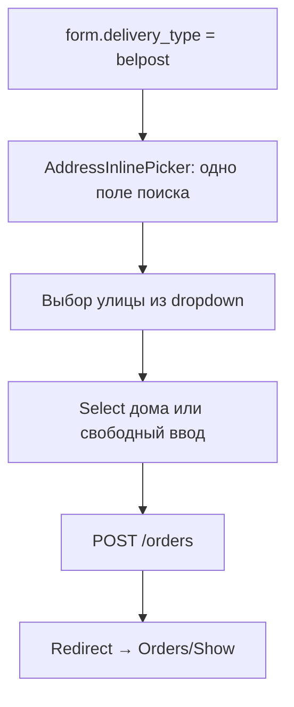

# Inline-поиск адреса при создании заказа

**Дата:** 28.06.2026  
**Статус:** implemented  
**Контекст:** Страница создания заказа (`Orders/Create.vue`) — вторая итерация inline-поиска Белпочты после [`inline-address-picker.md`](./inline-address-picker.md) (Show.vue)

## Цель

Подключить существующий `AddressInlinePicker` на страницу создания заказа: при выборе доставки «Белпочта» заменить поля Город/Улица/Дом на одно поисковое поле, сохранять `belpost_address_id` при `POST /orders` — по тому же паттерну, что уже работает в карточке заказа.

## Контекст проблемы

Первая итерация ([`inline-address-picker.md`](./inline-address-picker.md)) реализовала picker только в [`hosting/resources/js/Pages/Orders/Show.vue`](../resources/js/Pages/Orders/Show.vue).

На [`hosting/resources/js/Pages/Orders/Create.vue`](../resources/js/Pages/Orders/Create.vue) блок «Адрес» статичен — всегда пять текстовых полей. Select «Белпочта» (`form.delivery_type`) на UI адреса не влияет.

**Уже готово (переиспользуем без изменений):**

- [`AddressInlinePicker.vue`](../resources/js/Components/AddressInlinePicker.vue)
- `GET /api/address/search` → [`AddressController`](../app/Http/Controllers/AddressController.php)
- колонка `belpost_address_id` + `$fillable` в [`Order.php`](../app/Models/Order.php)
- validation `belpost_address_id` в `OrderController@update`
- fallback в [`BelpostService::createItem`](../app/Services/BelpostService.php)

## Целевой UX



**Условие показа picker:** `form.delivery_type === 'belpost'` — реактивно, без предварительного сохранения заказа.

**Для остальных типов доставки** — текущая сетка полей (Город / Улица / Дом / Корпус / Квартира), без регрессий.

## Затронутые файлы

| Файл | Изменение |
|------|-----------|
| [`hosting/resources/js/Pages/Orders/Create.vue`](../resources/js/Pages/Orders/Create.vue) | условный `AddressInlinePicker`, `belpost_address_id` в form, validate на submit |
| [`hosting/app/Http/Controllers/OrderController.php`](../app/Http/Controllers/OrderController.php) | +validation `belpost_address_id` в `store()` |
| [`inline-address-picker.md`](./inline-address-picker.md) | расширить scope, ссылка на эту итерацию |

## Реализация

### 1. Frontend — `Orders/Create.vue`

Заменить статичный блок «Адрес» на условный, по образцу Show.vue:

```vue
<template v-if="form.delivery_type === 'belpost'">
    <AddressInlinePicker
        ref="pickerRef"
        v-model:city="form.city"
        v-model:street="form.street"
        v-model:building="form.building"
        v-model:belpostAddressId="form.belpost_address_id"
    />
    <!-- корпус + квартира — plain inputs -->
</template>
<div v-else class="grid ...">
    <!-- текущие 5 полей без изменений -->
</div>
```

**Script:**

- `import AddressInlinePicker from '@/Components/AddressInlinePicker.vue'`
- `import { ref } from 'vue'` (добавить к существующему `computed`)
- `const pickerRef = ref(null)`
- В `useForm({...})` добавить `belpost_address_id: ''`
- В `submit()` перед `form.post()` — если `form.delivery_type === 'belpost'` и `pickerRef.value`, вызвать `pickerRef.validate()`; при `false` — abort (как в Show.vue)

**Переключение типа доставки:** `watch(() => form.delivery_type, ...)` — при смене с `belpost` на другой тип сбрасывать `belpost_address_id` в `''`. Поля `city`/`street`/`building` не трогать.

`initialQuery` для Create не нужен (заказ новый, адрес пустой).

### 2. Backend — `OrderController@store`

Добавить validation (аналогично `update()`):

```php
'belpost_address_id' => ['nullable', 'string', 'max:50'],
```

Миграции и изменения модели не требуются.

Опциональная серверная проверка `AddressService::isHouseAllowed` — **не включать** в эту итерацию (паритет с Show.vue).

### 3. Документация

- В [`inline-address-picker.md`](./inline-address-picker.md): убрать Create.vue из «вне scope», добавить ссылку на этот документ

## Критерии приёмки

- [ ] При выборе «Белпочта» на `/orders/create` поля Город/Улица/Дом заменяются на «Поиск адреса Белпочты» + корпус/квартира
- [ ] При смене типа доставки на не-belpost — возвращаются 5 текстовых полей
- [ ] Выбор улицы + дома заполняет `city`, `street`, `building`, `belpost_address_id` в формате GAS
- [ ] Submit без выбранного дома (когда `params_null === false`) блокируется с inline-ошибкой
- [ ] `POST /orders` сохраняет `belpost_address_id`; после редиректа на Show — badge «Белпочта» и структурированный адрес
- [ ] `BelpostService::createItem` использует сохранённый ID без autoResolve

## Риски

| Риск | Митигация |
|------|-----------|
| Picker не реагирует на смену delivery_type | `v-if` на `form.delivery_type`, не на props заказа |
| Dropdown обрезается card | известная проблема Show; при необходимости — отдельная задача (Teleport) |
| Pre-filled query без автопоиска | на Create поле пустое — не актуально |

## Тестирование (ручное)

1. Create → Белпочта → поиск → улица → дом → создать → Show: адрес и badge OK
2. Create → Белпочта → submit без дома → ошибка валидации picker
3. Create → Курьер → обычные поля, submit OK
4. Create → Белпочта → заполнить адрес → сменить на Курьер → создать → `belpost_address_id` пустой
5. Batch: заказ создан через picker → `createItem` успешен без «Исправить адрес»

## Чеклист реализации

- [x] `Orders/Create.vue`: условный `AddressInlinePicker`, `belpost_address_id` в form, validate на submit
- [x] `Orders/Create.vue`: watch сброс `belpost_address_id` при смене типа доставки с belpost
- [x] `OrderController@store`: validation `belpost_address_id`
- [x] `inline-address-picker.md`: расширить scope, ссылка на Create
- [ ] Ручная проверка по 5 сценариям выше

## Объём

~40 строк в Create.vue + 1 строка validation в OrderController + правка docs. Компонент `AddressInlinePicker` без изменений.

## Связанные документы

- [`inline-address-picker.md`](./inline-address-picker.md) — первая итерация (Show.vue, Batch)
- [`manual-order-create.md`](./manual-order-create.md) — страница создания заказа
- [`../migration-plan.md`](../migration-plan.md) — общий план миграции hosting
