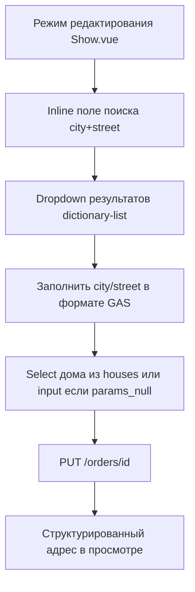

# Inline-поиск адреса в карточке заказа — Вариант B

**Дата:** 28.06.2026  
**Статус:** planned  
**Контекст:** Карточка заказа (`Orders/Show.vue`) — адрес Белпочты через dictionary-list, выбор дома из списка `params`

## Цель

Добавить inline-поиск адреса Белпочты в карточку заказа: autocomplete по `dictionary-list`, выбор номера дома из списка `params`, сохранение `belpost_address_id` для последующего `createItem` без повторного autoResolve.

## Контекст проблемы

Сейчас в [`hosting/resources/js/Pages/Orders/Show.vue`](../resources/js/Pages/Orders/Show.vue) адрес — простая склейка полей в просмотре и пять текстовых input в редактировании. Ручной поиск реализован только в [`AddressSearchModal.vue`](../resources/js/Components/AddressSearchModal.vue) и используется на [`Belpost/Batch.vue`](../resources/js/Pages/Belpost/Batch.vue), но при выборе улицы дом не выбирается из списка — берётся `order.building` как есть ([`BelpostService::createItem`](../app/Services/BelpostService.php)).

Legacy GAS формат после ручного выбора ([`backend/ScSA.gs`](../../backend/ScSA.gs) `setSelectedAddress`):

- `city` = `postcode + ' ' + city_type + ' ' + city`
- `street` = `street_type + ' ' + street`

API уже готов: `GET /api/address/search` → [`AddressController`](../app/Http/Controllers/AddressController.php) → [`AddressService::formatItem`](../app/Services/AddressService.php) возвращает `id`, `city`, `city_type`, `street`, `street_type`, `postcode`, `district`, `houses[]`, `params_null`, `label`.

## Целевой UX



**Scope:** [`Orders/Show.vue`](../resources/js/Pages/Orders/Show.vue) (первая итерация) и [`Orders/Create.vue`](../resources/js/Pages/Orders/Create.vue) — см. [`inline-address-picker-create.md`](./inline-address-picker-create.md).

**Условие показа picker:** `order.delivery_type === 'belpost'`. Для остальных типов доставки — текущие текстовые поля без изменений.

## Затронутые файлы

| Файл | Изменение |
|------|-----------|
| `database/migrations/2026_06_28_000001_add_belpost_address_id_to_orders.php` | создать |
| [`hosting/app/Models/Order.php`](../app/Models/Order.php) | +`belpost_address_id` в `$fillable` |
| [`hosting/app/Http/Controllers/OrderController.php`](../app/Http/Controllers/OrderController.php) | +validation в `update()` |
| [`hosting/app/Services/BelpostService.php`](../app/Services/BelpostService.php) | fallback на `order.belpost_address_id` |
| [`hosting/resources/js/Components/AddressInlinePicker.vue`](../resources/js/Components/AddressInlinePicker.vue) | создать |
| [`hosting/resources/js/Pages/Orders/Show.vue`](../resources/js/Pages/Orders/Show.vue) | интеграция picker |
| [`hosting/resources/js/Components/AddressSearchModal.vue`](../resources/js/Components/AddressSearchModal.vue) | +шаг выбора дома (для Batch) |
| [`hosting/resources/js/Pages/Belpost/Batch.vue`](../resources/js/Pages/Belpost/Batch.vue) | PATCH заказа перед `processOne` |

## Реализация

### 1. БД и модель

Новая миграция `2026_06_28_000001_add_belpost_address_id_to_orders.php`:

- колонка `belpost_address_id` — `string`, nullable, после `ops_id`

Обновить [`Order.php`](../app/Models/Order.php): добавить `belpost_address_id` в `$fillable`.

### 2. Backend — сохранение адреса

[`OrderController.php`](../app/Http/Controllers/OrderController.php), метод `update`:

- добавить в validation: `'belpost_address_id' => ['sometimes', 'nullable', 'string', 'max:50']`
- при ручном изменении `city`/`street` без picker — фронт сбрасывает `belpost_address_id` в `null`

Опциональная серверная проверка (рекомендуется): если передан `belpost_address_id` + `building`, вызвать `AddressService::isHouseAllowed` — иначе 422 с понятным сообщением.

### 3. Backend — createItem

[`BelpostService.php`](../app/Services/BelpostService.php), блок address resolution (~строки 91–114):

```php
$addressId = $belpostAddressId ?? $order->belpost_address_id;
```

Приоритет: явный параметр из Batch → сохранённый на заказе → `autoResolve()`.

### 4. Frontend — компонент AddressInlinePicker.vue

Создать [`AddressInlinePicker.vue`](../resources/js/Components/AddressInlinePicker.vue).

**Props (v-model через emit):**

- `city`, `street`, `building`, `belpostAddressId`
- `initialQuery` — pre-fill поиска из текущих city+street

**UI:**

- Поле поиска с debounce 600 ms, мин. 3 символа (логика из [`AddressSearchModal.vue`](../resources/js/Components/AddressSearchModal.vue))
- Absolute dropdown с результатами; строка = `item.label`
- Keyboard: ArrowUp/Down, Enter, Escape
- После выбора улицы:
  - `city` = `` `${postcode} ${city_type} ${city}`.trim() ``
  - `street` = `` `${street_type} ${street}`.trim() ``
  - `belpostAddressId` = `item.id`
  - Дом: если `params_null` → text input; иначе `<select>` из `item.houses`
  - Prefill дома: если текущий `building` (normalize) есть в `houses[]` — выбрать его; иначе пустой select (обязательный выбор)
- Readonly-поля city/street после выбора
- Кнопка «Сбросить» — очистить picker-состояние и `belpostAddressId`

**Emit:** `update:city`, `update:street`, `update:building`, `update:belpostAddressId`

### 5. Frontend — интеграция в Show.vue

**Режим просмотра** — структурированный вывод:

```
{postcode/city line}
{street line}
Дом {building} · корп. {housing} · кв. {apartment}
```

**Режим редактирования:**

- `v-if="order.delivery_type === 'belpost'"` → `<AddressInlinePicker v-model:... />`
- `v-else` → текущие текстовые поля city/street/building
- Добавить `belpost_address_id` в `useForm({...})`
- Валидация перед save: для belpost + select домов — если дом не выбран, inline-ошибка

### 6. Batch — выбор дома в модалке

Расширить [`AddressSearchModal.vue`](../resources/js/Components/AddressSearchModal.vue) вторым шагом (select дома) и emit `{ id, building, city, street }`.

[`Batch.vue`](../resources/js/Pages/Belpost/Batch.vue): перед `processOne` делать PATCH `/orders/{id}` с новыми полями + `belpost_address_id`.

## Критерии приёмки

- [ ] В карточке заказа (belpost) при редактировании работает inline-поиск через `/api/address/search`
- [ ] Dropdown показывает формат справочника (`label` из AddressService)
- [ ] После выбора улицы дом выбирается из select `houses[]`; при `params_null` — свободный ввод
- [ ] Существующий дом предзаполняется, если есть в списке
- [ ] Сохранение записывает `city`, `street`, `building`, `belpost_address_id`
- [ ] В просмотре адрес отображается структурированно
- [ ] `BelpostService::createItem` использует сохранённый `belpost_address_id`
- [ ] На Batch «Исправить адрес» → выбор улицы + дома → бланк с корректным `house`
- [ ] Заказы с `delivery_type != belpost` — без регрессий

## Риски

| Риск | Митигация |
|------|-----------|
| Dropdown обрезается в card | `position: absolute`, высокий z-index, `overflow-visible` на родителе |
| Ручное редактирование city/street ломает связь с Белпочтой | readonly после picker + кнопка «Сбросить» |
| Пустой `building` → HTTP 404 Белпочты | обязательный select дома перед save |
| Формат city/street отличается от импорта | тот же формат, что GAS `setSelectedAddress` |

## Тестирование (ручное)

1. Заказ belpost с пустым `building` → поиск → выбор улицы → выбор дома → save → createItem успешен
2. Заказ с домом в списке → дом предзаполнен
3. Заказ с домом не из списка → пустой select, обязательный выбор
4. `params_null` → text input для дома
5. Заказ europochta/courier → обычные поля, picker скрыт
6. Batch: `address_not_found` → исправить → выбрать дом → бланк создан

## Чеклист реализации

- [ ] Миграция `orders.belpost_address_id` + `Order::$fillable`
- [ ] `OrderController@update`: validation `belpost_address_id`, опционально `isHouseAllowed`
- [ ] `BelpostService::createItem` — fallback на `order.belpost_address_id`
- [ ] Создать `AddressInlinePicker.vue` (поиск, dropdown, select домов, prefill)
- [ ] Интегрировать picker в `Orders/Show.vue` (view/edit, form field, validation)
- [ ] `AddressSearchModal` + Batch: второй шаг выбора дома, PATCH заказа перед `processOne`
- [ ] Ручная проверка по 6 сценариям выше

## Связанные документы

- [`docs/feature/dictionary-list-migration.md`](../../feature/dictionary-list-migration.md) — переход на dictionary-list
- [`docs/fix/createitem-address-fallback.md`](../../fix/createitem-address-fallback.md) — fallback на ручной поиск в GAS
- [`migration-plan.md`](../migration-plan.md) — общий план миграции hosting
