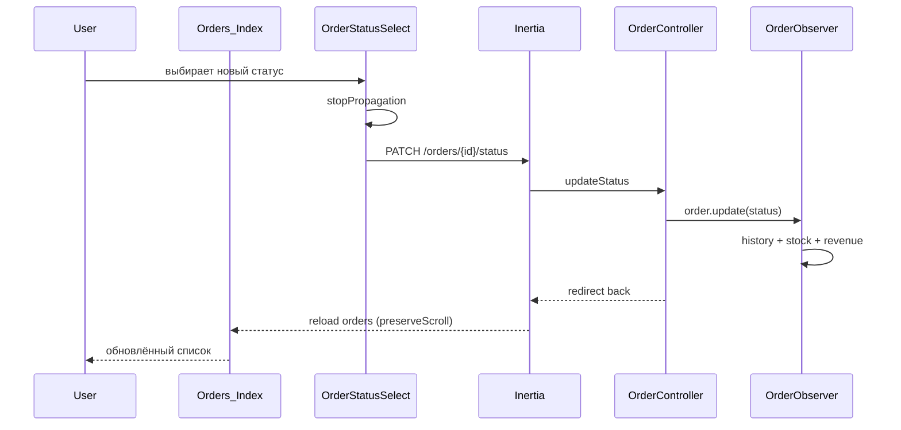

# Inline-смена статуса в списке заказов — вариант A

**Дата:** 25.07.2026  
**Статус:** planned  
**Контекст:** Список заказов `/orders` — операторы часто меняют статус после звонка без перехода в карточку

## Цель

Добавить возможность менять статус заказа прямо в таблице списка заказов через компактный `<select>`. Смена — **сразу при выборе**, без кнопки «Применить» и без confirm-диалогов (в том числе для критичных статусов).

## Текущее состояние

- Список [`Index.vue`](../resources/js/Pages/Orders/Index.vue) — статус read-only (`OrderStatusBadge`).
- Карточка [`Show.vue`](../resources/js/Pages/Orders/Show.vue) — select + «Применить» через `useForm().patch('/orders/{id}/status')`.
- API `PATCH /orders/{order}/status` в [`OrderController::updateStatus()`](../app/Http/Controllers/OrderController.php) — валидация по `Order::STATUSES`.
- Side effects (история, склад, выручка) — [`OrderObserver`](../app/Observers/OrderObserver.php).
- Тесты бэкенда: [`OrderStatusUpdateTest.php`](../tests/Feature/OrderStatusUpdateTest.php) — менять не нужно.

## Затронутые файлы

| Файл | Изменение |
|------|-----------|
| [`hosting/resources/js/Components/OrderStatusSelect.vue`](../resources/js/Components/OrderStatusSelect.vue) | новый компонент |
| [`hosting/resources/js/Pages/Orders/Index.vue`](../resources/js/Pages/Orders/Index.vue) | замена badge на select в колонке «Статус» |

Бэкенд, маршруты, миграции — **без изменений**.

## Поток данных



## Реализация

### 1. Компонент `OrderStatusSelect.vue`

Props:

- `orderId` (Number, required)
- `status` (String, required) — текущий статус
- `statuses` (Array, required) — список из `Order::STATUSES`
- `disabled` (Boolean) — для `readOnly`

Поведение:

- Локальный `selectedStatus` синхронизируется с prop `status` (watch).
- `@click.stop` и `@mousedown.stop` на wrapper — клик не открывает карточку заказа (строка таблицы имеет `@click="goToOrder"`).
- `@change`:
  - если значение совпадает с текущим — ничего не делать;
  - иначе `useForm({ status }).patch(\`/orders/${orderId}/status\`, { preserveScroll: true, only: ['orders'], onError: revert })`.
- Состояние `processing` — select `:disabled` на время запроса.
- При ошибке — откат `selectedStatus` к исходному `status`.

Стили: компактный select (`text-xs`, `py-1`, `max-w-[140px]`, `truncate`) — plain, без badge-стилизации.

### 2. Обновление `Orders/Index.vue`

В колонке `status` заменить рендер `OrderStatusBadge` на `OrderStatusSelect`:

```javascript
cell: info => {
    const row = info.row.original
    return h(OrderStatusSelect, {
        orderId: row.id,
        status: row.status,
        statuses: props.statuses,
        disabled: readOnly.value,
    })
}
```

- Импорт `OrderStatusSelect`, удалить неиспользуемый `OrderStatusBadge` из Index (badge остаётся в Show).
- `readOnly` уже доступен через `useSubscription()`.

### 3. Бэкенд

`updateStatus` возвращает `back()` — совместимо с Inertia `patch`, как на карточке заказа.

## Ограничения и edge cases

| Ситуация | Поведение |
|----------|-----------|
| `readOnly` (trial expired) | select disabled |
| Клик по select | не переходит на `/orders/{id}` |
| Ошибка валидации / 419 | откат select, Inertia reload при 419 (существующий interceptor) |
| Фильтр по статусу активен | после смены заказ может исчезнуть из списка — ожидаемое поведение |
| Критичные статусы («Отправлено», «Завершен») | confirm не нужен |

## Проверка (manual test plan)

1. Открыть `/orders`, сменить статус у заказа — строка обновляется без перехода на карточку.
2. Клик по select не открывает заказ; клик по остальной строке — открывает.
3. Проверить запись в истории на карточке заказа (`/orders/{id}`).
4. В режиме `readOnly` select недоступен.
5. При активном фильтре «Статус» — заказ корректно исчезает/остаётся в списке.
6. Запустить `php artisan test --filter=OrderStatusUpdateTest` — регрессии нет.

## Объём работ

~2 файла: 1 новый компонент + правка Index.vue. Небольшая задача, без миграций и без изменений API.
