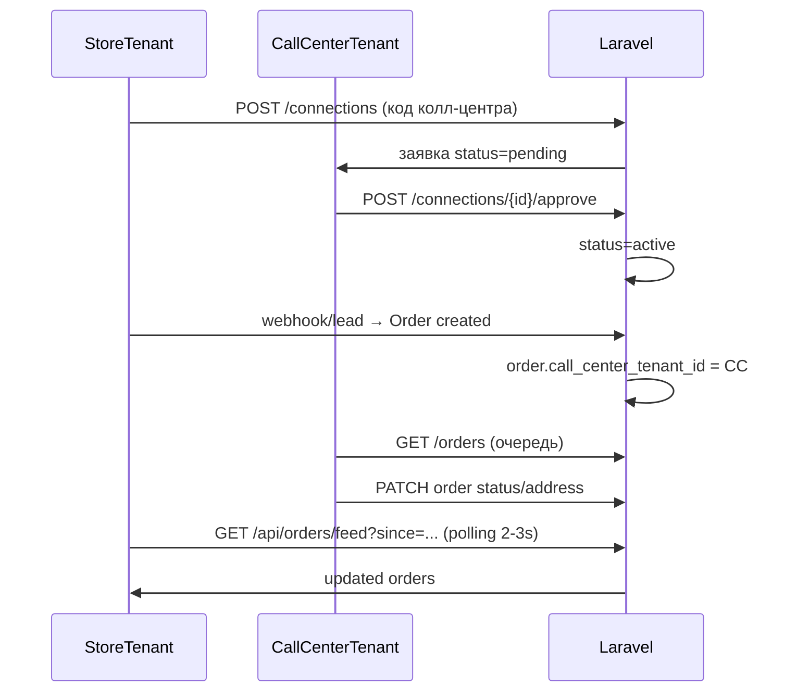
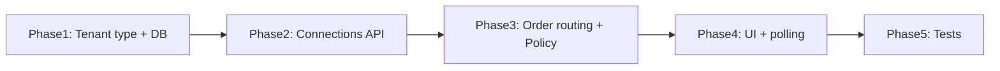

# Встроенный колл-центр

**Дата:** 30.07.2026  
**Статус:** planned  
**Контекст:** Отдельный тип компании `call_center` внутри CRM; магазин подключается по коду (вариант A), колл-центр одобряет заявку; заказы идут store → CC → store; синхронизация через HTTP polling (2–3 сек).

## Цель

Реализовать встроенный колл-центр без внешних интеграций (Belpost, Europochta, SalesRender):

1. **Тип тенанта** — `store` (интернет-магазин) и `call_center` (колл-центр).
2. **Подключение по коду** — магазин вводит код колл-центра и отправляет заявку; колл-центр одобряет или отклоняет (односторонний апрув).
3. **Маршрутизация заказов** — новые заказы магазина автоматически попадают в очередь колл-центра; изменения колл-центра видны магазину.
4. **Real-time (MVP)** — HTTP polling каждые 2–3 сек (паттерн как у tracking).

## Контекст (текущее состояние)

- Все компании — изолированные [`Tenant`](../app/Models/Tenant.php) без связей между собой.
- Колл-центр — внешний SalesRender ([`SalesRenderService`](../app/Services/SalesRenderService.php), [`SyncSalesRenderJob`](../app/Jobs/SyncSalesRenderJob.php)).
- Real-time — только polling ([`Orders/Index.vue`](../resources/js/Pages/Orders/Index.vue), `GET /api/orders/tracking-status`).
- Изоляция данных — `tenant_id` + [`TenantScope`](../app/Scopes/TenantScope.php).

## Целевой поток



---

## 1. Типы тенантов

**Миграция:** добавить в `tenants`:

```php
$table->enum('type', ['store', 'call_center'])->default('store');
```

**Модель** [`Tenant.php`](../app/Models/Tenant.php):

- константы `TYPE_STORE`, `TYPE_CALL_CENTER`
- методы `isStore()`, `isCallCenter()`

**Регистрация** [`RegisterController.php`](../app/Http/Controllers/Auth/RegisterController.php) + [`Register.vue`](../resources/js/Pages/Auth/Register.vue):

- radio «Интернет-магазин» / «Колл-центр»
- при создании `call_center` — сгенерировать `connection_code` (см. п.2)

**Provisioner** [`TenantProvisioner.php`](../app/Services/TenantProvisioner.php):

- для `store` — текущий набор настроек (Belpost, SR, …)
- для `call_center` — минимальный набор (`shop_name`, `connection_code`); без SR/Belpost/Europochta

**Inertia shared props** [`HandleInertiaRequests.php`](../app/Http/Middleware/HandleInertiaRequests.php):

- добавить `tenant: { id, type, name }` для условного UI

**Существующие tenants:** data-fix в миграции → `type = 'store'`.

---

## 2. Подключение по коду (вариант A, односторонний апрув)

### Код колл-центра

Хранить в `tenant_settings` (паттерн как `webhook_secret`):

- ключ `connection_code` — 8–10 символов, уникальный глобально
- генерируется при регистрации CC и по кнопке «Перегенерировать» в настройках

### Таблица `tenant_connections`

| Поле | Описание |
|------|----------|
| `store_tenant_id` | FK tenants |
| `call_center_tenant_id` | FK tenants |
| `status` | `pending` \| `active` \| `rejected` \| `disconnected` |
| `requested_at` | когда магазин отправил заявку |
| `approved_at` | когда колл-центр одобрил |
| `rejected_at` | nullable |
| `disconnected_at` | nullable |

**Ограничения:**

- unique `(store_tenant_id, call_center_tenant_id)`
- **одна активная связь на магазин** (partial unique index или проверка в сервисе) — MVP упрощает auto-assign заказов

**Правила (только store инициирует):**

1. Store admin вводит код → `POST /connections` → `status = pending`
2. Call center admin видит входящие заявки → `approve` / `reject`
3. При `approve` → `status = active`, `approved_at = now()`
4. Любая сторона может `disconnect` активную связь

**Модель:** `TenantConnection` с relations `store()`, `callCenter()`.

**Сервис:** `ConnectionService` — валидация кода, поиск CC по коду, проверка дубликатов, смена статусов.

**Контроллер:** `ConnectionController` + routes в [`web.php`](../routes/web.php):

```
GET    /connections                        — список (store: свои заявки; CC: incoming pending + active)
POST   /connections                        — store: запрос по коду (admin only)
POST   /connections/{id}/approve           — call_center admin
POST   /connections/{id}/reject            — call_center admin
POST   /connections/{id}/disconnect        — store или call_center admin
POST   /settings/regenerate-connection-code — call_center admin
```

**Gates** в [`AuthServiceProvider.php`](../app/Providers/AuthServiceProvider.php):

- `manage-connections` — tenant admin
- `approve-connections` — call_center admin

---

## 3. Маршрутизация заказов

### Схема БД

**Миграция `orders`:**

```php
$table->unsignedBigInteger('call_center_tenant_id')->nullable()->index();
$table->unsignedBigInteger('last_updated_by_user_id')->nullable();
```

Заказ **всегда принадлежит магазину** (`tenant_id` = store). `call_center_tenant_id` — кому делегирована обработка.

### Auto-assign при создании

Точки входа — все три должны вызывать `OrderAssignmentService::assignCallCenter($order)`:

- [`WebhookController.php`](../app/Http/Controllers/WebhookController.php) — после `Order::create`
- [`OrderController.php`](../app/Http/Controllers/OrderController.php) — `store()`, `importCsv()`
- при assign: если у store есть `active` connection → проставить `call_center_tenant_id`

**SalesRender:** в WebhookController — не вызывать `SalesRenderService::sendOrder()`, если у магазина активна internal-связь.

### Доступ колл-центра к заказам

`TenantScope` фильтрует по `tenant_id` — для CC не подходит.

**Решение:** `OrderPolicy` + отдельный query scope `CallCenterOrderScope`:

```php
Order::withoutGlobalScope(TenantScope::class)
    ->where('call_center_tenant_id', $ccTenantId)
    ->whereHas('storeConnection', fn ($q) => $q->where('status', 'active'));
```

**Policy `OrderPolicy`:**

- Store: `tenant_id === user.tenant_id`
- Call center: `call_center_tenant_id === user.tenant_id` + active connection
- CC может менять только поля фазы обзвона: `status`, `full_name`, `phone`, адрес, `goods`/`quantities`/`prices`, `delivery_type`, `source`, `sms_log`
- CC **не может**: удалять заказы, менять статусы почты (`Оформлен`…`Посчитан`), `track_number`, `belpost_address_id`, `mail_batch_id`
- Список разрешённых CC-статусов — подмножество `Order::STATUSES` до `Заказать`/`Отправить` включительно + закрывающие (`Отказ`, `Отказ(Ошибка)`, `Дубль`, `Недозвон*`)

**Audit:** в `OrderController::update/updateStatus` — писать `last_updated_by_user_id`; в [`OrderStatusHistory`](../app/Models/OrderStatusHistory.php) опционально добавить `user_id` (миграция).

### Контроллер заказов для CC

Расширить [`OrderController.php`](../app/Http/Controllers/OrderController.php):

- `index()` — если `tenant.isCallCenter()` → query через `CallCenterOrderScope`, eager-load `tenant` (имя магазина)
- `update()` / `updateStatus()` — authorize через Policy

---

## 4. Real-time через polling (2–3 сек)

Паттерн как tracking ([`tracking-status-checks.md`](tracking-status-checks.md)).

**Endpoint:**

```
GET /api/orders/feed?since=2026-07-30T18:00:00Z
```

**Ответ:**

```json
{
  "server_time": "...",
  "orders": [ /* id, status, full_name, phone, updated_at, store_name (for CC) */ ]
}
```

**Backend:** `OrderFeedController@index` или метод в `OrderController`:

- Store: `where tenant_id = current AND updated_at > since`
- CC: `where call_center_tenant_id = current AND updated_at > since`
- лимит 100 записей, сортировка по `updated_at ASC`

**Frontend:** composable `useOrderFeed.js`:

- polling каждые 2.5 с на [`Orders/Index.vue`](../resources/js/Pages/Orders/Index.vue) и CC-очереди
- merge/update строк в локальном state (или partial Inertia reload через `router.reload({ only: ['orders'] })`)
- badge «Обновлено» при изменениях от другой стороны

Route в [`web.php`](../routes/web.php) — `withoutMiddleware('tenant.writable')` (read-only).

---

## 5. UI / навигация

### Меню [`AppLayout.vue`](../resources/js/Layouts/AppLayout.vue)

| Раздел | store | call_center |
|--------|-------|-------------|
| Заказы | ✓ | ✓ (очередь) |
| Белпочта / Европочта | ✓ | скрыть |
| Склад | ✓ | read-only (товары связанных магазинов) |
| Финансы | ✓ | скрыть |
| Настройки | ✓ + блок «Колл-центр» | ✓ + код + входящие заявки |

**Middleware** `EnsureTenantType:store` / `:call_center` — блокировать Belpost/Europochta/Finance routes для CC.

### Новые/изменённые страницы

1. **Settings — store:** [`Settings/Index.vue`](../resources/js/Pages/Settings/Index.vue) — секция «Колл-центр»:
   - поле ввода кода + кнопка «Запросить подключение»
   - статус текущей связи (pending/active/disconnected)
   - кнопка «Отключить»

2. **Settings — call_center:** секция «Подключение магазинов»:
   - отображение `connection_code` + copy + regenerate
   - таблица входящих заявок (pending) с approve/reject
   - список активных магазинов + disconnect

3. **Orders/Index.vue — call_center mode:**
   - колонка «Магазин»
   - скрыть: tracking, import, create, belpost-actions
   - фильтр по магазину
   - подключить `useOrderFeed` polling

4. **Orders/Show.vue** — read-only поля почты для CC; badge «Обновлено колл-центром».

---

## 6. Безопасность

- Все cross-tenant запросы — только через `OrderPolicy` + проверка `TenantConnection.status = active`
- Rate limit: `POST /connections` — 10/мин
- `connection_code` — не логировать; regenerate инвалидирует старые pending-заявки (опционально)
- Jobs/webhooks: `app()->instance('current_tenant_id', ...)` как сейчас

---

## 7. Тесты (Feature)

Новые файлы в `tests/Feature/`:

| Тест | Проверка |
|------|----------|
| `ConnectionRequestTest` | store → pending; повторная заявка → ошибка |
| `ConnectionApprovalTest` | CC approve → active; reject → rejected |
| `ConnectionCodeTest` | неверный код → 422; regenerate меняет код |
| `OrderAssignmentTest` | webhook создаёт order с `call_center_tenant_id` |
| `CallCenterOrderAccessTest` | CC видит/редактирует только свои; не видит чужие |
| `CallCenterOrderRestrictionsTest` | CC не может менять track_number / почтовые статусы |
| `OrderFeedTest` | feed возвращает только изменения since |
| `TenantTypeMiddlewareTest` | CC 403 на /belpost |

---

## 8. Этапы реализации



| Фаза | Deliverable |
|------|-------------|
| **1** | migration `tenants.type`, `orders.call_center_tenant_id`, `tenant_connections`; Tenant model; регистрация с выбором типа |
| **2** | ConnectionService, ConnectionController, settings UI (код + заявки) |
| **3** | OrderAssignmentService, OrderPolicy, расширение OrderController/WebhookController |
| **4** | AppLayout по типу, CC orders UI, `/api/orders/feed` + composable polling |
| **5** | Feature tests |

### Чеклист задач

- [ ] **Phase 1:** Миграции `tenants.type`, `tenant_connections`, `orders.call_center_tenant_id`; обновить Tenant, Register, TenantProvisioner
- [ ] **Phase 2:** ConnectionService + ConnectionController + routes + Gates; UI настроек (код CC, заявки, approve/reject)
- [ ] **Phase 3:** OrderAssignmentService, OrderPolicy, расширить OrderController/WebhookController/import; отключить SR при active connection
- [ ] **Phase 4:** AppLayout по `tenant.type`, CC orders UI, `GET /api/orders/feed` + `useOrderFeed` composable (2.5s polling)
- [ ] **Phase 5:** Feature tests (connections, access, feed, middleware)

---

## Риски и решения

| Риск | Mitigation |
|------|------------|
| Обход TenantScope | Единая точка query для CC — `CallCenterOrderQuery`, только в Policy-authorized actions |
| Два CC на один store | MVP: одна active connection; ошибка при второй заявке |
| Polling нагрузка | `since` + index на `updated_at`; interval 2.5s только на открытой странице заказов |
| SR vs internal CC | При active connection — SR push отключён автоматически |

---

## Вне scope (следующие итерации)

- WebSocket (Laravel Echo) вместо polling
- Несколько колл-центров на один магазин
- Отдельная аналитика/оплата за обработку CC
- Super-admin: смена типа существующего tenant
