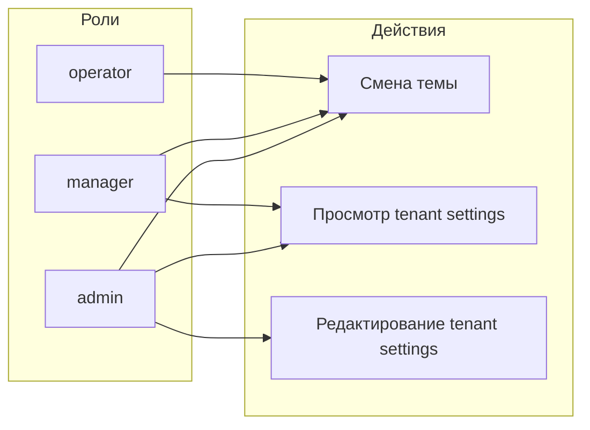

# Ограничение прав менеджера на настройки

**Дата:** 25.07.2026  
**Статус:** planned  
**Контекст:** Role-based доступ к странице «Настройки» — менеджер не должен изменять параметры интеграций (токены и т.п.), только просматривать их и менять тему приложения

## Цель

Разделить права на tenant-настройки:

- **manager** — read-only просмотр интеграций + полный доступ к смене темы;
- **admin** — просмотр и редактирование всех tenant-настроек;
- **operator** — только блок «Оформление» (тема), без доступа к интеграциям.

## Текущее состояние

Сейчас gate `manage-settings` в [`AuthServiceProvider.php`](../../app/Providers/AuthServiceProvider.php) разрешает **и просмотр, и сохранение** для ролей `admin` и `manager`:

```php
Gate::define('manage-settings', fn ($user) =>
    $user->isTenantUser() && in_array($user->role, ['admin', 'manager'])
);
```

[`TenantSettingController::index()`](../../app/Http/Controllers/TenantSettingController.php) использует этот gate для загрузки schema/current и передаёт один флаг `canManageSettings`. На фронте [`Settings/Index.vue`](../../resources/js/Pages/Settings/Index.vue) при `canManageSettings=true` рендерится полностью редактируемая форма с кнопкой «Сохранить».

Тема уже доступна всем ролям через `PATCH /settings/theme` без gate — менять не нужно.

## Целевая модель прав



| Роль | Тема | Просмотр интеграций | Редактирование |
|------|------|---------------------|----------------|
| operator | да | нет | нет |
| manager | да | да (read-only) | нет |
| admin | да | да | да |

## Задачи реализации

### 1. Разделить gates на backend

**Файл:** [`AuthServiceProvider.php`](../../app/Providers/AuthServiceProvider.php)

- Добавить gate `view-settings` — `admin` + `manager`
- Изменить `manage-settings` — **только** `admin`

```php
Gate::define('view-settings', fn ($user) =>
    $user->isTenantUser() && in_array($user->role, ['admin', 'manager'])
);

Gate::define('manage-settings', fn ($user) =>
    $user->isTenantUser() && $user->role === 'admin'
);
```

Методы `update()` и `generateWebhookSecret()` уже вызывают `Gate::authorize('manage-settings')` — после изменения gate менеджер автоматически получит 403 на POST-запросы.

### 2. Обновить контроллер настроек

**Файл:** [`TenantSettingController.php`](../../app/Http/Controllers/TenantSettingController.php)

В `index()`:

- Заменить `$canManage = Gate::check('manage-settings')` на два флага:
  - `$canView = Gate::check('view-settings')` — загрузка `$stored`, schema, current, secretPreviews
  - `$canEdit = Gate::check('manage-settings')`
- Передавать в Inertia:
  - `canViewSettings` (bool)
  - `canEditSettings` (bool)
- Убрать prop `canManageSettings` (breaking change только внутри одной Vue-страницы)

Логика загрузки данных:

```php
$stored = $canView
    ? TenantSetting::withoutGlobalScopes()->where('tenant_id', $tenantId)->pluck('value', 'key')->toArray()
    : [];

'schema' => $canView ? static::schema() : [],
```

`updateTheme()` — без изменений.

### 3. Read-only UI для менеджера

**Файл:** [`Settings/Index.vue`](../../resources/js/Pages/Settings/Index.vue)

Props: заменить `canManageSettings` на `canViewSettings` + `canEditSettings`.

Изменения в шаблоне:

- Блок tenant settings: `v-if="canViewSettings"` вместо `canManageSettings`
- Добавить бейдж «Только просмотр» над формой, когда `canViewSettings && !canEditSettings`
- Все inputs / select / textarea: `:disabled="!canEditSettings || readOnly"`
- Toggle-переключатели: `@click` только при `canEditSettings`, иначе `disabled` стиль
- Кнопка «Сохранить настройки» и «Сгенерировать» (webhook): `v-if="canEditSettings"`
- Функции `save()` и `generateSecret()`: early return если `!canEditSettings`

Блок «Оформление» (тема) остаётся без ограничений по роли — доступен всем авторизованным.

### 4. Убрать мёртвый код в layout

**Файл:** [`AppLayout.vue`](../../resources/js/Layouts/AppLayout.vue)

Computed `canManageSettings` объявлен, но **не используется** в шаблоне (ссылка ⚙ видна всем). Удалить неиспользуемый computed — без изменения поведения навигации.

### 5. Feature-тесты

**Новый файл:** [`SettingsAccessTest.php`](../../tests/Feature/SettingsAccessTest.php)

Паттерн создания пользователей — как в [`OrderDestroyTest.php`](../../tests/Feature/OrderDestroyTest.php) (`createActiveTenantUser($role)`).

| Тест | Роль | Запрос | Ожидание |
|------|------|--------|----------|
| operator sees only theme | operator | GET `/settings` | 200, Inertia props: `canViewSettings=false`, `canEditSettings=false`, пустой `schema` |
| manager sees read-only settings | manager | GET `/settings` | 200, `canViewSettings=true`, `canEditSettings=false`, непустой `schema` |
| admin sees editable settings | admin | GET `/settings` | 200, оба флага `true` |
| manager cannot save | manager | POST `/settings` | 403 |
| manager cannot generate webhook | manager | POST `/settings/generate-webhook-secret` | 403 |
| admin can save | admin | POST `/settings` | redirect/success |
| all roles can change theme | operator/manager/admin | PATCH `/settings/theme` | 200 |

В `setUp()` отключить CSRF middleware (как в других feature-тестах).

## Затронутые файлы

| Файл | Изменение |
|------|-----------|
| [`AuthServiceProvider.php`](../../app/Providers/AuthServiceProvider.php) | gates `view-settings` и `manage-settings` |
| [`TenantSettingController.php`](../../app/Http/Controllers/TenantSettingController.php) | props `canViewSettings` / `canEditSettings` |
| [`Settings/Index.vue`](../../resources/js/Pages/Settings/Index.vue) | read-only UI для менеджера |
| [`AppLayout.vue`](../../resources/js/Layouts/AppLayout.vue) | удалить неиспользуемый computed |
| [`SettingsAccessTest.php`](../../tests/Feature/SettingsAccessTest.php) | новый файл с тестами |

## Зависимости и риски

- **Безопасность:** главная защита — gate `manage-settings` только для admin; UI read-only — дополнительный слой
- **Маскировка секретов:** уже реализована в `buildCurrentForUi()` / `maskSecret()` — менеджер не получит полные токены
- **Подписка read-only:** `readOnly` из `useSubscription()` продолжит блокировать сохранение у admin при истёкшем trial; для менеджера блокировка дублируется через `canEditSettings=false`
- **Документация:** опционально обновить комментарий в [`dark-theme.md`](dark-theme.md) (строка про «admin/manager — полные tenant-настройки»)

## Критерии приёмки

- [ ] Менеджер может менять тему
- [ ] Менеджер видит параметры tenant settings (маски секретов, без полных токенов)
- [ ] Менеджер не может сохранить изменения через UI
- [ ] `POST /settings` и `POST /settings/generate-webhook-secret` возвращают 403 для менеджера
- [ ] Администратор сохраняет полный доступ на редактирование
- [ ] Оператор по-прежнему видит только блок «Оформление»
- [ ] `php artisan test --filter=SettingsAccessTest` проходит

## Проверка после реализации

1. Войти как `manager@crm.by` — видны карточки интеграций без кнопки «Сохранить», тема переключается
2. Войти как admin — полная форма с сохранением
3. Войти как operator — только блок «Оформление»
4. `php artisan test --filter=SettingsAccessTest`
