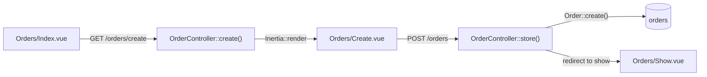

# Ручное создание заказа — Вариант B

**Дата:** 27.06.2026  
**Статус:** planned  
**Контекст:** Фаза 1 — дополнение к CRUD заказов в Laravel hosting

## Цель

Добавить возможность создавать заказ вручную через отдельную страницу `Orders/Create.vue`. После сохранения — редирект на карточку нового заказа.

## Затронутые файлы

| Файл | Изменение |
|------|-----------|
| [`hosting/app/Http/Controllers/OrderController.php`](../app/Http/Controllers/OrderController.php) | методы `create()` и `store()` |
| [`hosting/routes/web.php`](../routes/web.php) | маршруты `GET /orders/create`, `POST /orders` |
| [`hosting/resources/js/Pages/Orders/Create.vue`](../resources/js/Pages/Orders/Create.vue) | новый компонент |
| [`hosting/resources/js/Pages/Orders/Index.vue`](../resources/js/Pages/Orders/Index.vue) | кнопка «+ Новый заказ» |

## Поток данных



## Реализация

### 1. Маршруты — `routes/web.php`

Добавить **перед** `Route::get('/{order}', ...)`, чтобы `/create` не перехватывался как `{order}`:

```php
Route::get('/create', [OrderController::class, 'create'])->name('create');
Route::post('/',      [OrderController::class, 'store'])->name('store');
```

### 2. Контроллер — `OrderController.php`

**`create()`** — рендерит страницу, передаёт статусы и список товаров:

```php
public function create(): Response
{
    return Inertia::render('Orders/Create', [
        'statuses' => Order::STATUSES,
        'products' => Product::orderBy('name')->get(['id', 'name', 'stock']),
    ]);
}
```

**`store()`** — валидирует, создаёт заказ, редиректит на карточку:

```php
public function store(Request $request)
{
    $data = $request->validate([
        'full_name'  => ['required', 'string', 'max:255'],
        'phone'      => ['nullable', 'string', 'max:20'],
        'status'     => ['required', 'in:' . implode(',', Order::STATUSES)],
        'goods'      => ['nullable', 'array'],
        'quantities' => ['nullable', 'array'],
        'prices'     => ['nullable', 'array'],
        'city'       => ['nullable', 'string', 'max:100'],
        'street'     => ['nullable', 'string', 'max:100'],
        'building'   => ['nullable', 'string', 'max:20'],
        'housing'    => ['nullable', 'string', 'max:20'],
        'apartment'  => ['nullable', 'string', 'max:20'],
        'source'     => ['nullable', 'string', 'max:50'],
        'sms_log'    => ['nullable', 'string', 'max:1000'],
    ]);

    $data['tenant_id'] = Auth::user()->tenant_id;
    $data['source'] ??= 'manual';

    $order = Order::create($data);

    return redirect()->route('orders.show', $order)
        ->with('message', 'Заказ создан.');
}
```

### 3. Страница `Orders/Create.vue`

Структура идентична `Show.vue`, три секции:

- **Клиент** — `full_name` (required), `phone`, `source`, `status` (default «Позвонить»), `sms_log` (комментарий)
- **Адрес** — `city`, `street`, `building`, `housing`, `apartment`
- **Товары** — динамические строки: select из `products`, `quantities`, `prices`; кнопка «+ Добавить товар»

Использует `useForm` из `@inertiajs/inertia-vue3`, сабмит `form.post('/orders')`. Кнопка «Отмена» — `Inertia.get('/orders')`.

### 4. Кнопка в `Orders/Index.vue`

В шапку рядом с «Импорт CSV»:

```html
<Link href="/orders/create" class="btn-primary text-sm">+ Новый заказ</Link>
```

## Чеклист реализации

- [ ] Добавить `GET /orders/create` и `POST /orders` в `routes/web.php` (перед `/{order}`)
- [ ] Добавить методы `create()` и `store()` в `OrderController.php`
- [ ] Создать `resources/js/Pages/Orders/Create.vue` с тремя секциями
- [ ] Добавить кнопку «+ Новый заказ» в `Orders/Index.vue`

## Критерии приёмки

- Оператор может открыть `/orders/create` и создать заказ с минимумом: ФИО + телефон
- Заказ создаётся с `tenant_id` текущего пользователя и `source = manual` по умолчанию
- После сохранения — редирект на `/orders/{id}` с flash «Заказ создан»
- Маршрут `/orders/create` не конфликтует с `/{order}`

## Связанные документы

- [`migration-plan.md`](../migration-plan.md) — общий план миграции
- [`hosting/app/Http/Controllers/WebhookController.php`](../app/Http/Controllers/WebhookController.php) — автоматическое создание заказов с сайта
