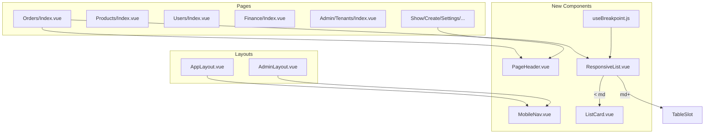

# Адаптив под мобильные устройства и планшеты (вариант B)

**Дата:** 29.07.2026  
**Статус:** implemented  
**Контекст:** Laravel 8 + Inertia.js + Vue 3 + Tailwind CSS 3 — фронтенд CRM ([`AppLayout.vue`](../../resources/js/Layouts/AppLayout.vue), списки заказов/товаров/пользователей)

## Цель

Поэтапное внедрение адаптива для работы менеджеров с телефона и планшета:

- **Burger-menu** в лейаутах (без bottom navigation)
- **Card-view** для списков на экранах `< md` (768px)
- Переиспользуемые UI-компоненты (`MobileNav`, `PageHeader`, `ResponsiveList`, `ListCard`)

**Out of scope:** PWA, split-view master-detail, изменения API/контроллеров.

## Подтверждённые решения

| Решение | Выбор |
|---------|-------|
| UX-вариант | B (прагматичный) |
| Навигация | Burger-menu + drawer |
| Списки на mobile | Card-view |
| Bottom navigation | Нет |

## Breakpoints (Tailwind defaults)

| Устройство | Breakpoint | Поведение |
|------------|------------|-----------|
| Mobile | `< md` (< 768px) | card-view, burger-menu |
| Tablet | `md–lg` (768–1023px) | таблицы допустимы, layout и headers адаптированы |
| Desktop | `≥ lg` (≥ 1024px) | текущий вид без деградации |

---

## Архитектура



---

## Фаза 0. Foundation (1 день)

### 0.1 Design tokens и utilities

**Файлы:** [`tailwind.config.js`](../../tailwind.config.js), [`resources/css/app.css`](../../resources/css/app.css)

Добавить utility-классы (не ломая desktop):

```css
.card-compact { @apply p-4 md:p-6; }
.touch-target { @apply min-h-[44px] min-w-[44px]; }
.nav-drawer { /* overlay + panel styles */ }
.list-card { /* border, rounded, tap highlight */ }
```

Обновить `.card` — опционально сделать padding responsive: `p-4 md:p-6` (или оставить `.card` как есть и использовать `.card-compact` точечно).

### 0.2 Composable `useBreakpoint`

**Файл:** `resources/js/composables/useBreakpoint.js`

- `matchMedia('(min-width: 768px)')` → `isMdUp`
- Реактивное обновление на `resize`
- Используется в `ResponsiveList` и при необходимости в страницах (не для nav — nav через CSS `md:hidden` / `hidden md:flex`)

### 0.3 Baseline QA

Скриншоты/ручная проверка на 375px, 768px, 1280px для: Orders, Show, Login.

---

## Фаза 1. Burger-menu и layouts (2 дня) — P0

### 1.1 Компонент `MobileNav.vue`

**Файл:** `resources/js/Components/MobileNav.vue`

**Props/slots:**

- `links: Array<{ href, label, active?, visible? }>`
- `shopName` / title
- Slot `actions` — settings, users, logout

**Поведение:**

- Кнопка burger: `md:hidden`, `touch-target`, `aria-expanded`, `aria-label="Меню"`
- Overlay (`fixed inset-0 z-40 bg-black/40`) + drawer слева (`w-72 max-w-[85vw]`)
- Закрытие: клик overlay, Esc, переход Inertia (`router.on('navigate', close)`)
- Блокировка scroll body при открытом drawer
- Активный пункт: тот же стиль, что desktop nav (`text-white` vs `text-indigo-300`)
- Role-based links: `canViewFinances`, `isAdmin` — props от layout

### 1.2 Рефакторинг `AppLayout.vue`

**Файл:** [`resources/js/Layouts/AppLayout.vue`](../../resources/js/Layouts/AppLayout.vue)

Текущая проблема — горизонтальное меню без адаптива (5+ ссылок в одну строку).

**Изменения:**

- Desktop nav: обернуть links в `hidden md:flex items-center gap-5`
- Mobile: `<MobileNav>` с burger + drawer
- User block: на mobile — имя, settings, users, logout внутри drawer; на desktop — текущий вид (`hidden sm:inline` для имени сохранить)
- Logo/title на mobile: слева в header bar (клик → `/orders`)

### 1.3 Рефакторинг `AdminLayout.vue`

**Файл:** [`resources/js/Layouts/AdminLayout.vue`](../../resources/js/Layouts/AdminLayout.vue)

- Аналогичный паттерн: 1 nav link «Тенанты» + logout в drawer
- Минимальный diff — переиспользовать `MobileNav`

**AC:**

- На 375px все разделы доступны без горизонтального скролла страницы
- Drawer закрывается после навигации
- Desktop layout не изменился визуально

---

## Фаза 2. PageHeader (1 день) — P0

### 2.1 Компонент `PageHeader.vue`

**Файл:** `resources/js/Components/PageHeader.vue`

```vue
<div class="flex flex-col gap-3 md:flex-row md:items-center md:justify-between">
  <div class="min-w-0"><slot name="title" /></div>
  <div class="flex flex-wrap gap-2 md:justify-end"><slot name="actions" /></div>
</div>
```

### 2.2 Страницы для миграции

| Страница | Приоритет | Проблема сейчас |
|----------|-----------|-----------------|
| [`Orders/Index.vue`](../../resources/js/Pages/Orders/Index.vue) | P0 | 5+ кнопок в одной строке |
| [`Orders/Show.vue`](../../resources/js/Pages/Orders/Show.vue) | P0 | title + badges + edit/delete |
| [`Orders/Create.vue`](../../resources/js/Pages/Orders/Create.vue) | P0 | back + cancel + save |
| [`Orders/Import.vue`](../../resources/js/Pages/Orders/Import.vue) | P1 | header actions |
| [`Belpost/Batch.vue`](../../resources/js/Pages/Belpost/Batch.vue) | P1 | complex header |
| [`Products/Index.vue`](../../resources/js/Pages/Products/Index.vue) | P1 | title + add button |
| [`Users/Index.vue`](../../resources/js/Pages/Users/Index.vue) | P1 | title + add button |
| [`Finance/Index.vue`](../../resources/js/Pages/Finance/Index.vue) | P1 | уже `flex-wrap` — унифицировать |
| [`Settings/Index.vue`](../../resources/js/Pages/Settings/Index.vue) | P2 | простой header |

---

## Фаза 3. ResponsiveList + Card-view (4–5 дней) — P0/P1

### 3.1 Базовые компоненты

**`ResponsiveList.vue`** — `resources/js/Components/ResponsiveList.vue`

```vue
<!-- md+ : slot table; < md : slot cards -->
<div class="hidden md:block"><slot name="table" /></div>
<div class="md:hidden space-y-3"><slot name="cards" /></div>
```

CSS-only переключение (без JS) — проще и без flash при SSR/hydration.

**`ListCard.vue`** — `resources/js/Components/ListCard.vue`

- Props: `clickable`, `@click`
- Стили: `list-card`, hover/active states, dark mode
- Slot для контента карточки

### 3.2 Orders/Index — card-view (P0)

**Файл:** [`resources/js/Pages/Orders/Index.vue`](../../resources/js/Pages/Orders/Index.vue)

**Desktop (`md+`):** существующая TanStack table без изменений.

**Mobile card layout** (на `< md`):

```
┌─────────────────────────────────┐
│ #12345          [StatusSelect]  │
│ Иванов Иван Иванович            │
│ +375 29 123-45-67 · Минск       │
│ Товары: Крем +2                 │
│ 29.07.26 · Белпочта · TR123     │
└─────────────────────────────────┘
```

**Поля карточки:** id, status (с `OrderStatusSelect`), full_name, phone (`tel:` link), city, goods, created_at, track_number, delivery_type. Delete — кнопка только если `canDeleteOrder`, иконка справа с `@click.stop`.

**Pagination:** на mobile — компактнее (только prev/next + «стр. N из M»), сохранить существующие Inertia links.

**Filters:** уже `grid-cols-1 sm:grid-cols-2 lg:grid-cols-4` — OK.

### 3.3 Products/Index — card-view (P1)

**Файл:** [`resources/js/Pages/Products/Index.vue`](../../resources/js/Pages/Products/Index.vue)

Mobile card:

- Название (bold)
- Строки: Вес, На складе, Продано, Выручка
- Inline edit на mobile: tap «Изменить» → раскрытие полей внутри карточки (переиспользовать логику `editing === product.id`)

Stats row: уже `grid-cols-2 sm:grid-cols-4` — OK.

### 3.4 Users/Index — card-view (P1)

**Файл:** [`resources/js/Pages/Users/Index.vue`](../../resources/js/Pages/Users/Index.vue)

Mobile card:

- Имя + badge роли
- Email
- Дата добавления
- Actions: «Изменить» / «Удалить» — `flex gap-2`, full-width buttons на `< sm`

### 3.5 Finance/Index — card-view (P2)

**Файл:** [`resources/js/Pages/Finance/Index.vue`](../../resources/js/Pages/Finance/Index.vue)

Две секции (расходы/доходы): на mobile каждая запись — card с date, category badge, description, amount, delete.

Summary cards: `col-span-2` на profit — проверить на 375px.

### 3.6 Admin/Tenants/Index — card-view (P2)

**Файл:** [`resources/js/Pages/Admin/Tenants/Index.vue`](../../resources/js/Pages/Admin/Tenants/Index.vue)

Mobile card per tenant:

- Company name
- Status select (full width)
- Trial datetime input
- Stats: users_count, orders_count
- Admin email

### 3.7 Прочие таблицы (scroll fallback)

Страницы без card-view в первой итерации — улучшенный horizontal scroll:

- [`Europochta/Create.vue`](../../resources/js/Pages/Europochta/Create.vue)
- [`Belpost/Batch.vue`](../../resources/js/Pages/Belpost/Batch.vue) — внутренние таблицы

Паттерн: `overflow-x-auto -mx-4 px-4 md:mx-0`, compact cell padding `px-2 py-2 md:px-4 md:py-3`.

---

## Фаза 4. Формы и детальные страницы (2 дня) — P1

### 4.1 Orders Show / Create

**Файлы:** [`Orders/Show.vue`](../../resources/js/Pages/Orders/Show.vue), [`Orders/Create.vue`](../../resources/js/Pages/Orders/Create.vue)

- Header → `PageHeader`
- `grid-cols-2` без prefix → `grid-cols-1 sm:grid-cols-2` (address fields, product qty)
- Sidebar (`lg:col-span-1`) — на tablet stack под main (`grid-cols-1 lg:grid-cols-3` уже есть)

### 4.2 Settings

**Файл:** [`Settings/Index.vue`](../../resources/js/Pages/Settings/Index.vue)

- `theme-segment`: на `< sm` — `flex flex-col` или horizontal scroll `overflow-x-auto`
- API token row с `whitespace-nowrap` button → wrap на mobile

### 4.3 Modals

**Файлы:** [`AddressSearchModal.vue`](../../resources/js/Components/AddressSearchModal.vue), [`DeleteOrderModal.vue`](../../resources/js/Components/DeleteOrderModal.vue)

- Проверить `max-h-[90vh] overflow-y-auto`, `mx-4` на 320px
- Кнопки modal footer: `flex-col-reverse sm:flex-row gap-2` (primary сверху на mobile)

### 4.4 Dropdowns

**Файл:** [`useDropdownPosition.js`](../../resources/js/composables/useDropdownPosition.js) — уже учитывает viewport; проверить `OrderStatusSelect` в card-view (не обрезается `overflow-hidden` на card container — использовать `overflow-visible` на card wrapper).

---

## Фаза 5. Tablet polish (1 день) — P1

| Область | Изменение |
|---------|-----------|
| Belpost/Batch | `grid-cols-1 md:grid-cols-2 lg:grid-cols-3` вместо `lg:grid-cols-3` only |
| Finance summary | profit card: `col-span-2 sm:col-span-1` на tablet |
| Orders filters | `md:grid-cols-2 lg:grid-cols-4` |
| Touch spacing | gap-3 minimum между интерактивными элементами |

---

## Фаза 6. QA и приёмка (1–2 дня)

### Manual test matrix

| Viewport | Страницы |
|----------|----------|
| 320px | Orders list cards, drawer, Show, Create, Login |
| 375px | Products, Users, Settings |
| 768px | Переключение table/cards на границе md |
| 1024px+ | Regression desktop |

### Acceptance Criteria

| ID | Критерий |
|----|----------|
| AC-1 | Нет горизонтального скролла страницы на `< md` (кроме намеренного scroll в Belpost/Europochta tables) |
| AC-2 | Burger-menu: все разделы + logout доступны |
| AC-3 | Orders: card tappable, status change работает без перехода на Show |
| AC-4 | Page headers: actions не обрезаются, переносятся на новую строку |
| AC-5 | Forms Create/Show: поля full-width на mobile |
| AC-6 | Dark mode корректен на drawer и cards |
| AC-7 | Desktop `≥ lg` визуально идентичен текущему |

### Риски

| Риск | Митигация |
|------|-----------|
| Дублирование разметки table/cards | Общие formatters (`formatDate`, `formatGoods`) уже в Orders/Index — вынести в card template, не дублировать логику |
| OrderStatusSelect click vs card click | `@click.stop` на select wrapper |
| Drawer + Inertia | Close on navigate via Inertia event listener |
| Card container overflow | `overflow-visible` на list cards |

---

## Порядок PR (рекомендуемый)

1. **PR-1:** Foundation + MobileNav + AppLayout/AdminLayout
2. **PR-2:** PageHeader + миграция headers (Orders, Show, Create)
3. **PR-3:** ResponsiveList + Orders/Index card-view
4. **PR-4:** Products + Users card-view
5. **PR-5:** Forms polish + Finance/Admin cards + QA fixes

**Оценка:** ~2.5–3 недели (1 frontend-разработчик).

---

## Файлы — сводка

**Новые:**

- `resources/js/Components/MobileNav.vue`
- `resources/js/Components/PageHeader.vue`
- `resources/js/Components/ResponsiveList.vue`
- `resources/js/Components/ListCard.vue`
- `resources/js/composables/useBreakpoint.js`

**Изменяемые (основные):**

- `resources/js/Layouts/AppLayout.vue`
- `resources/js/Layouts/AdminLayout.vue`
- `resources/css/app.css`
- `tailwind.config.js`
- `resources/js/Pages/Orders/Index.vue` (+ Show, Create, Import)
- `resources/js/Pages/Products/Index.vue`
- `resources/js/Pages/Users/Index.vue`
- `resources/js/Pages/Finance/Index.vue`
- `resources/js/Pages/Admin/Tenants/Index.vue`

**Backend:** без изменений.

---

## Чеклист задач

- [x] Фаза 0: app.css utilities, tailwind tokens, useBreakpoint composable, baseline screenshots¹
- [x] Фаза 1: MobileNav.vue + рефакторинг AppLayout.vue и AdminLayout.vue (burger drawer, role-based links)
- [x] Фаза 2: PageHeader.vue + миграция headers на Orders/Show/Create и остальных страницах
- [x] Фаза 3a: ResponsiveList.vue + ListCard.vue — базовые компоненты переключения table/cards
- [x] Фаза 3b: Orders/Index card-view (P0) с OrderStatusSelect, pagination, delete action
- [x] Фаза 3c: Card-view для Products/Index, Users/Index, Finance/Index, Admin/Tenants/Index
- [x] Фаза 4: Forms (Show/Create/Settings), modals, grid-cols fixes, dropdown overflow
- [x] Фаза 5–6: Tablet polish, scroll fallback для Belpost/Europochta, `npm run production` без ошибок²

¹ Скриншотное baseline QA не выполнялось (нет доступа к браузеру в среде агента) — рекомендуется ручная проверка на реальных устройствах/DevTools перед релизом.
² Ручная проверка по матрице 320/375/768/1024px (Фаза 6) требует браузера — см. AC-1–AC-7 выше как чеклист для QA.
