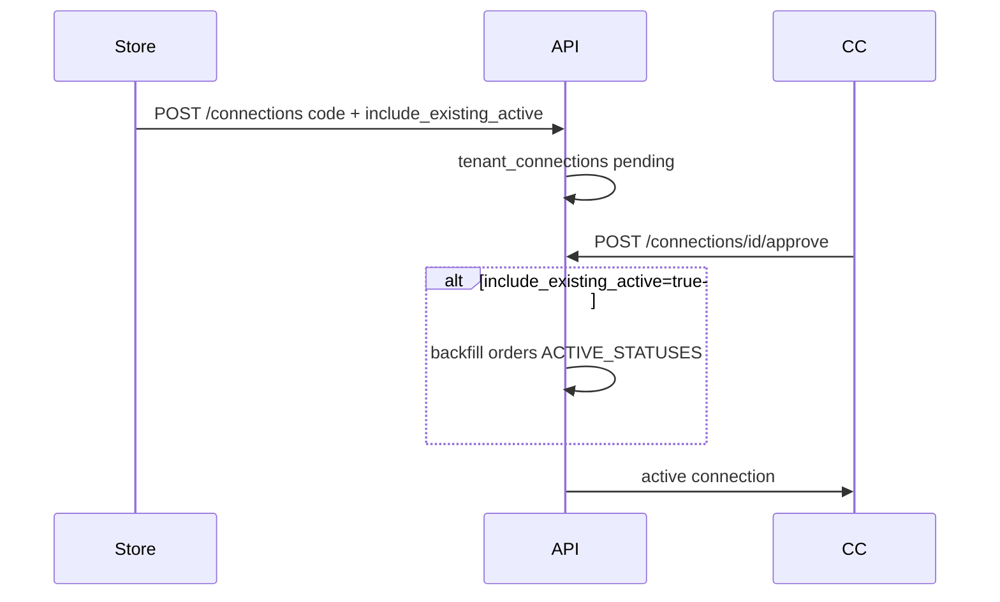

# Доработки формы заказа: ФИО, валидация, дубли, КЦ, UI товаров

**Дата:** 09.08.2026  
**Статус:** implemented  
**Контекст:** Шесть доработок Laravel-приложения по результатам анализа текущей реализации в `hosting/`. Google Sheets (`backend/`) не затрагиваем.

## Цель

1. **ФИО для Белпочты** — минимум 2 слова (фамилия + имя), не 3.
2. **Alert обязательных полей** — ФИО, телефон, товар: подсказка до submit + backend-валидация.
3. **Подключение КЦ** — выбор: только новые заказы или все **активные** на момент подключения.
4. **Телефон для бланка Белпочты** — явная проверка формата `375XXXXXXXXX`.
5. **Дубль по телефону** — бейдж «Дубль» **возле телефона**, без смены статуса.
6. **Строка товара** — длинное название не переносит крестик удаления на вторую строку.

## Согласованные решения

- **Дубль** — сравнение по последним 9 цифрам телефона; только с заявками в **активных** статусах; бейдж рядом с телефоном.
- **КЦ backfill** — при выборе «все активные» передаются только заказы в активных статусах, не закрытые и не почтовые.
- **ФИО** — «Иванов Иван» достаточно; отчество опционально.

---

## Общая константа активных статусов

Добавить в [`app/Models/Order.php`](../app/Models/Order.php):

```php
public const ACTIVE_STATUSES = [
    'Позвонить', 'Перезвонить', 'Недозвон', 'Недозвон1', 'Недозвон2',
    'Сомнения', 'Отдал заявку', 'Заказать', 'Подтвержден', 'Отправить',
];
```

Используется в задачах 3 и 5. Unit-тест в [`tests/Unit/OrderStatusesTest.php`](../tests/Unit/OrderStatusesTest.php).

---

## Задача 1 — ФИО: 2 слова для Белпочты

### Backend

- Переименовать [`app/Rules/FullNameThreeParts.php`](../app/Rules/FullNameThreeParts.php) → `FullNameTwoParts.php`: `count($parts) < 2`, сообщение: *«Укажите фамилию и имя через пробел (требование Белпочты)»*
- Обновить импорты в [`OrderController.php`](../app/Http/Controllers/OrderController.php) (`store`, `update`) и [`BelpostController.php`](../app/Http/Controllers/BelpostController.php) (`processOrder`)
- [`BelpostService::splitFio()`](../app/Services/BelpostService.php) — без изменений (`second_name = ''` допустимо для API)

### Frontend

- [`resources/js/utils/phone.js`](../resources/js/utils/phone.js) — `isFullNameComplete`: `parts.length >= 2`
- [`Create.vue`](../resources/js/Pages/Orders/Create.vue) и [`Show.vue`](../resources/js/Pages/Orders/Show.vue) — подпись: *«Фамилия и имя через пробел (требование Белпочты)»*, placeholder: `Иванов Иван`

### Тесты

- Новый [`tests/Unit/FullNameTwoPartsTest.php`](../tests/Unit/FullNameTwoPartsTest.php): «Иванов Иван» — ok, «Иванов» — fail, «И Иванов» — fail (< 2 символов)

---

## Задача 2 — Alert при незаполнении обязательных полей

### Frontend (alert + подсветка до submit)

Файлы: [`Create.vue`](../resources/js/Pages/Orders/Create.vue), [`Show.vue`](../resources/js/Pages/Orders/Show.vue)

В `submit()` / `saveEdit()` — client-side проверка **до** POST:

1. `full_name` — непустое
2. `phone` — непустое
3. `goods` — хотя бы один элемент с непустым названием

При ошибке: `alert('Заполните обязательные поля: …')` + CSS-класс `border-red-400` на соответствующих полях (ref или локальный `validationErrors`).

Belpost address picker (`pickerRef.validate()`) — оставить как есть, вызывать после базовых проверок.

### Backend (согласованность)

[`OrderController.php`](../app/Http/Controllers/OrderController.php) — `store` и `update`:

- `'phone' => ['required', 'string', 'max:20', new BelarusPhone]` (см. задачу 4)
- `'full_name' => [..., new FullNameTwoParts]`
- Custom rule `HasAtLeastOneGood` — массив `goods` содержит ≥1 непустую строку

Новый файл: [`app/Rules/HasAtLeastOneGood.php`](../app/Rules/HasAtLeastOneGood.php)

### Тесты

- Новый `OrderValidationTest.php` или расширение существующих: POST без phone/goods → 422

---

## Задача 3 — КЦ: выбор «только новые» / «все активные»



### БД

Новая миграция: `tenant_connections.include_existing_active` (boolean, default `false`)

Обновить [`TenantConnection.php`](../app/Models/TenantConnection.php) — `$fillable`, `$casts`

### Backend

- [`ConnectionController::store`](../app/Http/Controllers/ConnectionController.php) — принять `include_existing_active: boolean`
- [`ConnectionService::requestConnection`](../app/Services/ConnectionService.php) — сохранить флаг при create/update pending
- [`ConnectionService::approve`](../app/Services/ConnectionService.php) — после `status=active`:

```php
if ($connection->include_existing_active) {
    Order::where('tenant_id', $connection->store_tenant_id)
        ->whereNull('call_center_tenant_id')
        ->whereIn('status', Order::ACTIVE_STATUSES)
        ->update(['call_center_tenant_id' => $connection->call_center_tenant_id]);
}
```

- Вынести backfill в метод `OrderAssignmentService::backfillActiveOrders(TenantConnection $connection)`

### Frontend

[`Settings/Index.vue`](../resources/js/Pages/Settings/Index.vue) — блок store (запрос подключения):

- Checkbox: *«Передать колл-центру все активные заказы»*
- Передавать `include_existing_active` в `Inertia.post('/connections', …)`
- В списке pending для КЦ — показывать выбранный режим (read-only badge)

### Тесты

- [`ConnectionApprovalTest.php`](../tests/Feature/ConnectionApprovalTest.php): создать store-orders до подключения → approve с флагом → orders получают `call_center_tenant_id`; без флага — нет

---

## Задача 4 — Валидный телефон для бланка Белпочты

### Rule

Новый [`app/Rules/BelarusPhone.php`](../app/Rules/BelarusPhone.php):

- Нормализовать через [`PhoneNormalizer::normalize()`](../app/Support/PhoneNormalizer.php)
- Valid если: ровно 12 цифр, начинается с `375`, последние 9 цифр — локальный номер (упрощённо: `strlen === 12 && str_starts_with('375')`)

Сообщение: *«Укажите корректный белорусский номер (375XXXXXXXXX)»*

Эталон формата для API Белпочты — см. [`docs/fix/phone-formatting-carrier-apis.md`](../fix/phone-formatting-carrier-apis.md).

### Применение

- `OrderController` store/update — `required + BelarusPhone`
- [`BelpostController::processOrder`](../app/Http/Controllers/BelpostController.php) — явная проверка до `createItem` (422 с понятным текстом)
- Опционально: pre-check в [`Belpost/Batch.vue`](../resources/js/Pages/Belpost/Batch.vue) — disable кнопки оформления если phone невалиден

### Тесты

- [`PhoneNormalizerTest.php`](../tests/Unit/PhoneNormalizerTest.php) + `BelarusPhoneTest.php`
- Feature: processOrder с пустым/битым phone → 422

---

## Задача 5 — Бейдж «Дубль» возле телефона

### Backend

Новый [`app/Services/OrderDuplicateService.php`](../app/Services/OrderDuplicateService.php):

```php
public function attachDuplicateFlags(Collection $orders): void
// Для каждого order: is_phone_duplicate, duplicate_of_order_id (минимальный id среди совпадений)
// Сравнение: PhoneNormalizer::lastNineDigits($phone), tenant_id, status IN ACTIVE_STATUSES, id != current
```

Batch-запрос без N+1: один SQL с `whereIn` по phone-suffixes текущей страницы.

Подключить в:

- [`OrderController::index`](../app/Http/Controllers/OrderController.php) — после paginate
- [`OrderController::show`](../app/Http/Controllers/OrderController.php) — флаги для одного заказа

**Не менять статус** заказа автоматически.

### Frontend

- [`Show.vue`](../resources/js/Pages/Orders/Show.vue): рядом с телефоном amber-badge «Дубль», tooltip/link на `duplicate_of_order_id`
- [`Index.vue`](../resources/js/Pages/Orders/Index.vue): колонка «Телефон» + мобильная карточка — тот же badge

Стиль: переиспользовать паттерн badge из «ФИО неполное» (`bg-amber-50 text-amber-700 …`).

### Тесты

- Новый [`tests/Feature/OrderDuplicateTest.php`](../tests/Feature/OrderDuplicateTest.php):
  - Два active orders, один phone → второй `is_phone_duplicate=true`
  - Первый в `Отказ` → флаг false
  - Разные форматы одного номера → дубль

---

## Задача 6 — Товар в одну строку (CSS)

Файлы: [`Show.vue`](../resources/js/Pages/Orders/Show.vue) (edit mode), [`Create.vue`](../resources/js/Pages/Orders/Create.vue)

Изменения:

- `flex flex-wrap` → `flex items-center gap-2 min-w-0` (без wrap)
- `<select>`: `flex-1 min-w-0` + `truncate`
- qty/price/delete: `shrink-0`
- Блок «Товар не найден на складе» — оставить на второй строке

---

## Порядок реализации

| Шаг | Задачи | Зависимости |
|-----|--------|-------------|
| 1 | `ACTIVE_STATUSES` + `FullNameTwoParts` + UI подписи | — |
| 2 | `BelarusPhone` + `HasAtLeastOneGood` + backend validation | шаг 1 |
| 3 | Client-side alerts в Create/Show | шаг 2 |
| 4 | `OrderDuplicateService` + UI badge | шаг 1 |
| 5 | CC migration + backfill + Settings UI | шаг 1 |
| 6 | CSS fix товаров | — |
| 7 | PHPUnit прогон | все |

---

## Acceptance Criteria

| # | Критерий |
|---|----------|
| AC-1 | «Иванов Иван» проходит валидацию; бланк Белпочты создаётся |
| AC-2 | Нельзя сохранить заказ без ФИО, телефона, товара — alert до submit + 422 на backend |
| AC-3 | При подключении КЦ с checkbox — активные pre-connection заказы видны КЦ; без checkbox — только новые |
| AC-4 | Пустой/битый phone блокирует createItem с понятной ошибкой |
| AC-5 | Новая заявка с phone, совпадающим с active — badge «Дубль» у телефона в списке и карточке |
| AC-6 | Длинное название товара не переносит крестик удаления на вторую строку |

---

## Риски

- **Backfill**: при большом числе активных заказов — один bulk UPDATE, без job (MVP достаточно)
- **Duplicate query**: на странице 50 заказов — один доп. запрос, не 50
- **BelarusPhone**: строгая проверка кодов оператора может отклонить редкие номера — начать с проверки длины 12 + prefix 375

---

## Checklist реализации

- [x] `Order::ACTIVE_STATUSES` + unit-тест
- [x] `FullNameTwoParts` rule + UI подписи + `isFullNameComplete`
- [x] `BelarusPhone` + `HasAtLeastOneGood` rules
- [x] Client-side alerts в Create/Show
- [x] Migration `include_existing_active` + backfill + Settings checkbox
- [x] `OrderDuplicateService` + badge в Index/Show
- [x] CSS fix строки товара
- [x] Feature/unit тесты
