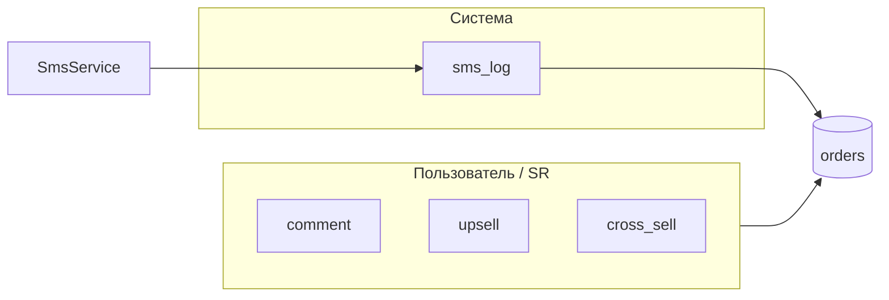

# Заметки заказа, SMS-лог, URL товаров

**Дата:** 05.08.2026  
**Статус:** planned  
**Контекст:** Карточка заказа — комментарий, апсейл, кроссейл; нормализация ссылок на товары

## Цель

1. Вынести заметки заказа в отдельные колонки БД (`comment`, `upsell`, `cross_sell`).
2. Оставить `sms_log` только для автоматических SMS-событий (read-only в UI).
3. Показать и редактировать заметки в создании и карточке заказа.
4. Сохранять URL товаров без обязательного `https://` (автодобавление схемы).
5. Улучшить отображение ссылки на страницу товара (иконка + обрезанный URL).

## Проблема

Сейчас поле `sms_log` в [`Order.php`](../../app/Models/Order.php) используется для всего сразу:

- ручной комментарий при создании ([`Create.vue`](../../resources/js/Pages/Orders/Create.vue));
- SR-sync ([`SyncSalesRenderJob.php`](../../app/Jobs/SyncSalesRenderJob.php));
- SMS-события ([`SmsService.php`](../../app/Services/SmsService.php)).

В карточке [`Show.vue`](../../resources/js/Pages/Orders/Show.vue) заметки не отображаются и не редактируются.

В Google Sheets ограничения таблицы заставляли хранить SMS в том же поле, что и комментарий. В Laravel-приложении этих ограничений нет.

## Целевая модель данных



| Поле | Кто пишет | UI |
|------|-----------|-----|
| `comment` | пользователь, SR-sync | редактируемое |
| `upsell` | пользователь, SR-sync | редактируемое |
| `cross_sell` | пользователь | редактируемое |
| `sms_log` | только `SmsService` | read-only |

## Затронутые файлы

| Файл | Изменение |
|------|-----------|
| `database/migrations/2026_08_05_000001_add_order_note_fields_to_orders_table.php` | новая миграция + data split |
| [`app/Models/Order.php`](../../app/Models/Order.php) | `$fillable`, `CALL_CENTER_EDITABLE_FIELDS` |
| [`app/Http/Controllers/OrderController.php`](../../app/Http/Controllers/OrderController.php) | validation `store` / `update` |
| [`app/Jobs/SyncSalesRenderJob.php`](../../app/Jobs/SyncSalesRenderJob.php) | `comment` + `upsell` вместо `sms_log` |
| [`app/Support/UrlNormalizer.php`](../../app/Support/UrlNormalizer.php) | новый класс |
| [`app/Http/Controllers/ProductController.php`](../../app/Http/Controllers/ProductController.php) | normalize `page_url` до validate |
| [`resources/js/Pages/Orders/Create.vue`](../../resources/js/Pages/Orders/Create.vue) | секция «Заметки» (3 поля) |
| [`resources/js/Pages/Orders/Show.vue`](../../resources/js/Pages/Orders/Show.vue) | секция «Заметки» + SMS read-only |
| [`resources/js/Pages/Products/Index.vue`](../../resources/js/Pages/Products/Index.vue) | input type, отображение ссылки |
| [`resources/js/utils/truncateLink.js`](../../resources/js/utils/truncateLink.js) | обрезка URL для UI |
| `tests/Unit/UrlNormalizerTest.php` | unit-тесты |
| `tests/Feature/OrderNoteFieldsTest.php` | feature-тесты заметок |
| [`tests/Feature/ProductPageUrlTest.php`](../../tests/Feature/ProductPageUrlTest.php) | URL без схемы |

**Без изменений:** [`SmsService.php`](../../app/Services/SmsService.php), [`WebhookController.php`](../../app/Http/Controllers/WebhookController.php).

---

## 1. Миграция БД и перенос данных

**Файл:** `database/migrations/2026_08_05_000001_add_order_note_fields_to_orders_table.php`

Добавить колонки после `source`:

```php
$table->text('comment')->nullable();
$table->text('upsell')->nullable();
$table->text('cross_sell')->nullable();
```

**Data migration** в той же миграции — разделить legacy `sms_log`:

- Паттерн SMS (из [`SmsService.php`](../../app/Services/SmsService.php)): `/^\d{2}\.\d{2}\.\d{4} - (об отправке|в отделении|5 день|10 день)$/u`
- Разбить по `, `; SMS-сегменты → остаются в `sms_log`, остальное → склеить в `comment`
- `upsell` / `cross_sell` для legacy = `null` (SR-данные, склеенные пробелом, не восстанавливаются автоматически)

---

## 2. Backend: модель и API

### `Order.php`

- Добавить в `$fillable`: `comment`, `upsell`, `cross_sell`
- В `CALL_CENTER_EDITABLE_FIELDS`: заменить `sms_log` на `comment`, `upsell`, `cross_sell`

### `OrderController.php`

**`store()`** — заменить validation:

```php
// убрать: 'sms_log' => ...
// добавить:
'comment'    => ['nullable', 'string', 'max:2000'],
'upsell'     => ['nullable', 'string', 'max:1000'],
'cross_sell' => ['nullable', 'string', 'max:1000'],
```

**`update()`** — аналогично; убрать `sms_log` из правил и из CC whitelist. Пользователь не может перезаписать SMS-лог через API.

### `SyncSalesRenderJob.php`

Заменить запись в `sms_log`:

```php
$data['comment'] = $comment ?: null;
$data['upsell']  = $upsale ?: null;
// sms_log не трогаем
```

---

## 3. Frontend: создание и карточка заказа

### `Create.vue`

- Заменить одно поле «Комментарий» (`form.sms_log`) на секцию **«Заметки»** с тремя полями:
  - Комментарий → `form.comment` (textarea)
  - Апсейл → `form.upsell` (input/textarea)
  - Кроссейл → `form.cross_sell` (input/textarea)
- Обновить `useForm` defaults

### `Show.vue`

Добавить карточку **«Заметки»** (между «Клиент» и «Адрес»):

**View mode:**

- Три поля с label + текст или «—»
- Блок **«SMS-события»** — `order.sms_log`, read-only, мелкий серый текст; скрывать секцию если пусто

**Edit mode:**

- Textarea/input для `comment`, `upsell`, `cross_sell`
- SMS-блок остаётся read-only (не в form)

**Form:**

```js
comment:    props.order.comment    ?? '',
upsell:     props.order.upsell     ?? '',
cross_sell: props.order.cross_sell ?? '',
```

Убрать `sms_log` из editable form; `saveEdit()` отправляет только три поля.

---

## 4. URL товаров: нормализация

### `UrlNormalizer.php`

По аналогии с [`PhoneNormalizer.php`](../../app/Support/PhoneNormalizer.php):

```php
public static function normalize(?string $url): ?string
{
    $url = trim((string) $url);
    if ($url === '') return null;
    if (!preg_match('~^https?://~i', $url)) {
        $url = 'https://' . $url;
    }
    return $url;
}
```

Автодобавление `https://` **только если** в строке нет `http://` или `https://` (в т.ч. при вставке из адресной строки браузера).

### `ProductController.php`

В `store()` и `update()` — merge `page_url` через `UrlNormalizer::normalize()` **до** `$request->validate(['page_url' => ['nullable', 'url', ...]])`.

### `Products/Index.vue`

- `type="url"` → `type="text"`
- placeholder: `example.com/page`
- View mode: заменить ↗ на иконку + обрезанный URL (см. п. 5)

---

## 5. Отображение ссылки на товар

### `truncateLink.js`

```js
export function truncateLinkDisplay(url, maxLength = 20) {
  const display = url.replace(/^https?:\/\//i, '')
  return display.length <= maxLength ? display : display.slice(0, maxLength) + '…'
}
```

### `Show.vue` и `Products/Index.vue`

Заменить символ ↗ на:

```html
<a :href="url" target="_blank" rel="noopener" :title="url"
   class="text-xs text-indigo-600 hover:underline inline-flex items-center gap-1">
  <svg><!-- Heroicons arrow-top-right-on-square --></svg>
  {{ truncateLinkDisplay(url) }}
</a>
```

- Видимый текст: до 20 символов + `…`
- `title`: полный URL

---

## 6. Тесты

| Тест | Что проверяет |
|------|---------------|
| `tests/Unit/UrlNormalizerTest.php` | `example.com` → `https://`, `http://`/`https://` без изменений, пустая строка → null |
| `tests/Feature/ProductPageUrlTest.php` | сохранение URL без схемы |
| `tests/Feature/OrderNoteFieldsTest.php` | store/update comment/upsell/cross_sell; CC может редактировать; `sms_log` не принимается из request |
| `tests/Unit/OrderSmsLogMigrationTest.php` (опц.) | логика split SMS vs comment |

Запуск:

```bash
php artisan test --filter=OrderNote|UrlNormalizer|ProductPageUrl
```

---

## Порядок реализации

1. Migration + data split
2. Order model + OrderController + SyncSalesRenderJob
3. Create.vue + Show.vue (заметки)
4. UrlNormalizer + ProductController + Products/Index.vue
5. truncateLink.js + ссылки в Show.vue / Products/Index.vue
6. Тесты

---

## Риски и ограничения

- **Legacy SR-записи** (comment + upsale в одном `sms_log`): попадут целиком в `comment`; upsell останется пустым до ручного редактирования
- **SmsService dedup** (`str_contains($smsLog, 'об отправке')`) продолжит работать корректно после split, т.к. в `sms_log` не будет пользовательского текста
- **Документация** ([`manual-order-create.md`](manual-order-create.md), [`internal-call-center.md`](internal-call-center.md)) — обновить после реализации

---

## Acceptance Criteria

- [ ] `comment`, `upsell`, `cross_sell` — отдельные колонки в БД
- [ ] Три поля в Create и Show (view + edit)
- [ ] `sms_log` — отдельный read-only блок; не редактируется пользователем
- [ ] SMS-сервис дописывает события, не затирая comment/upsell/cross_sell
- [ ] SR-sync пишет в `comment` и `upsell`
- [ ] Legacy migration: SMS-части отделены от комментария где возможно
- [ ] URL без `http(s)://` сохраняется с автодобавлением `https://`
- [ ] Ссылка товара: иконка + текст до 20 символов + `…`, полный URL в tooltip
