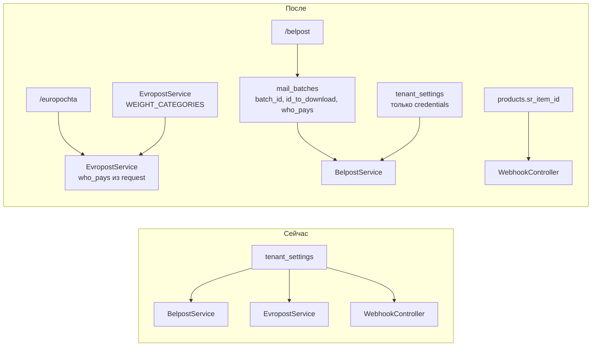

# Очистка настроек и перенос параметров доставки

**Дата:** 27.06.2026  
**Статус:** planned  
**Контекст:** Уточнение структуры `tenant_settings` после миграции с GAS — убрать runtime-поля, перенести «кто платит» на рабочие страницы, SR item ID на товар

## Цель

- Убрать из `/settings` поля, которые не являются постоянными credentials магазина
- Хранить runtime-данные партий Белпочты в `mail_batches`
- Выбор «кто платит» — на `/belpost` (при создании партии) и `/europochta` (в шапке оформления)
- Категории веса Европочты — константа в коде (только legacy JWT API)
- ID товара SalesRender — на карточке товара, не в настройках
- Webhook-секрет остаётся видимым с генерацией для внешнего лендинга

## Архитектура



---

## 1. Очистка schema настроек

**Файл:** [`hosting/app/Http/Controllers/TenantSettingController.php`](../app/Http/Controllers/TenantSettingController.php)

**Убрать из `schema()`:**

| Ключ | Причина |
|------|---------|
| `active_list` | Уже в `mail_batches.batch_id` |
| `id_to_download` | Уже в `mail_batches.id_to_download` |
| `belpost_recipient_email` | Не используется; см. п. 3 |
| `ep_weight_categories` | Перенос в код; см. п. 5 |
| `who_pays` | Перенос на UI страниц; см. п. 4 |
| `sr_default_item_id` | Перенос на товар; см. п. 6 |

**Оставить без изменений логики:**

- `webhook_secret` — видимый password + кнопка «Сгенерировать» (уже есть в [`Settings/Index.vue`](../resources/js/Pages/Settings/Index.vue))
- Обновить hint: «Вставьте в заголовок `X-Webhook-Token` на лендинге при POST на `/api/webhook/lead`»

**Итоговая группа Белпочта:** `auth_token_bp`, `elc`, `belpost_sender_email`, `shelf_life`

**Итоговая группа Европочта:** `ep_api_version`, `warehouse_id_start`, + поля API по версии (без `who_pays`)

---

## 2. Миграция данных tenant_settings

**Новый файл:** `hosting/database/migrations/2026_06_27_000013_cleanup_tenant_settings.php`

- Удалить устаревшие ключи: `active_list`, `id_to_download`, `belpost_recipient_email`, `ep_weight_categories`, `sr_default_item_id`, `who_pays`
- Не трогать `webhook_secret`

---

## 3. Белпочта — email и who_pays на партии

### 3a. Email получателя

**Файл:** [`hosting/app/Services/BelpostService.php`](../app/Services/BelpostService.php)

- Удалить чтение `belpost_recipient_email`
- В payload: `person.email` = `null` (как в [`backend/General.gs`](../../backend/General.gs))
- Оставить `belpost_sender_email` только для ecommerce → `addons.email`

### 3b. who_pays при создании партии

**Миграция:** `hosting/database/migrations/2026_06_27_000014_add_who_pays_to_mail_batches.php`

```php
$table->string('who_pays', 20)->default('Покупатель')->after('type');
```

**Модель:** [`hosting/app/Models/MailBatch.php`](../app/Models/MailBatch.php) — добавить `who_pays` в `$fillable`, константы:

```php
public const SELLER_ONLY_TYPES = ['ecommerce_light', 'ecommerce_optima'];
public const WHO_PAYS_OPTIONS = ['Покупатель', 'Продавец'];
```

**Backend:** [`BelpostController::createBatch`](../app/Http/Controllers/BelpostController.php)

- Принимать `who_pays` (`Покупатель` | `Продавец`)
- Для типов `ecommerce_light` / `ecommerce_optima` — принудительно `'Продавец'` (422 если передан «Покупатель»)
- Сохранять в `mail_batches.who_pays`

**BelpostService::createItem** — читать `$batch->who_pays` вместо `TenantSetting::get('who_pays')`

**Frontend:** [`hosting/resources/js/Pages/Belpost/Batch.vue`](../resources/js/Pages/Belpost/Batch.vue)

- Select «Кто платит за доставку» рядом с типом отправления
- При выборе `ecommerce_light` / `ecommerce_optima` — auto-set «Продавец», select disabled
- Передавать `who_pays` в `POST /belpost/batches`
- В карточке активной партии показывать `batch_id` и после commit — `id_to_download` (read-only)

---

## 4. Европочта — who_pays на вкладке оформления

**Frontend:** [`hosting/resources/js/Pages/Europochta/Create.vue`](../resources/js/Pages/Europochta/Create.vue)

- Select «Кто платит за доставку» в шапке (рядом с кнопкой «Оформить все»)
- Значение по умолчанию: «Покупатель»
- Передавать `who_pays` в body:
  - `POST /europochta/orders/{id}/register`
  - `POST /europochta/register-all`

**Backend:** [`EvropostController`](../app/Http/Controllers/EvropostController.php)

- Валидировать `who_pays`: `required|in:Покупатель,Продавец`
- Прокидывать в `EvropostService::createItem()` / `createItemNew()`

**Service:** [`hosting/app/Services/EvropostService.php`](../app/Services/EvropostService.php)

- Сигнатуры: `createItem(Order $order, int $tenantId, string $whoPays)` и `createItemNew(..., string $whoPays)`
- Убрать `TenantSetting::get('who_pays')` из обоих методов

---

## 5. Категории веса — константа (только legacy JWT)

**Файл:** [`hosting/app/Services/EvropostService.php`](../app/Services/EvropostService.php)

Заменить `resolveWeightCategory()` — читать из private const, не из настроек:

| postal_weight_id | min (г) | max (г) |
|------------------|---------|---------|
| 20 | 0 | 1000 |
| 21 | 1001 | 2000 |
| 22 | 2001 | 5000 |
| 23 | 5001 | 10000 |
| 24 | 10001 | 15000 |
| 25 | 15001 | 20000 |
| 26 | 20001 | 25000 |
| 27 | 25001 | 30000 |

- `createItemNew()` **не менять** — передаёт `'weight' => $fullWeight` напрямую (категории не нужны)
- Обновить текст ошибки: убрать упоминание «настроек»

---

## 6. SalesRender item ID на товаре

**Миграция:** `hosting/database/migrations/2026_06_27_000015_add_sr_item_id_to_products.php`

```php
$table->unsignedInteger('sr_item_id')->nullable()->after('weight');
```

**Model:** [`hosting/app/Models/Product.php`](../app/Models/Product.php) — `$fillable`, cast `sr_item_id` => integer

**Controller:** [`ProductController`](../app/Http/Controllers/ProductController.php)

- `store` / `update`: опционально `sr_item_id` (`nullable|integer|min:1`)
- `index`: передать `srEnabled` из `TenantSetting::get('sr_enabled') === '1'`

**Frontend:** [`hosting/resources/js/Pages/Products/Index.vue`](../resources/js/Pages/Products/Index.vue)

- Колонка «ID SalesRender» — только если `srEnabled`
- Поле в модалках создания/редактирования

**Webhook:** [`WebhookController::lead`](../app/Http/Controllers/WebhookController.php)

```php
$product = $data['offer']
    ? Product::withoutGlobalScopes()->where('tenant_id', $tenantId)->where('name', $data['offer'])->first()
    : null;
$srItemId = $product?->sr_item_id;
// push только если srEnabled && srItemId
```

**SalesRenderService** — обновить комментарии (item ID из product, не settings)

---

## 7. Seeder и документация

**Файл:** [`hosting/database/seeders/DatabaseSeeder.php`](../database/seeders/DatabaseSeeder.php) — убрать удалённые ключи

**Документация:**

- [`settings-refactor.md`](settings-refactor.md) — пометить как superseded или актуализировать
- [`hosting/README.md`](../README.md) — пример webhook для лендинга

---

## Задачи реализации

- [ ] Убрать устаревшие ключи из `TenantSettingController::schema()`, обновить hint `webhook_secret`
- [ ] Миграция удаления obsolete `tenant_settings` ключей
- [ ] `mail_batches.who_pays` + BelpostController/Service + Batch.vue (seller-only для light/optima)
- [ ] BelpostService: убрать recipient email, `person.email` = null
- [ ] who_pays select на Europochta/Create.vue + EvropostController/Service через request body
- [ ] Захардкодить WEIGHT_CATEGORIES (id 20–27) в EvropostService, только legacy JWT
- [ ] Миграция `products.sr_item_id` + ProductController + Products/Index.vue + WebhookController
- [ ] Обновить DatabaseSeeder, README webhook

---

## Критерии приёмки

- [ ] `/settings` не содержит runtime-полей Белпочты, JSON категорий, SR default item, who_pays
- [ ] Webhook-секрет виден, генерируется, описан для лендинга
- [ ] `/belpost`: выбор who_pays при создании партии; Лайт/Оптима — только «Продавец»; ID партии и id_to_download видны в UI
- [ ] `/europochta`: who_pays в шапке, передаётся при оформлении
- [ ] Legacy JWT: категории 20–27 по весу; new API: вес числом
- [ ] `/products`: SR ID у товара при включённой интеграции; webhook использует item ID товара по `offer`
- [ ] `belpost_recipient_email` удалён; `person.email` = null в payload Белпочты

## Риски

- **Webhook без SR ID у товара:** лид создаётся, но не уходит в SR — ожидаемое поведение; менеджер должен заполнить `sr_item_id` у товара
- **Существующие mail_batches без who_pays:** default `'Покупатель'` в миграции
- **Старые tenant_settings в БД:** data-миграция удалит, UI их больше не покажет
