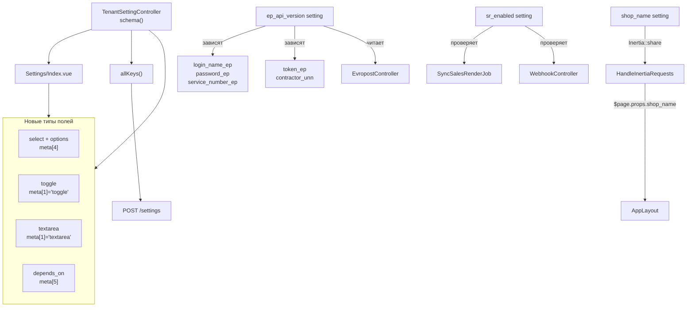

# Рефакторинг настроек магазина

**Дата:** 27.06.2026  
**Статус:** planned  
**Контекст:** Фаза 5 — расширение `tenant_settings`, UI настроек и связанных интеграций

## Цель

Расширить систему настроек магазина:

- название магазина в шапке;
- раздельные email Белпочты (отправитель / получатель);
- `shelf_life` (срок хранения в ПВЗ, по умолчанию 10 дней);
- переключатель интеграции SalesRender (CallCentr);
- выбор версии API Европочты с условным отображением полей;
- переименование `id_project_in_call_centr` → `company_id_in_call_centre`;
- актуализация типов партий Белпочты (9 типов).

## Архитектура изменений



## Расширенный формат схемы

Текущий формат в [`TenantSettingController.php`](../app/Http/Controllers/TenantSettingController.php):

```php
'key' => [label, type, placeholder, hint]
```

Новый формат (обратно совместим — старые 4-элементные массивы работают без изменений):

```php
'key' => [label, type, placeholder, hint, options_or_null, depends_on_or_null]
// meta[4] — массив ['value' => 'Label'] для type='select'
// meta[5] — ['key' => 'value'] условие видимости, e.g. ['ep_api_version' => 'legacy']
```

## Итоговая структура групп настроек

### shop — Магазин

| Ключ | Тип | Описание |
|------|-----|----------|
| `shop_name` | text | Название магазина (отображается в шапке) |

### belpost — Белпочта

| Ключ | Тип | Описание |
|------|-----|----------|
| `auth_token_bp` | password | Токен авторизации Bearer |
| `elc` | text | ELC (код отправителя) |
| `active_list` | text | ID активного списка (runtime) |
| `id_to_download` | text | ID для скачивания PDF (runtime) |
| `belpost_sender_email` | text | Email отправителя — уведомления о выдаче (обязателен для ecommerce) |
| `belpost_recipient_email` | text | Email получателя — уведомления о приходе посылки |
| `shelf_life` | text | Срок хранения в ПВЗ, дней (default: `10`) |

### europochta — Европочта

| Ключ | Тип | Версия | Описание |
|------|-----|--------|----------|
| `ep_api_version` | select | общий | `new` (v1.8.2) / `legacy` (JWT) |
| `warehouse_id_start` | text | общий | ОПС отправки |
| `who_pays` | select | общий | `Покупатель` / `Продавец` |
| `ep_weight_categories` | textarea | общий | JSON категорий веса для расчёта стоимости |
| `token_ep` | password | new | Bearer-токен API v1.8.2 |
| `contractor_unn` | text | new | УНН контрагента |
| `login_name_ep` | text | legacy | Логин JWT API |
| `password_ep` | password | legacy | Пароль JWT API |
| `service_number_ep` | password | legacy | UUID сервиса |

### salesrender — SalesRender (CallCentr)

| Ключ | Тип | Описание |
|------|-----|----------|
| `sr_enabled` | toggle | Включить интеграцию с колл-центром |
| `api_token_call_centr` | password | API-токен SalesRender |
| `company_id_in_call_centre` | text | Company ID (URL), было `id_project_in_call_centr` |
| `project_id_in_call_centr` | text | Project UUID (GraphQL) |
| `sr_default_item_id` | text | ID товара по умолчанию для webhook |

### sms, blacklist, system

Без изменений.

## Затронутые файлы

| Файл | Изменение |
|------|-----------|
| [`hosting/database/migrations/2026_06_27_000012_rename_sr_company_id_setting.php`](../database/migrations/) | миграция переименования ключа SR |
| [`hosting/app/Http/Controllers/TenantSettingController.php`](../app/Http/Controllers/TenantSettingController.php) | новая `schema()`, группы, формат meta |
| [`hosting/resources/js/Pages/Settings/Index.vue`](../resources/js/Pages/Settings/Index.vue) | select, toggle, textarea, depends_on |
| [`hosting/app/Http/Middleware/HandleInertiaRequests.php`](../app/Http/Middleware/HandleInertiaRequests.php) | share `shop_name` |
| [`hosting/resources/js/Layouts/AppLayout.vue`](../resources/js/Layouts/AppLayout.vue) | отображение названия магазина |
| [`hosting/app/Services/BelpostService.php`](../app/Services/BelpostService.php) | два email, shelf_life |
| [`hosting/app/Http/Controllers/EvropostController.php`](../app/Http/Controllers/EvropostController.php) | `ep_api_version` из настроек |
| [`hosting/resources/js/Pages/Europochta/Create.vue`](../resources/js/Pages/Europochta/Create.vue) | убрать селектор API |
| [`hosting/app/Jobs/SyncSalesRenderJob.php`](../app/Jobs/SyncSalesRenderJob.php) | `sr_enabled`, rename company_id |
| [`hosting/app/Http/Controllers/WebhookController.php`](../app/Http/Controllers/WebhookController.php) | `sr_enabled`, rename company_id |
| [`hosting/app/Services/SalesRenderService.php`](../app/Services/SalesRenderService.php) | обновить комментарии |
| [`hosting/database/seeders/DatabaseSeeder.php`](../database/seeders/DatabaseSeeder.php) | все новые ключи |
| [`hosting/app/Models/MailBatch.php`](../app/Models/MailBatch.php) | 9 типов DELIVERY_TYPES |

## Задачи реализации

### 1. Миграция: переименование ключа SR

```php
DB::table('tenant_settings')
    ->where('key', 'id_project_in_call_centr')
    ->update(['key' => 'company_id_in_call_centre']);
```

### 2. TenantSettingController — полная замена schema()

- Переписать `schema()` с новыми группами и новым форматом
- `allKeys()` — depends_on не меняет логику сохранения, ключи всё равно в белом списке

### 3. Settings/Index.vue — поддержка новых типов

- `type='select'` → `<select>` с `v-for` по `meta[4]`
- `type='toggle'` → checkbox, значение `'1'` / `''`
- `type='textarea'` → `<textarea>`
- `meta[5]` (depends_on) → `v-if` с проверкой `(form[depKey] || currentValues[depKey]) === depVal`
- Инициализировать `form['ep_api_version']` из `currentValues` чтобы depends_on работал сразу

### 4. HandleInertiaRequests + AppLayout — название магазина

```php
'shop_name' => fn () => auth()->check()
    ? TenantSetting::get('shop_name', 'BaseCRM')
    : 'BaseCRM',
```

```js
const shopName = computed(() => page.props.value.shop_name || 'BaseCRM')
```

### 5. BelpostService — два email

```php
$senderEmail    = $isEcommerce ? (TenantSetting::get('belpost_sender_email', '') ?: '') : '';
$recipientEmail = TenantSetting::get('belpost_recipient_email', '') ?: null;

// В payload:
'person'  => [..., 'email' => $recipientEmail],
'addons'  => [..., 'email' => $senderEmail],
```

### 6. EvropostController — версия API из настроек

```php
$useNew = TenantSetting::get('ep_api_version', 'new') !== 'legacy';
```

Удалить селектор API с страницы `/europochta` — выбор переносится в настройки.

### 7. SyncSalesRenderJob + WebhookController — rename + sr_enabled

```php
$srEnabled = TenantSetting::get('sr_enabled', '') === '1';
$companyId = TenantSetting::get('company_id_in_call_centre', '');
if (!$srEnabled || !$apiToken || !$companyId) { return; }
```

### 8. DatabaseSeeder — полное обновление ключей

- Заменить `id_project_in_call_centr` → `company_id_in_call_centre`
- Добавить: `shop_name`, `sr_enabled`, `project_id_in_call_centr`, `sr_default_item_id`, `belpost_sender_email`, `belpost_recipient_email`, `shelf_life` (`'10'`), `ep_api_version` (`'new'`), `who_pays`, `ep_weight_categories`
- Убрать устаревший `email` (если был)

### 9. MailBatch::DELIVERY_TYPES — 9 типов Белпочты

```php
public const DELIVERY_TYPES = [
    'package'               => 'Простая посылка республиканская (без ОЦ)',
    'package_declare_value' => 'Посылка с объявленной ценностью',
    'ems'                   => 'Экспресс-посылка',
    'ecommerce_economical'  => 'E-commerce Эконом',
    'ecommerce_standard'    => 'E-commerce Стандарт',
    'ecommerce_elite'       => 'E-commerce Элит',
    'ecommerce_express'     => 'E-commerce Экспресс',
    'ecommerce_light'       => 'E-commerce Лайт',
    'ecommerce_optima'      => 'E-commerce Оптима',
];
```

## Критерии приёмки

- [ ] На `/settings` отображаются все группы настроек по сервисам
- [ ] При `ep_api_version=legacy` видны только legacy-поля Европочты, при `new` — только new-поля
- [ ] Toggle `sr_enabled` отключает push в SR (webhook) и sync из SR (job)
- [ ] Название магазина отображается в шапке вместо «BaseCRM»
- [ ] При ecommerce-партии BP в payload уходят разные email для `person` и `addons`
- [ ] На `/belpost` доступны все 9 типов партий
- [ ] Миграция переименовывает `id_project_in_call_centr` без потери данных
