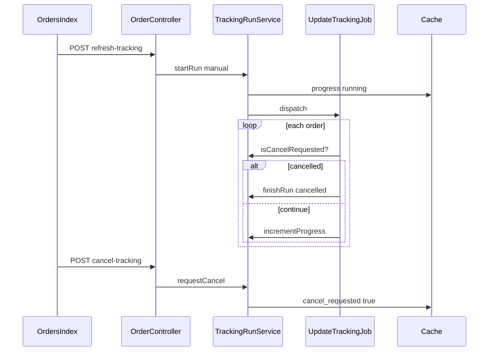
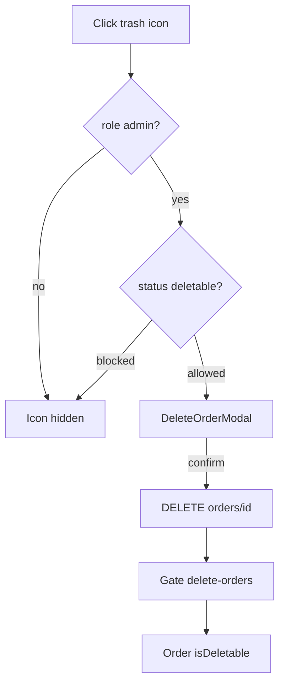

# Остановка проверки статусов и удаление заказов

**Дата:** 24.07.2026  
**Статус:** planned  
**Контекст:** Расширение модуля заказов — контроль ручной проверки трекинга и безопасное удаление заявок

## Цель

1. **Остановка ручной проверки статусов** — кнопка «Остановить» во время manual run (вариант A: замена «Обновить статусы»); cooperative cancel в job.
2. **Удаление заказа** — иконка корзины на карточке заказа и в списке; модальное подтверждение; только **admin**; запрет для финальных и активных статусов.

## Контекст (текущее состояние)

Уже реализовано:

- Ручной запуск проверки: `POST /orders/refresh-tracking` → [`TrackingRunService::startRun()`](../app/Services/TrackingRunService.php) → [`UpdateTrackingJob`](../app/Jobs/UpdateTrackingJob.php)
- UI polling в [`Orders/Index.vue`](../resources/js/Pages/Orders/Index.vue) — кнопка disabled при `running`, остановки нет
- Backend удаления: [`OrderController::destroy()`](../app/Http/Controllers/OrderController.php) + `DELETE /orders/{order}` — UI отсутствует

См. также: [`tracking-status-checks.md`](tracking-status-checks.md)

## Архитектура

### Остановка проверки



### Удаление заказа



---

## Часть 1: остановка ручной проверки статусов

### Backend

**[`TrackingRunService.php`](../app/Services/TrackingRunService.php)**

- Добавить методы:
  - `requestCancel(int $tenantId): bool` — ставит `cancel_requested: true` в progress, только если `status=running` и `source=manual`
  - `isCancelRequested(int $tenantId): bool`
  - `clearCancelFlag(int $tenantId): void` — вызывать в `finishRun`
- В `finishRun()` — поддержать статус `cancelled`; снимать lock как сейчас

**[`UpdateTrackingJob.php`](../app/Jobs/UpdateTrackingJob.php)**

- В циклах `processBelpost` / `processEvropost` после обработки каждого заказа:

```php
if ($service->isCancelRequested($this->tenantId)) { break; }
```

- В `finally`: если cancel — `finishRun(..., 'cancelled')`; `saveAutoStats` не вызывать при `cancelled` / `failed`

**[`OrderController.php`](../app/Http/Controllers/OrderController.php) + [`web.php`](../routes/web.php)**

- `cancelTracking()` → `POST /orders/cancel-tracking`
- Ответы: `204` (ok), `409` (не running или auto-run), `403` (read-only через `tenant.writable`)

### Frontend

**[`Orders/Index.vue`](../resources/js/Pages/Orders/Index.vue)**

- Условие кнопки:
  - `running && source === 'manual'` → «Остановить» (красный/secondary), вызывает `POST /orders/cancel-tracking`
  - иначе → «Обновить статусы» (disabled при auto-running или `readOnly`)
- `trackingLabel`:
  - `running` → «Проверка: N из M…»
  - `cancelled` → «Остановлено: N из M»
  - `done` → «Проверено N из M» (+ reload orders)
- Polling останавливать при `cancelled` / `done` / `failed`; reload только при `done`

---

## Часть 2: удаление заказа

### Модель и права

**[`Order.php`](../app/Models/Order.php)**

```php
public const NON_DELETABLE_STATUSES = [
    // Revenue final
    'Завершен', 'Посчитан',
    // Tracking / delivery active
    'Оформлен', 'Передан на почту', 'Отправлено', 'В отделении', 'Забрать деньги',
    // Call-center active
    'Позвонить', 'Перезвонить', 'Заказать', 'Отправить', 'Сомнения', 'Отдал заявку',
];

public static function isDeletable(Order $order): bool
{
    return !in_array($order->status, self::NON_DELETABLE_STATUSES, true);
}
```

**Можно удалять:** `Недозвон`, `Недозвон1`, `Недозвон2`, `Отказ`, `Отказ(Ошибка)`, `Дубль`, `Возврат`

**[`AuthServiceProvider.php`](../app/Providers/AuthServiceProvider.php)**

```php
Gate::define('delete-orders', fn ($user) => $user->isTenantUser() && $user->role === 'admin');
```

**[`OrderController::destroy()`](../app/Http/Controllers/OrderController.php)**

```php
Gate::authorize('delete-orders');
abort_unless(Order::isDeletable($order), 422, '...');
$order->delete();
return redirect()->route('orders.index')->with('message', 'Заказ удалён.');
```

**[`HandleInertiaRequests.php`](../app/Http/Middleware/HandleInertiaRequests.php)**

Shared prop для tenant users:

```php
'order_delete' => ['blocked_statuses' => Order::NON_DELETABLE_STATUSES]
```

### UI-компоненты

**Новый [`DeleteOrderModal.vue`](../resources/js/Components/DeleteOrderModal.vue)**

- Props: `open`, `order` (`id`, `full_name`, `status`)
- Emit: `cancel`, `confirm`
- Разметка по паттерну модалки в [`Show.vue`](../resources/js/Pages/Orders/Show.vue) (`.modal-backdrop`, `.modal-box`)
- Кнопки: «Отмена» | «Удалить» (красная, `:disabled="deleting"`)

**Иконка корзины** — inline heroicons outline (`w-4 h-4`), `text-red-500`, `title="Удалить заказ"`

**[`Show.vue`](../resources/js/Pages/Orders/Show.vue)**

- Иконка корзины в шапке при `isAdmin && !readOnly && orderIsDeletable`
- `@click` → открыть `DeleteOrderModal`
- Подтверждение: `Inertia.delete('/orders/{id}')`

**[`Index.vue`](../resources/js/Pages/Orders/Index.vue)**

- Колонка `actions` с иконкой корзины per row
- `@click.stop` — строка кликабельна (`goToOrder`), корзина не открывает карточку
- Общая модалка + `apiFetch DELETE` → `Inertia.reload({ only: ['orders'] })` при успехе

```javascript
const isAdmin = computed(() => page.props.auth?.user?.role === 'admin')
function canDeleteOrder(order) {
    return isAdmin.value && !readOnly.value && !blockedStatuses.includes(order.status)
}
```

---

## Часть 3: тесты

**Новый [`OrderDestroyTest.php`](../tests/Feature/OrderDestroyTest.php)**

- Admin удаляет заказ в `Отказ` → redirect `/orders`, заказ удалён
- Operator → 403
- Admin + статус `Посчитан` / `Позвонить` → 422
- Read-only tenant → 403

**Новый [`TrackingCancelTest.php`](../tests/Feature/TrackingCancelTest.php)**

- `requestCancel` на manual run → progress `cancelled`, lock released
- Cancel на auto-run / idle → 409
- Job прерывается cooperative при `cancel_requested`

Паттерн setup — как в [`OrderStatusUpdateTest.php`](../tests/Feature/OrderStatusUpdateTest.php).

---

## Затронутые файлы

| Файл | Изменение |
|------|-----------|
| [`app/Models/Order.php`](../app/Models/Order.php) | `NON_DELETABLE_STATUSES`, `isDeletable()` |
| [`app/Providers/AuthServiceProvider.php`](../app/Providers/AuthServiceProvider.php) | Gate `delete-orders` |
| [`app/Http/Controllers/OrderController.php`](../app/Http/Controllers/OrderController.php) | `destroy()` checks, `cancelTracking()` |
| [`app/Services/TrackingRunService.php`](../app/Services/TrackingRunService.php) | cancel methods |
| [`app/Jobs/UpdateTrackingJob.php`](../app/Jobs/UpdateTrackingJob.php) | cooperative break |
| [`app/Http/Middleware/HandleInertiaRequests.php`](../app/Http/Middleware/HandleInertiaRequests.php) | shared `order_delete` |
| [`routes/web.php`](../routes/web.php) | `POST /orders/cancel-tracking` |
| [`resources/js/Components/DeleteOrderModal.vue`](../resources/js/Components/DeleteOrderModal.vue) | новый |
| [`resources/js/Pages/Orders/Show.vue`](../resources/js/Pages/Orders/Show.vue) | trash + modal |
| [`resources/js/Pages/Orders/Index.vue`](../resources/js/Pages/Orders/Index.vue) | trash column, stop button, modal |
| [`tests/Feature/OrderDestroyTest.php`](../tests/Feature/OrderDestroyTest.php) | новый |
| [`tests/Feature/TrackingCancelTest.php`](../tests/Feature/TrackingCancelTest.php) | новый |

---

## Порядок реализации

1. `Order::NON_DELETABLE_STATUSES` + Gate + `destroy()` + shared prop
2. `DeleteOrderModal.vue` + корзина в `Show.vue` и `Index.vue`
3. `TrackingRunService` cancel + `UpdateTrackingJob` + route + controller
4. `Orders/Index.vue` stop button + labels
5. Feature-тесты

---

## Риски

| Риск | Митигация |
|------|-----------|
| Job cancel не мгновенный | Cooperative break после текущего заказа — ожидаемое поведение |
| Hard delete | Cascade history; income → `order_id = null` (существующие FK) |
| Drift статусов FE/BE | Единый список через Inertia shared prop |

---

## Acceptance Criteria

- [ ] Manual run → кнопка «Остановить»; auto run → без остановки
- [ ] Корзина только у admin, только для deletable статусов
- [ ] Модалка перед удалением; backend дублирует проверки (Gate + status)
- [ ] Manager/operator не видят корзину и получают 403 при прямом DELETE
- [ ] После cancel lock снят, можно запустить новую проверку
- [ ] Обработанные до stop заказы сохраняют обновлённые статусы

### Ручной чеклист

- [ ] Admin: удаление заказа в `Отказ` из карточки и из списка
- [ ] Admin: попытка удалить `Позвонить` — иконки нет / 422
- [ ] Operator: корзины нет
- [ ] Manual tracking: «Остановить» → «Остановлено: N из M»
- [ ] Read-only tenant: корзина скрыта, mutating API → 403
