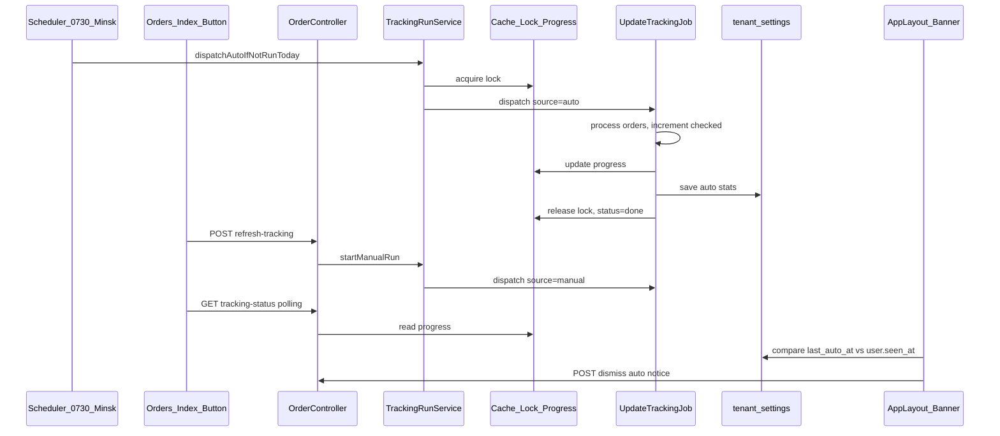

# Проверка статусов активных заявок

**Дата:** 01.07.2026  
**Статус:** implemented  
**Контекст:** Фаза 3 — трекинг Белпочта + Европочта, multi-tenant hosting

## Цель

Реализовать:

1. **Утреннюю авто-проверку** — один раз в день в **07:30 Europe/Minsk**, все активные заявки tenant.
2. **Ручную проверку** — кнопка «Обновить статусы» на вкладке «Заказы» (вариант A: в шапке списка) с прогрессом «N из M».
3. **Info-баннер при входе в кабинет** — когда была утренняя проверка и сколько заявок проверено; dismiss per user; **всем ролям** (admin, manager, operator).
4. **Multi-user** — tenant-level lock и общий progress; разные tenant изолированы.

## Контекст (текущее состояние)

Сейчас [`UpdateTrackingJob.php`](../app/Jobs/UpdateTrackingJob.php) диспатчится **каждые 5 минут** для всех tenant ([`Kernel.php`](../app/Console/Kernel.php)). Ручной запуск и UI отсутствуют. Flash-инфраструктура уже есть в [`AppLayout.vue`](../resources/js/Layouts/AppLayout.vue) и [`HandleInertiaRequests.php`](../app/Http/Middleware/HandleInertiaRequests.php).

**Активные заявки** (уже в job): `delivery_type` in `belpost|europochta`, `track_number` not null, `status` in `['Оформлен', 'Передан на почту', 'Отправлено', 'В отделении']`.

Legacy: [`backend/General.gs`](../../backend/General.gs) — `getStatus()` (ручной запуск из GAS с checkpoint `jsonObject.number`).

## Целевая архитектура



## Затронутые файлы

| Файл | Изменение |
|------|-----------|
| [`hosting/app/Services/TrackingRunService.php`](../app/Services/TrackingRunService.php) | новый сервис |
| [`hosting/app/Jobs/UpdateTrackingJob.php`](../app/Jobs/UpdateTrackingJob.php) | progress, source auto/manual, stats |
| [`hosting/app/Console/Kernel.php`](../app/Console/Kernel.php) | dailyAt 07:30, убрать everyFiveMinutes tracking |
| [`hosting/app/Http/Controllers/OrderController.php`](../app/Http/Controllers/OrderController.php) | refreshTracking, trackingStatus, dismissNotice |
| [`hosting/app/Http/Middleware/HandleInertiaRequests.php`](../app/Http/Middleware/HandleInertiaRequests.php) | shared `tracking_auto_notice` |
| [`hosting/app/Models/User.php`](../app/Models/User.php) | `tracking_auto_seen_at` |
| [`hosting/routes/web.php`](../routes/web.php) | новые маршруты |
| [`hosting/resources/js/Layouts/AppLayout.vue`](../resources/js/Layouts/AppLayout.vue) | info-баннер |
| [`hosting/resources/js/Pages/Orders/Index.vue`](../resources/js/Pages/Orders/Index.vue) | кнопка + polling |
| migration | `users.tracking_auto_seen_at` |

---

## 1. Backend: сервис и модель данных

### Новый сервис `TrackingRunService`

Централизует логику между cron, controller и job:

- `activeOrdersQuery(int $tenantId)` — общий запрос активных заявок
- `countActiveOrders(int $tenantId): int`
- `lockKey(int $tenantId)` → `tracking:lock:{tenantId}`
- `progressKey(int $tenantId)` → `tracking:progress:{tenantId}`
- `startRun(int $tenantId, string $source): array` — lock + init progress `{status, checked, total, errors, source, started_at}` + dispatch job; возвращает `{total}` или conflict
- `getProgress(int $tenantId): ?array`
- `incrementProgress(int $tenantId, bool $hadError = false): void`
- `finishRun(int $tenantId, string $source, array $stats): void` — release lock, set `status=done`
- `saveAutoStats(int $tenantId, int $total, int $checked, int $errors): void` — `TenantSetting::put` ключи:
  - `tracking_last_auto_at`
  - `tracking_last_auto_total`
  - `tracking_last_auto_checked`
  - `tracking_last_auto_errors`
- `alreadyRanAutoToday(int $tenantId): bool` — сравнение `tracking_last_auto_at` с «сегодня» в `Europe/Minsk`
- `buildAutoNoticeForUser(User $user): ?array` — данные для info-баннера

Lock: `Cache::lock(..., 900)` (15 мин, с запасом над job timeout 300).

### Расширить `UpdateTrackingJob`

- Конструктор: `(int $tenantId, string $source = 'auto')` где `source` in `auto|manual`
- В `handle()`:
  1. Получить список активных заявок через сервис (Belpost + Europochta — текущая логика сохраняется)
  2. После обработки **каждой** заявки: `$service->incrementProgress(...)` (ошибка API → `errors++`)
  3. В `finally`: `$service->finishRun(...)`; при `source=auto` — `$service->saveAutoStats(...)`
- Belpost `loadMap()` один раз на run — без изменений

### Миграция users

Файл: `database/migrations/2026_07_01_000001_add_tracking_auto_seen_at_to_users_table.php`

```php
$table->timestamp('tracking_auto_seen_at')->nullable()->after('theme');
```

Обновить `User.php`: добавить в `$fillable` и `$casts`.

---

## 2. Scheduler: только утро

В `Kernel.php`:

- **Удалить** блок `everyFiveMinutes()` для tracking
- **Добавить**:

```php
$schedule->call(function () {
    $service = app(TrackingRunService::class);
    foreach (Tenant::all() as $tenant) {
        if ($service->alreadyRanAutoToday($tenant->id)) {
            continue;
        }
        try {
            $service->startRun($tenant->id, 'auto');
        } catch (\Throwable $e) {
            Log::warning('Auto tracking dispatch failed', [...]);
        }
    }
})->dailyAt('07:30')
  ->timezone('Europe/Minsk')
  ->name('dispatch-tracking-morning')
  ->withoutOverlapping();
```

SalesRender sync (`everyFiveMinutes`) — **не трогаем**.

---

## 3. API и контроллер

| Метод | Route | Ответ |
|---|---|---|
| `refreshTracking()` | `POST /orders/refresh-tracking` | `202 { total, status: 'running' }` или `409 { message, progress }` |
| `trackingStatus()` | `GET /api/orders/tracking-status` | `{ status, checked, total, errors, source, finished_at }` |
| `dismissTrackingNotice()` | `POST /api/tracking/auto-notice/dismiss` | `204` |

`refreshTracking`: middleware `auth + tenant`; вызов `TrackingRunService::startRun($tenantId, 'manual')`.

`dismissTrackingNotice`: `Auth::user()->update(['tracking_auto_seen_at' => TenantSetting::get('tracking_last_auto_at')])` — привязка к конкретному run.

Маршруты в `web.php`:

```php
Route::post('/refresh-tracking', ...)->name('refreshTracking');
// в группе api:
Route::get('/orders/tracking-status', ...);
Route::post('/tracking/auto-notice/dismiss', ...);
```

---

## 4. Shared props: авто-нотификация

В `HandleInertiaRequests.php`:

```php
'tracking_auto_notice' => fn () => auth()->check()
    ? app(TrackingRunService::class)->buildAutoNoticeForUser(auth()->user())
    : null,
```

Логика `buildAutoNoticeForUser`:

- Прочитать `tracking_last_auto_at`, `_total`, `_checked`, `_errors` из tenant_settings
- `show = true` если:
  - `tracking_last_auto_at` не пуст
  - дата авто-run = сегодня (Minsk)
  - `user.tracking_auto_seen_at` < `tracking_last_auto_at` (или null)
- **Всем ролям** — без фильтра по role

---

## 5. Frontend

### `AppLayout.vue`

- Info-баннер (indigo/blue, не green flash) под nav:
  - Текст: «Утренняя проверка статусов выполнена {дата время}. Проверено заявок: {checked} из {total}.»
  - При `errors > 0`: «Ошибок: {errors}.»
  - Кнопка «✕» → `POST /api/tracking/auto-notice/dismiss`, скрыть локально
- Формат даты: `ru-RU`

### `Orders/Index.vue`

- Label: «Обновить статусы» в шапке рядом с «+ Новый заказ»
- `disabled` когда `trackingStatus.status === 'running'`
- При клике: `POST /orders/refresh-tracking`
  - `202` → polling `GET /api/orders/tracking-status` каждые 2 с
  - `409` → подключиться к существующему polling (общий progress tenant)
- Inline-текст: «Проверка: 12 из 47…»
- По `status=done`: остановить polling, итог «Проверено 47 из 47», `Inertia.reload({ only: ['orders'] })`
- `onMounted`: если progress `running` — автоматически подключить polling

Паттерн polling — аналог [`Belpost/Batch.vue`](../resources/js/Pages/Belpost/Batch.vue) (`batchStatus`).

---

## 6. Multi-user и edge cases

| Сценарий | Поведение |
|---|---|
| Два user одного tenant жмут кнопку | Второй получает 409, видит тот же progress через polling |
| User открывает /orders во время run | `onMounted` подхватывает running progress |
| Auto + manual одновременно | Общий lock — второй запуск отклоняется |
| Job упал | `finally` снимает lock; progress → `status=failed` |
| Нет активных заявок | `total=0`, run завершается сразу, stats сохраняются |
| Нет `auth_token_bp` | Belpost skip (как сейчас); Europochta orders проверяются |

---

## 7. Настройки и cleanup

- `TenantSettingController`: опционально скрыть deprecated `tracking_checkpoint` (job его не использует)
- `DatabaseSeeder`: не добавлять новые ключи в seed (создаются job при первом run)

---

## Acceptance Criteria

1. Cron 07:30 Minsk — один auto-run per tenant per day
2. Кнопка «Обновить статусы» на `/orders`
3. Ручной run показывает «N из M» в реальном времени
4. Info-баннер при входе: время + N из M; dismiss per user; все роли
5. Параллельные запуски одного tenant блокируются
6. Разные tenant изолированы (settings, lock, progress)

### Ручной чеклист

- [ ] `php artisan schedule:list` — задача `dispatch-tracking-morning` at 07:30
- [ ] Имитация manual run через tinker
- [ ] Два браузера / два user одного tenant — один progress
- [ ] Dismiss баннера — не показывается повторно до следующего утреннего run

---

## Порядок реализации

1. Migration + User model
2. `TrackingRunService`
3. Refactor `UpdateTrackingJob` (progress + stats)
4. `Kernel.php` schedule
5. Controller + routes
6. `HandleInertiaRequests` notice
7. `AppLayout.vue` banner
8. `Orders/Index.vue` button + polling

## Риски

- **Timeout 300s** при большом объёме: мониторить логи; follow-up — chunk jobs (вне scope)
- **Cache driver=file** на shared hosting — достаточен для single-server; lock/progress через Cache API
