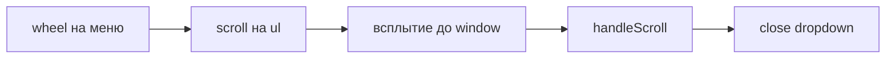

# AppScrollSelect — закрытие при scroll колёсиком внутри меню

**Дата:** 25.07.2026  
**Статус:** done  
**Контекст:** После внедрения [`AppScrollSelect`](../features/app-scroll-select.md) выпадающий список статусов закрывается при попытке прокрутить пункты колёсиком мыши — нижние статусы недоступны.

## Цель

Исправить закрытие `AppScrollSelect` при прокрутке колёсиком **внутри** меню. Сохранить закрытие при scroll **страницы/таблицы**.

## Текущее состояние

- Компонент [`AppScrollSelect.vue`](../resources/js/Components/AppScrollSelect.vue) — кастомный dropdown с `Teleport to="body"`
- Composable [`useDropdownPosition.js`](../resources/js/composables/useDropdownPosition.js) — позиционирование и слушатели scroll
- При открытии меню вешается глобальный обработчик:

```javascript
function handleScroll() {
    onClose?.()
}
window.addEventListener('scroll', handleScroll, true)
```

- Меню имеет `overflowY: auto` и `maxHeight` — при wheel scroll генерируется событие `scroll` на `<ul>`, оно всплывает до `window`, `handleScroll` закрывает dropdown

## Поток проблемы



Задуманное поведение: закрывать при scroll страницы/таблицы, **не** закрывать при scroll внутри меню.

## Затронутые файлы

| Файл | Изменение |
|------|-----------|
| [`resources/js/composables/useDropdownPosition.js`](../resources/js/composables/useDropdownPosition.js) | `menuRef` + фильтр `event.target` в `handleScroll` |
| [`resources/js/Components/AppScrollSelect.vue`](../resources/js/Components/AppScrollSelect.vue) | передать `menuRef`; класс `overscroll-contain` |

Index, Show, Create, OrderStatusSelect — **без изменений**.

## Реализация

### 1. Фильтрация scroll-событий в composable

**Файл:** [`useDropdownPosition.js`](../resources/js/composables/useDropdownPosition.js)

- Добавить второй аргумент `menuRef` в `useDropdownPosition(triggerRef, menuRef, options)`
- Обновить `handleScroll(event)`:

```javascript
function handleScroll(event) {
    const menu = menuRef?.value
    if (menu && (menu === event.target || menu.contains(event.target))) return
    onClose?.()
}
```

Scroll target таблицы (`overflow-x-auto`) или `document` по-прежнему вызывает закрытие.

### 2. Передать menuRef из компонента

**Файл:** [`AppScrollSelect.vue`](../resources/js/Components/AppScrollSelect.vue)

```javascript
const { menuStyle, updatePosition, attachListeners, detachListeners } = useDropdownPosition(
    triggerRef,
    menuRef,
    { maxMenuHeight: props.maxHeight, minWidth: props.minWidth },
)
```

### 3. Изоляция scroll chaining

**Файл:** [`AppScrollSelect.vue`](../resources/js/Components/AppScrollSelect.vue)

- Добавить класс `overscroll-contain` на `<ul>` меню — предотвращает «проброс» колёсика на страницу на границах списка

## Тест-план (ручной)

1. Таблица `/orders`, последняя строка → wheel внутри списка → меню **остаётся открытым**, видны нижние статусы
2. Scroll страницы при открытом меню → меню **закрывается**
3. Горизонтальный scroll таблицы → меню **закрывается**
4. Верх/низ списка + продолжить scroll → страница под меню **не прокручивается**
5. Выбор статуса, Escape, click outside — без регрессий

## Порядок реализации

- [x] `menuRef` + фильтр `event.target` в `useDropdownPosition.js`
- [x] Передать `menuRef` из `AppScrollSelect.vue` + `overscroll-contain`
- [x] `npm run build` + ручная проверка

## Acceptance Criteria

| # | Критерий |
|---|----------|
| AC1 | Колёсико прокручивает пункты внутри dropdown без закрытия |
| AC2 | Scroll страницы/таблицы по-прежнему закрывает dropdown |
| AC3 | `npm run build` проходит без ошибок |
