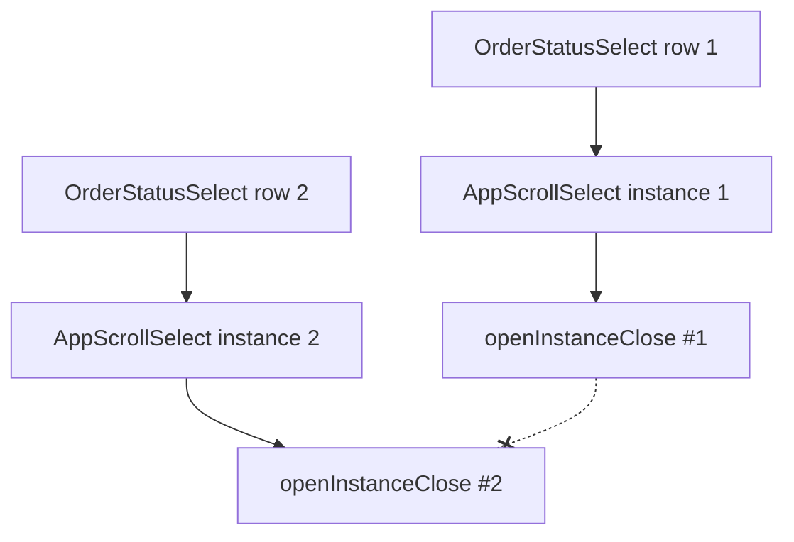
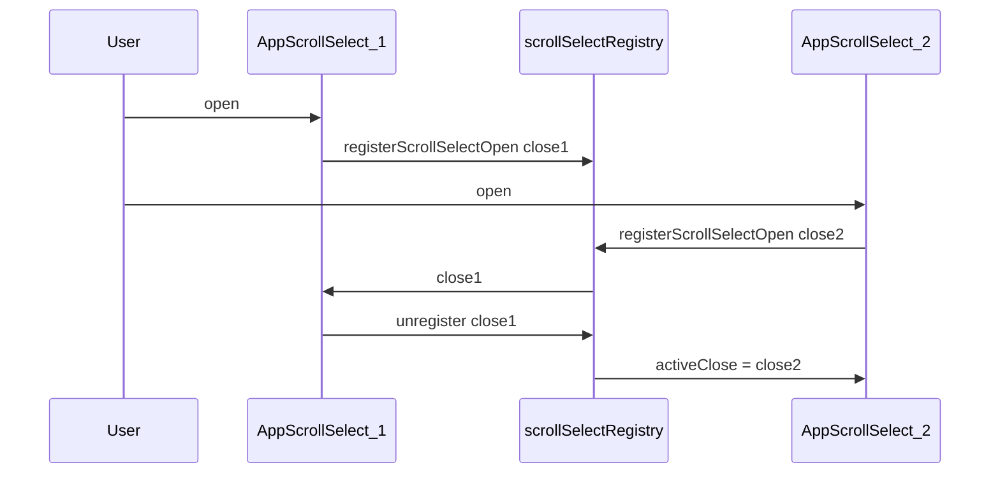

# AppScrollSelect — scroll jump и multiple open в таблице

**Дата:** 25.07.2026  
**Статус:** done  
**Контекст:** После [`AppScrollSelect`](../features/app-scroll-select.md) и fix [`mouse-scroll`](app-scroll-select-mouse-scroll.md) в таблице `/orders` остаются два UX-бага: страница прыгает вниз при клике по тексту статуса; одновременно открыты dropdown у нескольких заявок.

## Цель

1. Убрать скачок scroll страницы при открытии dropdown.
2. Гарантировать, что одновременно открыт только один `AppScrollSelect` на странице.

## Текущее состояние

### Проблема 1: scroll jump

При открытии меню в [`AppScrollSelect.vue`](../resources/js/Components/AppScrollSelect.vue):

```javascript
nextTick(() => {
    attachListeners(close)
    menuRef.value?.focus?.()
})
```

Меню через `<Teleport to="body">` находится в конце DOM. Браузер при `focus()` прокручивает страницу к элементу в дереве, хотя визуально он `position: fixed`.

### Проблема 2: несколько открытых списков

Singleton `openInstanceClose` объявлен в `<script setup>` — **per-instance**, не shared:

```javascript
let openInstanceClose = null  // отдельная копия на каждый AppScrollSelect
```

Каждая строка таблицы — свой `OrderStatusSelect` → свой `AppScrollSelect`. Открытие второго меню не закрывает первое.



## Затронутые файлы

| Файл | Изменение |
|------|-----------|
| [`resources/js/utils/scrollSelectRegistry.js`](../resources/js/utils/scrollSelectRegistry.js) | новый — module-level singleton |
| [`resources/js/Components/AppScrollSelect.vue`](../resources/js/Components/AppScrollSelect.vue) | `preventScroll: true` + registry |

`OrderStatusSelect.vue`, `Index.vue`, `useDropdownPosition.js` — **без изменений**.

## Реализация

### 1. Убрать scroll jump при focus

**Файл:** [`AppScrollSelect.vue`](../resources/js/Components/AppScrollSelect.vue)

```javascript
// было
menuRef.value?.focus?.()

// станет
menuRef.value?.focus({ preventScroll: true })
```

### 2. Общий registry для single-open

**Новый файл:** [`scrollSelectRegistry.js`](../resources/js/utils/scrollSelectRegistry.js)

```javascript
let activeClose = null

export function registerScrollSelectOpen(closeFn) {
    if (activeClose && activeClose !== closeFn) {
        activeClose()
    }
    activeClose = closeFn
}

export function unregisterScrollSelectClose(closeFn) {
    if (activeClose === closeFn) {
        activeClose = null
    }
}
```

**Файл:** [`AppScrollSelect.vue`](../resources/js/Components/AppScrollSelect.vue)

- Удалить локальный `let openInstanceClose = null`
- В `open()`: `registerScrollSelectOpen(close)`
- В `close()`: `unregisterScrollSelectClose(close)`



## Тест-план (ручной)

1. `/orders` — клик по **тексту** статуса → меню открывается, страница **не прыгает**
2. Открыть статус у заявки 1 → открыть у заявки 2 → меню у заявки 1 **закрыто**
3. Фильтр «Статус» + inline в таблице → только **один** dropdown одновременно
4. Wheel внутри меню, Escape, scroll страницы — без регрессий
5. Клик по статусу не открывает карточку заказа

## Порядок реализации

- [x] Создать `scrollSelectRegistry.js`
- [x] Обновить `AppScrollSelect.vue` (registry + preventScroll)
- [x] `npm run build` + ручная проверка

## Acceptance Criteria

| # | Критерий |
|---|----------|
| AC1 | Открытие dropdown не вызывает scroll страницы |
| AC2 | Одновременно открыт только один AppScrollSelect на странице |
| AC3 | `npm run build` проходит без ошибок |
