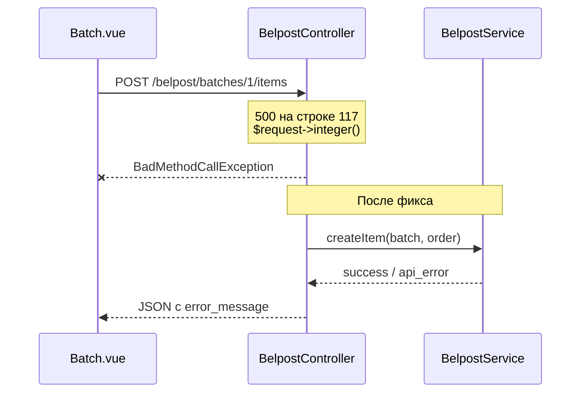

# Fix: 500 при создании бланка Белпочты

**Дата:** 27.06.2026  
**Статус:** done  
**Контекст:** При оформлении бланка (`POST /belpost/batches/{id}/items`) приложение падает с 500. URL запроса корректен; ошибка в контроллере из‑за API Laravel 9+ на Laravel 8.

## Симптом

```
BadMethodCallException: Method Illuminate\Http\Request::integer does not exist.
```

Stack trace указывает на [`BelpostController::processOrder`](../app/Http/Controllers/BelpostController.php), строка 117.

## Причина

Проект на **Laravel 8** ([`hosting/composer.json`](../composer.json): `"laravel/framework": "^8.83"`). Метод `$request->integer()` появился только в **Laravel 9+**.

Проблемный код:

```php
$order = Order::find($request->integer('order_id'));
// ...
'order_id' => $request->integer('order_id'),
```

Других вызовов `$request->integer()` в `hosting/app/` нет. `$request->boolean()` в [`LoginController`](../app/Http/Controllers/Auth/LoginController.php) — валиден для Laravel 8, менять не нужно.

## Поток (до и после фикса)



## Затронутые файлы

| Файл | Изменение |
|------|-----------|
| [`hosting/app/Http/Controllers/BelpostController.php`](../app/Http/Controllers/BelpostController.php) | Замена `$request->integer()` на Laravel 8-совместимый код |
| [`hosting/resources/js/Pages/Belpost/Batch.vue`](../resources/js/Pages/Belpost/Batch.vue) | Показ `error_message` в колонке «Результат» |
| [`hosting/public/js/app.js`](../public/js/app.js) | Пересборка фронтенда (`npm run dev` / `npm run prod`) |

---

## Шаг 1. Исправить `BelpostController::processOrder`

В методе `processOrder` (строки 117 и 129) заменить два вызова `$request->integer('order_id')` на один локальный `$orderId`:

```php
$orderId = (int) $request->input('order_id');
$order = Order::find($orderId);
```

В блоке `catch`:

```php
'order_id' => $orderId,
```

Validation `'order_id' => ['required', 'integer']` уже гарантирует наличие значения до приведения типа.

---

## Шаг 2. Показ `error_message` в Batch.vue

Скопировать паттерн из [`Europochta/Create.vue`](../resources/js/Pages/Europochta/Create.vue) (строки 93–97) в блок «Результат» [`Batch.vue`](../resources/js/Pages/Belpost/Batch.vue) (строки 159–161):

```vue
<span v-else class="text-xs text-red-500 leading-tight">
    {{ errorLabel(results[order.id].error) }}
    <span
        v-if="results[order.id].error_message"
        class="block text-gray-400 truncate max-w-[160px]"
        :title="results[order.id].error_message"
    >
        {{ results[order.id].error_message }}
    </span>
</span>
```

Это позволит видеть детали от Белпочты (`HTTP 401`, «Адрес не найден» и т.д.) без открытия Network.

---

## Шаг 3. Сборка фронтенда

После правки Vue выполнить в `hosting/`:

```bash
npm run dev
```

(или `npm run prod` для production-сборки)

---

## Проверка (AC)

- [ ] `POST /belpost/batches/{id}/items` возвращает **JSON**, не 500
- [ ] При успехе: заказ получает трек (`success: true`, `track_number`)
- [ ] При ошибке API/адреса: в таблице видны и код (`✕ Ошибка API`), и текст `error_message`
- [x] Логин и остальные страницы не затронуты (изменения локализованы)

**Ручной тест:**

1. Открыть `/belpost`, выбрать партию в статусе «Черновик»
2. Нажать «Оформить все бланки» (или «Повторить» для одного заказа)
3. Убедиться, что запрос завершается 200/422 с JSON, а не 500

**Риски:** минимальные — изменение локализовано в одном методе контроллера и одном Vue-компоненте.

## Чеклист реализации

- [x] Заменить `$request->integer()` на `(int) $request->input()` в `BelpostController::processOrder`
- [x] Добавить отображение `error_message` в `Batch.vue` по образцу `Europochta/Create.vue`
- [x] Пересобрать фронтенд (`npm run dev`)
- [ ] Ручная проверка оформления бланка в UI
