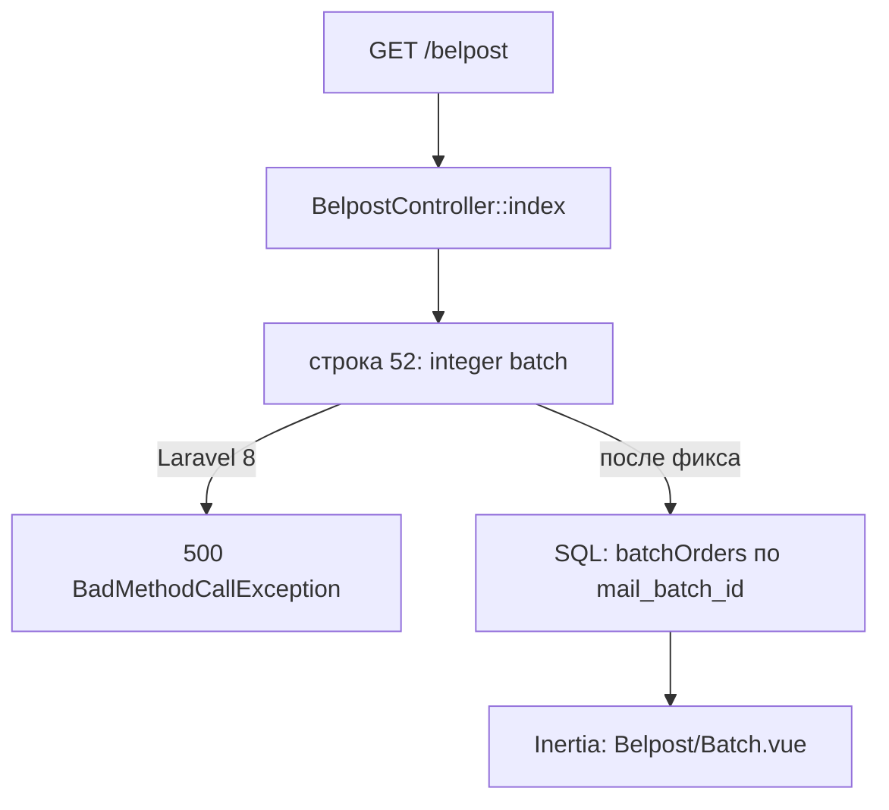

# Fix: 500 при открытии вкладки Белпочта

**Дата:** 20.07.2026  
**Статус:** done  
**Контекст:** После деплоя фичи [`belpost-batch-ux`](../features/belpost-batch-ux.md) страница `/belpost` падает с 500. Ошибка в `BelpostController::index` из‑за API Laravel 9+ на Laravel 8.

## Симптом

```
BadMethodCallException: Method Illuminate\Http\Request::integer does not exist.
#0 BelpostController.php(52)
```

Production-лог (`21:06`, `21:11`, `21:12`):

```
[2026-07-20 21:06:01] production.ERROR: Method Illuminate\Http\Request::integer does not exist.
{"userId":1,"exception":"[object] (BadMethodCallException ...)"}
#0 /home/crmgspro/crm/app/Http/Controllers/BelpostController.php(52)
```

Stack trace указывает на [`BelpostController::index`](../app/Http/Controllers/BelpostController.php), строка 52.

## Причина

Проект на **Laravel 8** ([`hosting/composer.json`](../composer.json): `"laravel/framework": "^8.83"`). Метод `$request->integer()` появился только в **Laravel 9+**.

Проблемный код (добавлен в рамках belpost-batch-ux):

```php
'selectedBatchId' => $request->integer('batch') ?: null,
```

Ошибка возникает **до** SQL-запроса `batchOrders` — страница падает на строке 52, не доходя до загрузки данных из БД.

Аналогичный баг уже исправлялся в [`belpost-createitem-500.md`](belpost-createitem-500.md) для `processOrder` — нужно применить тот же паттерн к `index`.

## Поток (до и после фикса)



## Затронутые файлы

| Файл | Изменение |
|------|-----------|
| [`hosting/app/Http/Controllers/BelpostController.php`](../app/Http/Controllers/BelpostController.php) | Замена `$request->integer('batch')` на Laravel 8-совместимый код |
| [`hosting/docs/features/belpost-batch-ux.md`](../features/belpost-batch-ux.md) | Обновить пример (опционально, чтобы спека не содержала Laravel 9+ API) |

---

## Шаг 1. Исправить `BelpostController::index`

**Строка 52** — заменить:

```php
'selectedBatchId' => $request->integer('batch') ?: null,
```

на Laravel 8-совместимый вариант:

```php
'selectedBatchId' => ($batchId = (int) $request->query('batch')) > 0 ? $batchId : null,
```

Альтернатива (явная переменная в теле метода):

```php
$selectedBatchId = ($id = (int) $request->query('batch')) > 0 ? $id : null;
// ...
'selectedBatchId' => $selectedBatchId,
```

Других вызовов `$request->integer()` в `hosting/app/` сейчас нет — правка точечная, одна строка.

---

## Шаг 2. Проверить миграцию на production

После деплоя кода проверить миграцию — без неё после фикса `integer()` может появиться **вторая** ошибка:

```
Unknown column 'mail_batch_id' in 'field list'
```

Миграция: [`2026_07_20_000001_add_mail_batch_id_to_orders.php`](../../database/migrations/2026_07_20_000001_add_mail_batch_id_to_orders.php)

На сервере:

```bash
cd /home/crmgspro/crm
php artisan migrate:status | grep mail_batch
php artisan migrate   # если статус Pending
```

---

## Шаг 3. Обновить спеку (опционально)

В [`belpost-batch-ux.md`](../features/belpost-batch-ux.md) (раздел «Deep-link на партию», ~строка 172) заменить пример:

```php
// было (Laravel 9+)
'selectedBatchId' => $request->integer('batch') ?: null,

// нужно (Laravel 8)
'selectedBatchId' => ($batchId = (int) $request->query('batch')) > 0 ? $batchId : null,
```

---

## Проверка (AC)

| Шаг | Ожидание |
|-----|----------|
| Открыть `/belpost` | 200, страница загружается без 500 |
| Открыть `/belpost?batch=6` | Партия с id=6 автоматически выбрана |
| Секция «Оформленные бланки» | Видна для выбранной партии (пустая или с данными) |
| Лог Laravel | Нет `BadMethodCallException` / `Unknown column mail_batch_id` |

**Ручной тест:**

1. Открыть `/belpost` — страница загружается
2. Кликнуть партию в истории — секция «Оформленные бланки» отображается
3. Перейти по ссылке из колонки «Партия» в `/orders` → `/belpost?batch={id}` — партия выбрана автоматически

## Риски

- **Низкий:** замена `integer()` — изолированная, поведение идентично (0 и отсутствие параметра → `null`).
- **Средний:** если миграция не накатана — 500 сменится на SQL-ошибку; решается одной командой `migrate`.
- **Backfill не нужен:** старые заказы без `mail_batch_id` корректно показывают `—`.

## Чеклист реализации

- [x] Заменить `$request->integer('batch')` на `(int) $request->query('batch')` в `BelpostController::index`
- [ ] На production: проверить и при необходимости накатить миграцию `mail_batch_id`
- [x] Обновить пример в `belpost-batch-ux.md` (Laravel 8 совместимость)
- [ ] Ручная проверка `/belpost` и `/belpost?batch={id}` после деплоя
