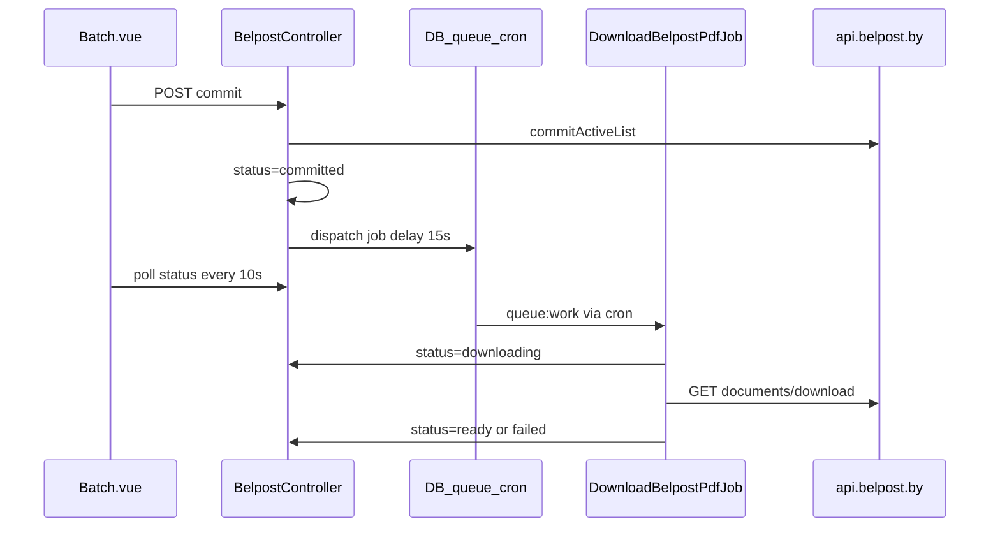
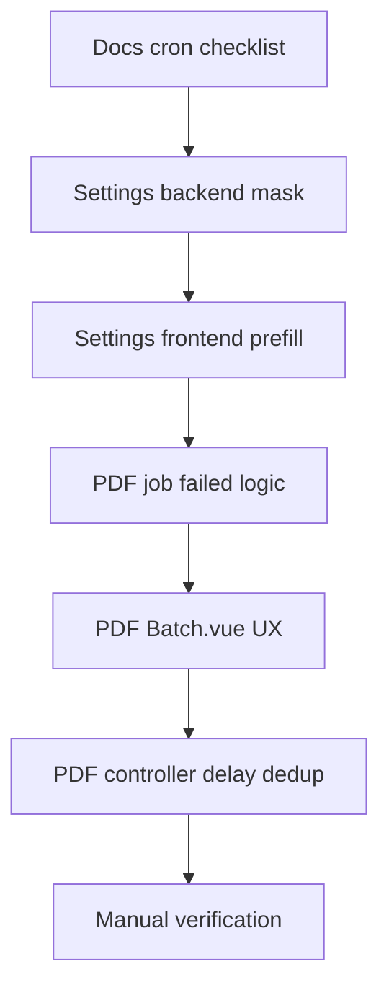

# Fix: зависание PDF Белпочты и отображение настроек

**Дата:** 24.07.2026  
**Статус:** implemented  
**Контекст:** (1) После commit партия «зависает» на формировании PDF, хотя на стороне Белпочты бланки уже готовы. (2) На странице настроек не отображаются сохранённые параметры; токены нужно показывать маской (первые символы + точки), без передачи полных секретов в браузер.

---

## Симптомы

1. **PDF:** после commit статус остаётся `committed` («Белпочта формирует PDF…»), UI не переходит к `ready`, хотя в ЛК Белпочты партия уже сформирована.
2. **Настройки:** текстовые поля (`shop_name`, `elc`, `warehouse_id_start` и др.) пустые — виден только индикатор «✓ Сохранено». Токены не отображаются явно (только placeholder на фронте из полного значения в props).

---

## Диагноз

### PDF

После commit CRM сразу ставит статус `committed`, а скачивание PDF выполняет фоновая job [`DownloadBelpostPdfJob`](../app/Jobs/DownloadBelpostPdfJob.php). UI опрашивает **только локальную БД** (`GET /api/belpost/batches/{id}/status`), не API Белпочты.



**Корневая причина зависания:** job не выполняется (cron / `schedule:run` не работает или очередь не обрабатывается). Статус остаётся `committed`, хотя PDF на Белпочте уже готов.

Очередь обрабатывается через [`app/Console/Kernel.php`](../app/Console/Kernel.php):

```php
$schedule->command('queue:work --stop-when-empty --tries=3')
    ->everyMinute()
    ->withoutOverlapping();
```

**Дополнительная UX-проблема:** в `catch` блоке `DownloadBelpostPdfJob::handle()` статус сразу ставится `failed`, затем job ретраится — UI может показывать ошибку между попытками.

### Настройки

[`TenantSettingController::index()`](../app/Http/Controllers/TenantSettingController.php) отдаёт полные расшифрованные значения в prop `current`. [`Settings/Index.vue`](../resources/js/Pages/Settings/Index.vue) намеренно оставляет `text` / `password` inputs пустыми — пользователь видит только «✓ Сохранено».

---

## Часть 1: PDF — зависание после commit

### 1.1 Документация и чеклист деплоя

Обновить [`README.md`](../../README.md) и/или [`belpost-retry-download-who-pays.md`](belpost-retry-download-who-pays.md):

- Явный чеклист: `QUEUE_CONNECTION=database`, cron `* * * * * php artisan schedule:run`, проверка таблицы `jobs`, логи `DownloadBelpostPdfJob`.
- Диагностика застрявшей партии: `status=committed` + pending job в `jobs` = проблема очереди, не Белпочты.
- Инструкция «что делать сейчас»: кнопка «Повторить скачивание» на странице партии.

**Чеклист cron (prod):**

```bash
# crontab
* * * * * cd /path/to/hosting && php artisan schedule:run >> /dev/null 2>&1
```

**Диагностика:**

```sql
-- статус партии
SELECT id, batch_id, status, id_to_download, error_message FROM mail_batches WHERE id = ?;

-- необработанные jobs
SELECT id, queue, payload, attempts, available_at FROM jobs
WHERE payload LIKE '%DownloadBelpostPdfJob%';
```

```bash
# логи
grep DownloadBelpostPdfJob storage/logs/laravel.log
```

### 1.2 UX — [`Batch.vue`](../resources/js/Pages/Belpost/Batch.vue)

| Изменение | Текущее | Новое |
|-----------|---------|-------|
| Текст статуса `committed` | «Белпочта формирует PDF…» | «Ожидание скачивания PDF…» |
| Таймер retry-кнопки | 120 000 ms | 60 000 ms |
| Подсказка под retry | «Подождите 30–60 сек…» | «Если статус не меняется более минуты — нажмите „Повторить скачивание“» |

Затронутые места: `showRetryButton` computed (~строка 401), блок PDF status (~строки 284–306).

### 1.3 Job logic — [`DownloadBelpostPdfJob.php`](../app/Jobs/DownloadBelpostPdfJob.php)

**Изменение:**

- В `catch` — только лог + `throw $e` (без `$batch->update(['status' => failed])`).
- Статус `failed` выставлять только в `failed()` (после исчерпания 3 попыток с backoff 60/120/240 с).
- Добавить `Log::info` при старте job (`batch_id`, `attempt`).

### 1.4 Controller — [`BelpostController.php`](../app/Http/Controllers/BelpostController.php)

- Увеличить начальную задержку dispatch после commit: **15s → 30s**.
- В `retryDownload()`: перед dispatch проверить, нет ли уже pending job для этого `batch_id` в таблице `jobs` (по payload), чтобы не плодить дубликаты.
- Добавить `Log::info` при dispatch commit / retry.

### 1.5 Вне scope этой итерации

- Polling API Белпочты на готовность документа (отдельная задача).
- Supervisor-конфиг для постоянного queue worker (выбран вариант «код + docs»).

---

## Часть 2: Настройки — вариант B

### 2.1 Backend — [`TenantSettingController.php`](../app/Http/Controllers/TenantSettingController.php)

Добавить protected-методы:

```php
protected static function maskSecret(string $value, int $visible = 4): string
protected static function buildCurrentForUi(array $stored): array // returns [$current, $secretPreviews]
```

Логика `buildCurrentForUi()` по schema:

- `password` → в `$secretPreviews[$key] = maskSecret($value)` (полное значение **не** отдаётся)
- `text`, `select`, `toggle` → в `$current[$key] = $value`

Изменить `index()`:

```php
return Inertia::render('Settings/Index', [
    'schema'         => ...,
    'current'        => $current,       // без секретов
    'secretPreviews' => $secretPreviews,
    ...
]);
```

`update()` и `generateWebhookSecret()` — **без изменений** (пустое password-поле не затирает значение).

### 2.2 Frontend — [`Settings/Index.vue`](../resources/js/Pages/Settings/Index.vue)

- Новый prop `secretPreviews: Object`.
- Инициализация формы: для `type === 'text'` — `f[key] = props.current[key] ?? ''`; для `password` — `''`.
- `maskedPlaceholder()` — брать значение из `secretPreviews[key]`.
- Индикатор «✓ Сохранено» для password: если есть `secretPreviews[key]`.
- После save: обновлять `current` для text-полей; для password — не хранить полный токен в клиенте.
- Исключение: `generateWebhookSecret()` — после генерации показывать полный секрет один раз (существующее поведение).

### 2.3 Безопасность

После изменений в DevTools / Inertia props не должно быть полных значений ключей: `auth_token_bp`, `token_ep`, `password_ep`, `service_number_ep`, `api_token_call_centr`, `token_sms_by`, `api_key_blacks_by`, `webhook_secret` (кроме момента после «Сгенерировать»).

---

## Порядок реализации



### Задачи

| ID | Задача | Файл |
|----|--------|------|
| docs-cron-checklist | Чеклист cron, QUEUE_CONNECTION, диагностика | README / docs |
| pdf-job-failed-logic | failed только в failed(), логирование | DownloadBelpostPdfJob.php |
| pdf-controller | delay 30s, dedup retry, логи | BelpostController.php |
| pdf-batch-ux | тексты, retry 60s | Batch.vue |
| settings-backend-mask | maskSecret, buildCurrentForUi | TenantSettingController.php |
| settings-frontend | prefill text, secretPreviews | Settings/Index.vue |
| manual-verify | Ручная проверка по AC | — |

---

## Acceptance criteria

### PDF

- [ ] После commit при работающем cron: `committed` → `downloading` → `ready` за 1–3 мин. *(ручная проверка staging/prod)*
- [x] UI не пишет «Белпочта формирует», когда CRM ждёт очередь.
- [x] Retry-кнопка доступна через 60 с.
- [x] Между auto-retry job статус не перескакивает в `failed` преждевременно.
- [x] Документация содержит чеклист cron / очереди.

### Настройки

- [x] Текстовые поля видны при открытии `/settings`.
- [x] Password-поля показывают preview `XXXX••••••••`, полный токен не в props.
- [x] Сохранение с пустым password не затирает существующий токен.
- [x] `select` / `toggle` работают без регрессий.

### Ручной тест PDF (prod / staging)

1. Commit партии → наблюдать смену статусов.
2. Проверить `jobs` и `storage/logs/laravel.log`.
3. Если зависло в `committed` > 2 мин → «Повторить скачивание» → `ready`.

---

## Затронутые файлы

| Файл | Изменения |
|------|-----------|
| [`app/Jobs/DownloadBelpostPdfJob.php`](../app/Jobs/DownloadBelpostPdfJob.php) | failed только после retries, логирование |
| [`app/Http/Controllers/BelpostController.php`](../app/Http/Controllers/BelpostController.php) | delay 30s, dedup retry, логи |
| [`resources/js/Pages/Belpost/Batch.vue`](../resources/js/Pages/Belpost/Batch.vue) | тексты, retry 60s |
| [`app/Http/Controllers/TenantSettingController.php`](../app/Http/Controllers/TenantSettingController.php) | mask + buildCurrentForUi |
| [`resources/js/Pages/Settings/Index.vue`](../resources/js/Pages/Settings/Index.vue) | secretPreviews, prefill text |
| [`README.md`](../../README.md) | cron / queue checklist |
