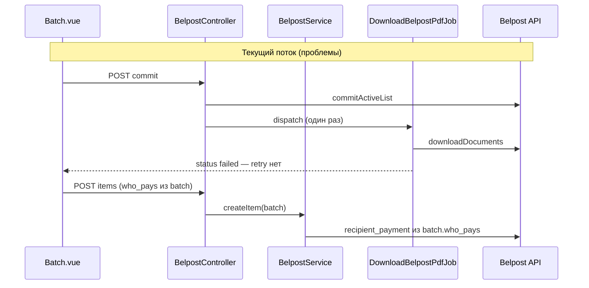
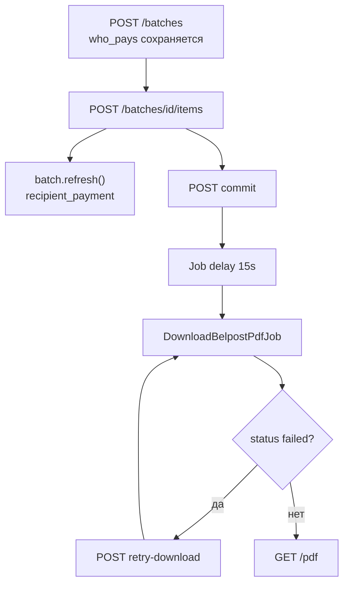

# Fix: повторное скачивание бланков и оплата пересылки (Белпочта)

**Дата:** 20.07.2026  
**Статус:** implemented  
**Контекст:** Два расхождения Laravel-реализации с рабочей логикой GS: (1) при ошибке скачивания PDF бланков нет возможности перескачать; (2) выбор «Покупатель» при создании партии не отражается на бланке — нужно выровнять поведение с GS и устранить UX-путаницу.

## Симптомы

1. **Скачивание PDF:** после commit партия переходит в `failed` (или «зависает» в `committed`/`downloading`), пользователь видит ошибку, но не может повторить скачивание. В GS функция `downloadBlanksActiveList` вызывается отдельно и повторно.
2. **Оплата пересылки:** в UI выбран «Покупатель», но на бланке Белпочты пересылку оплачивает продавец. В GS ячейка E1 корректно передаётся в `addons.recipient_payment`.

## GS-эталон

| Аспект | GS | Файл |
|--------|----|------|
| Скачивание | Отдельный повторяемый вызов по `id_to_download` | [`backend/SaveItems.gs`](../../backend/SaveItems.gs) — `downloadBlanksActiveList` |
| Commit → скачивание | Разделены; alert «вызывайте минимум через 10 секунд» | [`backend/SaveItems.gs`](../../backend/SaveItems.gs) — `commitActiveList` |
| Оплата пересылки | `recipient_payment: true/false` из E1 | [`backend/General.gs`](../../backend/General.gs) строки 100–106, 244 |

## Текущее состояние Laravel

- Commit автоматически диспатчит [`DownloadBelpostPdfJob`](../app/Jobs/DownloadBelpostPdfJob.php) один раз ([`BelpostController::commit`](../app/Http/Controllers/BelpostController.php)).
- При `failed` UI только показывает ошибку ([`Batch.vue`](../resources/js/Pages/Belpost/Batch.vue), блок PDF).
- Логика `who_pays` → `recipient_payment` в [`BelpostService::createItem`](../app/Services/BelpostService.php) **совпадает с GS**, но нет `$batch->refresh()`, логирования payload и UX-защиты от путаницы (select «Кто платит» относится к **новой** партии, а не к выбранной из истории).
- В логах была ошибка `Unknown column 'who_pays'` — миграция [`2026_06_27_000014_add_who_pays_to_mail_batches.php`](../database/migrations/2026_06_27_000014_add_who_pays_to_mail_batches.php) должна быть применена на prod.



---

## Задача 1: Повторное скачивание бланков

### Backend

**Файл:** [`hosting/app/Http/Controllers/BelpostController.php`](../app/Http/Controllers/BelpostController.php)

Добавить метод `retryDownload(MailBatch $batch)`:

- Разрешить retry при статусах: `failed`, `committed`, `downloading`
- Требовать наличие `id_to_download` (иначе 422 с понятным сообщением)
- Перед dispatch: сбросить `error_message`, выставить `status = committed` (job сам обновит на `downloading`)
- `DownloadBelpostPdfJob::dispatch($batch->id, Auth::user()->tenant_id)`

**Файл:** [`hosting/routes/web.php`](../routes/web.php)

```php
Route::post('/batches/{batch}/retry-download', [BelpostController::class, 'retryDownload'])
    ->name('batches.retryDownload');
```

**Метод `commit`:** добавить начальную задержку job (как в GS «минимум 10 секунд»):

```php
DownloadBelpostPdfJob::dispatch($batch->id, Auth::user()->tenant_id)
    ->delay(now()->addSeconds(15));
```

**Метод `downloadPdf`:** если `pdf_path` отсутствует на диске, но есть `id_to_download` — redirect back с сообщением «Файл потерян, нажмите „Повторить скачивание“».

### Frontend

**Файл:** [`hosting/resources/js/Pages/Belpost/Batch.vue`](../resources/js/Pages/Belpost/Batch.vue)

1. Блок `failed`: кнопка **«Повторить скачивание»** + подсказка «Подождите 30–60 сек, если PDF ещё формируется на стороне Белпочты» (текст из GS)
2. Блок `committed`/`downloading`: кнопка retry (disabled во время `retrying`) — на случай «зависания» при неработающей очереди
3. Метод `retryDownload()` → `POST /belpost/batches/{id}/retry-download` → `startPolling()`

### Зависимости / риски

- Очередь: `QUEUE_CONNECTION=database`, worker через [`Kernel.php`](../app/Console/Kernel.php) schedule. Retry не поможет, если cron не запущен — проверить `schedule:run` на prod
- Job уже имеет 3 auto-retry ([`DownloadBelpostPdfJob.php`](../app/Jobs/DownloadBelpostPdfJob.php)) — ручной retry дополняет, не заменяет

---

## Задача 2: Оплата пересылки (who_pays → recipient_payment)

### Backend — надёжность данных

**Файл:** [`hosting/app/Services/BelpostService.php`](../app/Services/BelpostService.php) — метод `createItem`

1. В начале: `$batch->refresh()` — гарантия актуального `who_pays` из БД
2. Явная нормализация:

```php
$whoPays = $batch->who_pays ?? 'Покупатель';
$recipientPayment = $whoPays !== 'Продавец';
```

3. Лог перед POST (уровень `info`):

```php
Log::info('BelpostService::createItem payment', [
    'batch_id' => $batch->batch_id,
    'who_pays' => $whoPays,
    'recipient_payment' => $recipientPayment,
    'order_id' => $order->id,
]);
```

Логика boolean **не меняется** — она идентична GS. Изменения — защита от `null` и наблюдаемость.

**Файл:** [`BelpostController::batchStatus`](../app/Http/Controllers/BelpostController.php) — добавить `who_pays` в JSON-ответ polling.

### Frontend — UX против путаницы

**Файл:** [`Batch.vue`](../resources/js/Pages/Belpost/Batch.vue)

1. Select «Кто платит» оставить только в карточке «Создать новую партию», но:
   - При выборе партии из истории — badge «Оплата: Покупатель/Продавец» в шапке
   - Если `activeBatch.status === 'draft'` — info-блок: «Плательщик зафиксирован при создании партии и не меняется»
2. Select «Кто платит» disabled, когда выбрана активная партия (опционально: визуально отделить блок «Новая партия»)

### Deploy / миграция

Перед выкатом: `php artisan migrate` — колонка `who_pays` в `mail_batches`.

Проверка на prod:

```sql
SELECT batch_id, type, who_pays, status FROM mail_batches WHERE batch_id = '...';
```

---

## Поток после фиксов



---

## Критерии приёмки

| # | Критерий |
|---|----------|
| AC-1 | После ошибки скачивания (`status=failed`) пользователь нажимает «Повторить скачивание» → job запускается, статус переходит в `downloading` → `ready`, ZIP скачивается |
| AC-2 | При `committed`/`downloading` > 2 мин доступна ручная retry-кнопка |
| AC-3 | Партия с `who_pays=Покупатель` → в логах `recipient_payment: true`, на бланке Белпочты оплата пересылки у получателя |
| AC-4 | Партия с `who_pays=Продавец` → `recipient_payment: false` |
| AC-5 | В шапке активной партии явно видно, кто платит; нет путаницы с select создания новой партии |
| AC-6 | Типы `ecommerce_light`/`ecommerce_optima` — только «Продавец» (без регрессии) |

---

## Тест-план (ручной)

1. Создать партию `package`, who_pays = «Покупатель» → оформить 1 бланк → проверить лог `recipient_payment: true`
2. Создать партию, who_pays = «Продавец» → проверить лог `recipient_payment: false`
3. Commit → дождаться `ready` → скачать ZIP
4. Симулировать `failed` (ручной update status / invalid token) → «Повторить скачивание» → успех
5. Выбрать старую партию из истории — who_pays в шапке соответствует БД, а не select «новой партии»

---

## Объём изменений

| Файл | Изменение |
|------|-----------|
| [`BelpostController.php`](../app/Http/Controllers/BelpostController.php) | `retryDownload`, delay на commit, who_pays в status, улучшение downloadPdf |
| [`BelpostService.php`](../app/Services/BelpostService.php) | refresh + log recipient_payment |
| [`web.php`](../routes/web.php) | маршрут retry-download |
| [`Batch.vue`](../resources/js/Pages/Belpost/Batch.vue) | кнопка retry, badge who_pays, UX-подсказка |
| `public/js/app.js` | пересборка фронта (`npm run dev`) |

---

## Чеклист реализации

- [x] `BelpostController::retryDownload` + route + delay(15s) на commit + улучшение downloadPdf
- [x] `Batch.vue`: кнопка «Повторить скачивание», `retryDownload()`, polling после retry
- [x] `BelpostService`: `batch.refresh()`, нормализация who_pays, log recipient_payment; who_pays в batchStatus
- [x] `Batch.vue`: badge who_pays в шапке партии, info-блок о фиксации плательщика
- [ ] Ручной прогон AC-1..AC-6 + проверка миграции who_pays на prod
