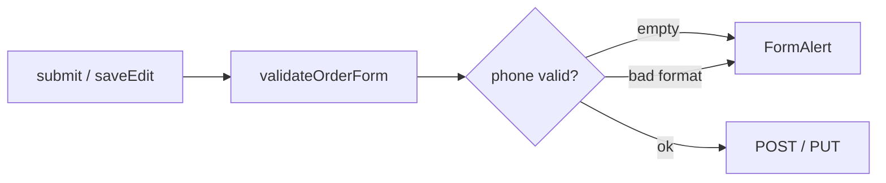

# Fix: client-side валидация формата телефона

**Дата:** 09.08.2026  
**Статус:** implemented  
**Контекст:** Дополнение к [`order-form-validation-ux.md`](order-form-validation-ux.md). После in-app алертов для ФИО/товара телефон на клиенте проверяется только на «не пусто»; формат `375XXXXXXXXX` валидируется лишь на backend.

**Связанные файлы:** [`phone.js`](../../resources/js/utils/phone.js), [`orderFormValidation.js`](../../resources/js/utils/orderFormValidation.js), [`BelarusPhone.php`](../../app/Rules/BelarusPhone.php), [`PhoneNormalizer.php`](../../app/Support/PhoneNormalizer.php)

---

## Симптомы

| Ситуация | Текущее поведение |
|----------|-------------------|
| Телефон пустой | FormAlert «Укажите телефон» + красная рамка |
| Телефон неверного формата (`123`, `3751416`) | Submit уходит на сервер → 422, без client-side FormAlert |
| Валидные форматы (`291234567`, `+375…`, `80…`) | Проходят после round-trip на backend |

---

## Цель

При неверном формате — тот же UX, что для ФИО и товара: красный `FormAlert` + `fieldErrors.phone` **до** submit, без запроса на сервер.



---

## Шаг 1 — JS-хелперы в phone.js

**Файл:** [`resources/js/utils/phone.js`](../../resources/js/utils/phone.js)

Добавить функции, зеркалящие [`PhoneNormalizer`](../../app/Support/PhoneNormalizer.php) + [`BelarusPhone`](../../app/Rules/BelarusPhone.php):

```javascript
export function normalizePhone(phone) { /* 9 → 375..., 80 → 375..., 375... as-is */ }

export function isValidBelarusPhone(phone) {
  // после normalize: ровно 12 цифр, startsWith('375'), last 9 digits
}
```

Логика `normalizePhone` (как в PHP):

- 9 цифр → `'375' + digits`
- 11 цифр, prefix `80` → `'375' + slice(2)`
- 12 цифр, prefix `375` → as-is
- иначе → digits as-is (для последующего fail в `isValidBelarusPhone`)

Сообщение об ошибке (совпадает с backend): *«Укажите корректный белорусский номер (375XXXXXXXXX)»*

---

## Шаг 2 — validateOrderForm

**Файл:** [`resources/js/utils/orderFormValidation.js`](../../resources/js/utils/orderFormValidation.js)

Заменить блок телефона:

```javascript
if (!phone?.trim()) {
    errors.phone = 'Укажите телефон'
} else if (!isValidBelarusPhone(phone)) {
    errors.phone = 'Укажите корректный белорусский номер (375XXXXXXXXX)'
}
```

В `normalizeOrderFormFields` — нормализовать телефон перед отправкой:

```javascript
phone: normalizePhone(data.phone?.trim()) || '',
```

`FormAlert` и `fieldErrors.phone` уже подключены в [`Create.vue`](../../resources/js/Pages/Orders/Create.vue) и [`Show.vue`](../../resources/js/Pages/Orders/Show.vue) — дополнительный UI-код не нужен.

---

## Шаг 3 — Inline-подсказка под полем (опционально)

**Файл:** [`resources/js/Pages/Orders/Show.vue`](../../resources/js/Pages/Orders/Show.vue)

В edit mode под полем телефона можно добавить блок как в Create (`form.errors.phone` с сервера).

**Рекомендация:** достаточно FormAlert + рамка; inline в Show — nice-to-have, не блокер.

---

## Шаг 4 — Документация

Обновить [`order-form-validation-ux.md`](order-form-validation-ux.md): AC для формата телефона, ссылка на этот fix.

---

## Acceptance Criteria

| # | Критерий |
|---|----------|
| AC-1 | Пустой телефон → «Укажите телефон» в FormAlert + красная рамка |
| AC-2 | `123`, `3751416` → «Укажите корректный белорусский номер (375XXXXXXXXX)» в FormAlert + рамка |
| AC-3 | `291234567`, `+375291234567`, `80291234567` → проходят, submit без ошибки |
| AC-4 | При submit телефон нормализуется в `375XXXXXXXXX` (как backend) |
| AC-5 | Поведение одинаково в Create и Show (edit) |

---

## Объём

~3 файла, ~40 строк. Backend не меняется.

| Файл | Действие |
|------|----------|
| `resources/js/utils/phone.js` | `normalizePhone`, `isValidBelarusPhone` |
| `resources/js/utils/orderFormValidation.js` | проверка формата + normalize при submit |
| `docs/fix/order-form-validation-ux.md` | дополнить AC |

[`Create.vue`](../../resources/js/Pages/Orders/Create.vue), [`Show.vue`](../../resources/js/Pages/Orders/Show.vue), [`FormAlert.vue`](../../resources/js/Components/FormAlert.vue) — без изменений.

---

## Checklist реализации

- [x] `normalizePhone` + `isValidBelarusPhone` в `phone.js`
- [x] Расширить `validateOrderForm` и `normalizeOrderFormFields`
- [x] Обновить `order-form-validation-ux.md`
