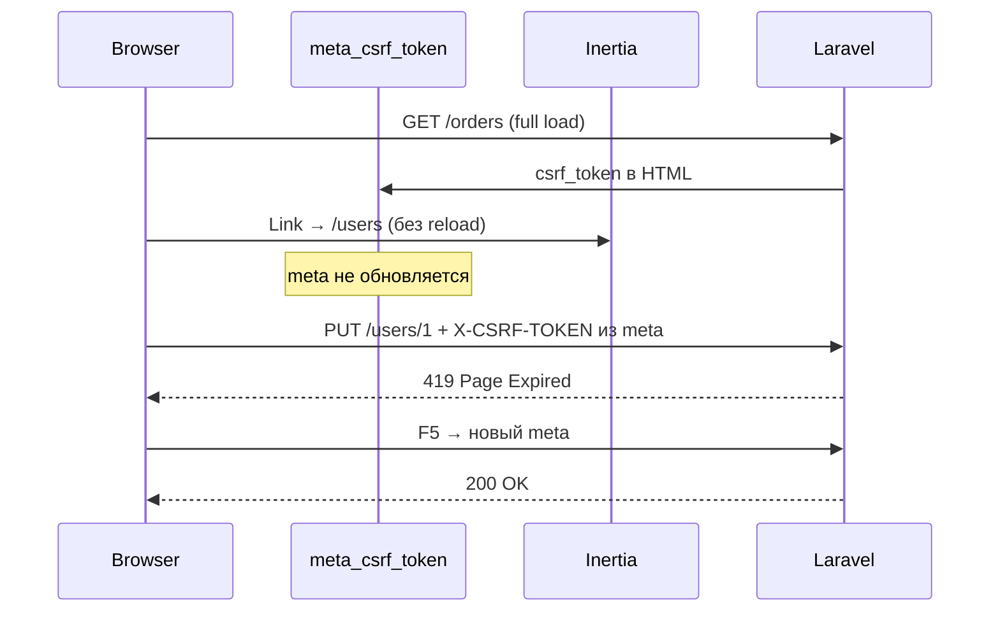

# Fix: CSRF 419 после Inertia-навигации

**Дата:** 20.07.2026  
**Статус:** planned  
**Контекст:** На странице «Пользователи» (и других SPA-страницах с ручным `fetch`) mutating-запросы (POST/PUT/DELETE) падают с **419 Page Expired**. После полной перезагрузки страницы (F5) операции снова работают. Backend (`UserController`, маршруты, `VerifyCsrfToken`) корректен — проблема на фронтенде.

## Симптомы

1. **Пользователи:** создание, редактирование и удаление не работают без F5.
2. **Network:** запросы `POST/PUT/DELETE` к `/users/*` возвращают **419**.
3. **После F5:** все операции снова проходят.
4. **Тот же паттерн** возможен на «Склад», «Финансы», Белпочта, Заказы и др. — везде, где CSRF берётся из `<meta name="csrf-token">`.

## Причина



- CSRF-токен в `<meta name="csrf-token">` задаётся только при полной загрузке [`resources/views/app.blade.php`](../resources/views/app.blade.php).
- При SPA-переходах через Inertia HTML не перезагружается — **meta устаревает**.
- Laravel обновляет cookie `XSRF-TOKEN` на каждом ответе, но текущий код использует **meta**, а не cookie.
- Inertia-формы (например, сохранение настроек через `Inertia.post`) CSRF подставляют автоматически — там проблемы нет.

## Решение

Создать общий модуль [`resources/js/utils/api.js`](../resources/js/utils/api.js) на базе уже установленного `axios` ([`package.json`](../package.json)):

- `axios` автоматически читает cookie `XSRF-TOKEN` и шлёт заголовок `X-XSRF-TOKEN` (стандарт Laravel).
- Общие заголовки: `X-Requested-With: XMLHttpRequest`, `Accept: application/json`.
- Экспорт функции `apiFetch(path, method, body?)` с **fetch-совместимым интерфейсом** (`ok`, `status`, `json()`) — минимальные правки в существующих компонентах.
- Response interceptor: при **419** — `window.location.reload()` (fallback, если cookie тоже устарел).

Пример целевого API:

```javascript
import { apiFetch } from '@/utils/api'

const resp = await apiFetch('/users', 'POST', payload)
const data = await resp.json()
if (data.success) { /* ... */ }
```

Alias `@` уже настроен в [`webpack.mix.js`](../webpack.mix.js).

## Файлы для изменения

### 1. Новый утилитный модуль

| Файл | Действие |
|------|----------|
| [`resources/js/utils/api.js`](../resources/js/utils/api.js) | Создать: axios instance + `apiFetch` + обработка 419 |

### 2. Страницы с дублирующим `getCsrf` / `apiFetch`

Удалить локальные функции, импортировать `@/utils/api`:

| Файл | Запросы |
|------|---------|
| [`resources/js/Pages/Users/Index.vue`](../resources/js/Pages/Users/Index.vue) | POST, PUT, DELETE `/users` |
| [`resources/js/Pages/Products/Index.vue`](../resources/js/Pages/Products/Index.vue) | POST, PUT, DELETE `/products` |
| [`resources/js/Pages/Finance/Index.vue`](../resources/js/Pages/Finance/Index.vue) | POST, DELETE `/finances/*` |

### 3. Страницы с inline `fetch` + meta CSRF

| Файл | Запросы |
|------|---------|
| [`resources/js/Pages/Belpost/Batch.vue`](../resources/js/Pages/Belpost/Batch.vue) | ~5 POST к `/belpost/*` |
| [`resources/js/Pages/Orders/Index.vue`](../resources/js/Pages/Orders/Index.vue) | PATCH/POST к `/orders/*`, `/api/*` |
| [`resources/js/Pages/Europochta/Create.vue`](../resources/js/Pages/Europochta/Create.vue) | POST `/europochta/*` |
| [`resources/js/Pages/Settings/Index.vue`](../resources/js/Pages/Settings/Index.vue) | POST `/settings/generate-webhook-secret` |
| [`resources/js/Layouts/AppLayout.vue`](../resources/js/Layouts/AppLayout.vue) | POST `/api/tracking/auto-notice/dismiss` |
| [`resources/js/composables/useTheme.js`](../resources/js/composables/useTheme.js) | PATCH `/settings/theme` |

**Не трогаем:**

- Inertia-формы (основное сохранение на `Settings/Index.vue` через `Inertia.post`) — CSRF уже работает.
- [`Orders/Import.vue`](../resources/js/Pages/Orders/Import.vue) — FormData с `_token`; мигрировать отдельно при необходимости.

**Backend не меняем:** [`app/Http/Middleware/VerifyCsrfToken.php`](../app/Http/Middleware/VerifyCsrfToken.php), маршруты и контроллеры корректны.

## Шаги реализации

1. **Создать `utils/api.js`**
   - Настроить axios defaults (`xsrfCookieName`, `xsrfHeaderName` — дефолты Laravel совпадают).
   - Реализовать `apiFetch` с fetch-совместимым ответом.
   - Добавить interceptor для 419 → reload.

2. **Мигрировать Users, Products, Finance**
   - `import { apiFetch } from '@/utils/api'`
   - Удалить локальные `getCsrf()` и `apiFetch()`
   - Логика `resp.json()` / `data.success` без изменений.

3. **Мигрировать остальные 6 файлов**
   - Заменить `fetch(..., { headers: { X-CSRF-TOKEN: ... } })` на `apiFetch`.
   - Удалить неиспользуемые `getCsrf()`.

4. **Сборка**
   - `npm run build` в корне `hosting/`.

## Проверка (Acceptance Criteria)

- [ ] Зайти на `/orders` → перейти в «Пользователи» через меню **без F5** → создать / изменить / удалить пользователя — **без 419**.
- [ ] То же для «Склад» и «Финансы» (POST/PUT/DELETE без reload).
- [ ] Белпочта, Европочта, смена темы, dismiss tracking notice — работают после Inertia-навигации.
- [ ] При искусственном 419 (устаревшая сессия) — страница перезагружается, а не «молчаливый» сбой.
- [ ] В Network: запросы содержат cookie сессии и заголовок `X-XSRF-TOKEN` (не только `X-CSRF-TOKEN` из meta).

## Риски

| Риск | Митигация |
|------|-----------|
| axios меняет формат ошибок | fetch-совместимая обёртка `apiFetch` сохраняет текущий паттерн `resp.json()` |
| DELETE без body | `apiFetch(path, 'DELETE')` — `data: undefined` |
| FormData (Import CSV) | `Orders/Import.vue` использует `_token` в FormData — оставить как есть |

## Объём

~1 новый файл + ~9 правок Vue/JS. Backend и конфиг сессий не требуют изменений.

## Checklist реализации

- [ ] Создать `resources/js/utils/api.js`: axios instance, apiFetch, interceptor 419
- [ ] Мигрировать Users, Products, Finance — import apiFetch, удалить локальные getCsrf/apiFetch
- [ ] Мигрировать Belpost, Orders, Europochta, Settings, AppLayout, useTheme на apiFetch
- [ ] `npm run build` + ручная проверка CRUD без F5 после Inertia-навигации
