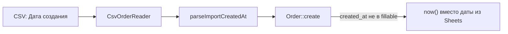

# Fix: дата создания при импорте CSV из Google Sheets

**Дата:** 13.08.2026  
**Статус:** implemented  
**Контекст:** При импорте CSV (экспорт листа «Заказы» из CRM Google Sheets) дата создания заявки должна браться из колонки «Дата создания», а не из момента импорта.

## Симптом

- В CSV есть колонка «Дата создания» (например, `15.07.2026`).
- После импорта в Laravel у заказа `created_at` равен дате/времени импорта, а не значению из Sheets.
- В UI списка и карточки заказа отображается неверная дата.

## Причина

Колонка проходит весь pipeline импорта, но **отбрасывается при сохранении**:



- [`CsvOrderReader.php`](../../app/Support/CsvOrderReader.php) — маппинг `дата создания` → `created_at` уже есть.
- [`OrderController::importCsv()`](../../app/Http/Controllers/OrderController.php) — парсинг `d.m.Y` / `d.m.Y H:i` уже есть (строки 169–174, 251–261).
- [`Order.php`](../../app/Models/Order.php) — **`created_at` отсутствует в `$fillable`**, Laravel игнорирует значение при `Order::create()`.

Формат даты в Google Sheets (GAS): `dd.mm.yyyy` и `dd.MM.yyyy hh:mm` — см. [`backend/OnEdit.gs`](../../../backend/OnEdit.gs).

## Решение

### 1. Разрешить mass assignment для `created_at`

**Файл:** [`app/Models/Order.php`](../../app/Models/Order.php)

Добавить `'created_at'` в массив `$fillable`.

**Безопасность:** ручное создание (`OrderController::store()`) и webhook (`WebhookController::lead()`) не передают `created_at` — поле не входит в `$request->validate()`. Laravel по-прежнему автоматически проставит `now()` для этих сценариев.

### 2. Тест на сохранение даты из CSV

**Файл:** [`tests/Feature/OrderCsvImportTest.php`](../../tests/Feature/OrderCsvImportTest.php)

В тесте `test_imports_google_sheets_csv_with_multiple_line_items` fixture уже содержит `15.07.2026`, но assertion отсутствует. Добавить:

```php
$this->assertSame('2026-07-15', $order->created_at->format('Y-m-d'));
```

Добавить отдельный тест на импорт с датой и временем (`15.07.2026 14:30`) — проверить сохранение часов и минут.

### 3. (Опционально) Предупреждение при нераспознанной дате

**Файл:** [`app/Http/Controllers/OrderController.php`](../../app/Http/Controllers/OrderController.php)

Если в CSV есть значение в колонке «Дата создания», но `parseImportCreatedAt()` вернул `null` — добавить запись в `$warnings`:

> «Не удалось распознать дату «…», использована текущая дата»

Расширять форматы парсинга (`Y-m-d`, ISO) — **только если** в реальных экспортах Sheets встречаются другие форматы.

## Затронутые файлы

| Файл | Изменение |
|------|-----------|
| [`app/Models/Order.php`](../../app/Models/Order.php) | `created_at` в `$fillable` |
| [`tests/Feature/OrderCsvImportTest.php`](../../tests/Feature/OrderCsvImportTest.php) | assertions на `created_at` |
| [`app/Http/Controllers/OrderController.php`](../../app/Http/Controllers/OrderController.php) | warning при нераспознанной дате (опционально) |

## Acceptance Criteria

| # | Критерий |
|---|----------|
| AC1 | Импорт CSV с «Дата создания: 15.07.2026» → `orders.created_at = 2026-07-15` |
| AC2 | Импорт с датой и временем → сохраняются часы и минуты |
| AC3 | Ручное создание заказа → `created_at = now()` (без изменений) |
| AC4 | Webhook с сайта → `created_at = now()` (без изменений) |
| AC5 | Feature-тесты проходят |

## Проверка

```bash
cd hosting && php artisan test --filter=OrderCsvImportTest
```

Ручная проверка: импортировать CSV с колонкой «Дата создания», убедиться что в списке заказов и на странице заказа отображается дата из Sheets, а не дата импорта.

## Риски

- **Минимальные.** Изменение затрагивает только явную передачу `created_at` в `importCsv()`. Остальные потоки создания заказов не затронуты.

## Порядок реализации

- [x] `created_at` в `$fillable` модели `Order`
- [x] Assertions в `OrderCsvImportTest` (дата и дата+время)
- [x] Warning при нераспознанной дате в `importCsv()`
- [x] Запуск тестов
