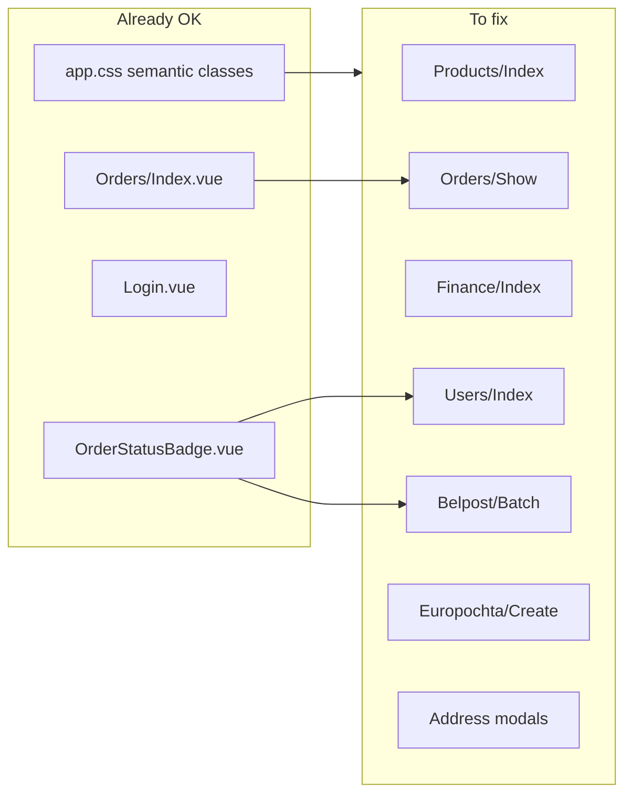

# Fix: контраст текста в тёмной теме

**Дата:** 29.06.2026  
**Статус:** planned  
**Контекст:** Laravel + Inertia + Vue 3 + Tailwind — тёмная тема реализована, но на ~40% страниц текст сливается с фоном карточек из‑за отсутствия `dark:`-вариантов у inline-классов `text-gray-*`.

## Симптом

В dark mode на карточках (`dark:bg-gray-800`) основной контент плохо читается или невидим:

- Крупные цифры статистики (`text-gray-800`) — контраст ~1:1 с фоном
- Имена, email, адреса, описания в таблицах (`text-gray-600/700/800`) — ниже WCAG AA
- Бейджи ролей и статусов партий — светлые «пятна» без dark-вариантов

**Наиболее заметно:** страница «Склад» ([`Products/Index.vue`](../resources/js/Pages/Products/Index.vue)) — цифры в stat-карточках.

## Причина

Инфраструктура темы работает корректно ([`app.css`](../resources/css/app.css), [`useTheme.js`](../resources/js/composables/useTheme.js), [`dark-theme.md`](../features/dark-theme.md)). Семантические классы (`.page-title`, `.text-muted`, `.text-body`) уже имеют `dark:`-варианты.

Проблема — **неполное покрытие** при миграции страниц: inline `text-gray-*` без парных `dark:text-*` на тёмных карточках. Часть страниц (Orders/Index, Login, OrderStatusBadge) уже исправлена и служит эталоном.

## Стратегия

Единая таблица соответствий (применять везде):

| Light | Dark | Назначение |
|-------|------|------------|
| `text-gray-900` | `dark:text-gray-100` | акцент / суммы |
| `text-gray-800` | `dark:text-gray-200` | основной текст (имена, цифры) |
| `text-gray-700` | `dark:text-gray-300` | вторичный акцент |
| `text-gray-600` | `dark:text-gray-400` | обычный вторичный |
| `text-gray-400` | `dark:text-gray-500` | подписи, empty states |
| `hover:text-gray-600` | `dark:hover:text-gray-300` | интерактивные элементы |

**Два подхода в одном PR:**

1. **Где возможно** — заменить inline `text-gray-*` на `.text-body` / `.text-muted` (меньше дублирования).
2. **Где нельзя** (динамические `:class`, бейджи, semantic colors) — добавить `dark:` по таблице выше.

Бейджи (`bg-*-100`) — по паттерну [`OrderStatusBadge.vue`](../resources/js/Components/OrderStatusBadge.vue):

```
bg-red-100 text-red-700  →  dark:bg-red-900 dark:text-red-200
bg-yellow-100 text-yellow-700  →  dark:bg-yellow-900 dark:text-yellow-200
... и т.д.
```



---

## Шаг 1: Расширить app.css (опционально, 2 класса)

Файл: [`hosting/resources/css/app.css`](../resources/css/app.css)

Добавить utility-классы для stat-карточек:

```css
.stat-label {
    @apply text-xs text-gray-400 dark:text-gray-500 font-medium uppercase tracking-wide;
}
.stat-value {
    @apply text-2xl font-bold text-gray-800 dark:text-gray-200;
}
```

---

## Шаг 2: Критичные страницы (P0)

### [`Products/Index.vue`](../resources/js/Pages/Products/Index.vue)

- Стат-карточки: `stat-label` / `stat-value`
- Таблица: `text-gray-800` → `dark:text-gray-200`, `text-gray-600` → `dark:text-gray-400`, `text-gray-700` → `dark:text-gray-300`
- Inline edit inputs: заменить на класс `.input`
- Semantic: `text-red-600` → `dark:text-red-400`, `text-green-600` → `dark:text-green-400`

### [`Users/Index.vue`](../resources/js/Pages/Users/Index.vue)

- Таблица: имена, email, даты — по таблице соответствий
- `roleBadgeClass()` — dark-варианты:

```js
admin:    'bg-red-100 text-red-700 dark:bg-red-900 dark:text-red-200',
manager:  'bg-yellow-100 text-yellow-700 dark:bg-yellow-900 dark:text-yellow-200',
operator: 'bg-blue-100 text-blue-700 dark:bg-blue-900 dark:text-blue-200',
```

- Модалки: `text-gray-400` → `dark:text-gray-500`

### [`Finance/Index.vue`](../resources/js/Pages/Finance/Index.vue)

- Стат-карточки: labels через `stat-label`; суммы — `dark:text-green-400`, `dark:text-red-400`, `dark:text-indigo-400`
- Month input: `dark:border-gray-600 dark:bg-gray-800 dark:text-gray-100`
- Чипы: `bg-gray-100 text-gray-600` → `dark:bg-gray-700 dark:text-gray-300`
- Бейджи категории/источника: `dark:bg-indigo-900/40 dark:text-indigo-200`, green-аналог
- Описания: `text-gray-600` → `dark:text-gray-400`
- Кнопки удаления: `text-gray-300` → `dark:text-gray-600`

---

## Шаг 3: Страницы заказов (P1)

### [`Orders/Show.vue`](../resources/js/Pages/Orders/Show.vue)

- Адрес: `.text-body` или `dark:` для `text-gray-800/600`
- Таблица товаров: th/td + итого
- Бейдж «Белпочта»: `dark:bg-green-900/30 dark:text-green-200`
- История статусов: `text-gray-700` → `dark:text-gray-300`

### [`Orders/Create.vue`](../resources/js/Pages/Orders/Create.vue)

- «Итого»: `text-gray-800` → `dark:text-gray-200`

### [`Orders/Index.vue`](../resources/js/Pages/Orders/Index.vue)

- Колонка `#`: `dark:text-gray-500`
- Track без значения: `dark:text-gray-500`

---

## Шаг 4: Белпочта / Европочта (P1)

### [`Belpost/Batch.vue`](../resources/js/Pages/Belpost/Batch.vue)

- Таблицы: имена, адреса, batch_id — по таблице
- `badgeClass()` — dark-варианты (5 статусов)
- Sidebar active: `dark:bg-indigo-900/40 dark:border-indigo-700`

### [`Europochta/Create.vue`](../resources/js/Pages/Europochta/Create.vue)

- Таблица очереди: `text-gray-800/600` → `dark:text-gray-200/400`

---

## Шаг 5: Компоненты и мелочи (P2)

| Файл | Изменения |
|------|-----------|
| [`AddressSearchModal.vue`](../resources/js/Components/AddressSearchModal.vue) | hover, label, district/postcode |
| [`AddressInlinePicker.vue`](../resources/js/Components/AddressInlinePicker.vue) | hover-ссылки, подписи |
| [`Orders/Import.vue`](../resources/js/Pages/Orders/Import.vue) | breadcrumb, result card dark |
| [`Settings/Index.vue`](../resources/js/Pages/Settings/Index.vue) | проверка (уже почти OK) |

---

## Шаг 6: Сборка и проверка

```bash
cd hosting && npm run dev   # или npm run prod
```

**Ручная проверка:**

- Включить тёмную тему в Настройках
- Пройти: Склад, Пользователи, Финансы, карточка заказа, Белпочта, Европочта
- Цифры, имена, email, адреса, описания читаются на карточках
- Бейджи ролей и статусов — читаемы, без «светлых пятен»
- Светлая тема — без регрессий

**Критерии приёмки:**

- Контраст основного текста на `bg-gray-800` ≥ WCAG AA (~4.5:1) для `text-sm`+
- Нет `text-gray-800` на `dark:bg-gray-800` без override
- Единообразие с Orders/Index, Login

---

## Риски

| Риск | Митигация |
|------|-----------|
| Пропущенные inline-классы | Финальный grep `text-gray-[678]00` по `resources/js/` |
| Светлые бейджи на тёмном фоне | Пара `dark:bg-*-900 dark:text-*-200` везде |
| Scope creep | Только CSS/Vue стили, без backend |

## Объём

~10 файлов Vue + опционально 2 класса в `app.css`. Один атомарный PR.

## Checklist

- [ ] `.stat-label` / `.stat-value` в app.css
- [ ] Products/Index, Users/Index, Finance/Index
- [ ] Orders/Show, Orders/Create, Orders/Index
- [ ] Belpost/Batch, Europochta/Create
- [ ] AddressSearchModal, AddressInlinePicker, Orders/Import
- [ ] npm run dev/prod + ручная проверка + grep на пропуски
