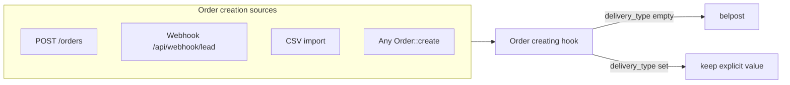

# Default «Белпочта» для всех источников создания заказа

**Дата:** 14.08.2026  
**Статус:** implemented  
**Контекст:** После фичи «Белпочта по умолчанию» default работал только при ручном создании; webhook и CSV-импорт оставляли `delivery_type = null`

## Цель

При создании заказа, если вид доставки **не указан**, автоматически проставлять `belpost` («Белпочта») — для webhook, CSV-импорта, ручного создания и любых других вызовов `Order::create()`.

## Проблема

Сейчас `belpost` по умолчанию работает только при **ручном создании**:

- [`Create.vue`](../resources/js/Pages/Orders/Create.vue) — `delivery_type: 'belpost'`
- [`OrderController::store()`](../app/Http/Controllers/OrderController.php) — `$data['delivery_type'] ??= 'belpost'`

Другие точки входа **не** проставляют доставку:

| Источник | Файл | Сейчас |
|----------|------|--------|
| Webhook (сайт) | [`WebhookController.php`](../app/Http/Controllers/WebhookController.php) ~стр. 95 | `delivery_type` отсутствует → `null` |
| CSV-импорт | [`OrderController::importCsv()`](../app/Http/Controllers/OrderController.php) ~стр. 237 | только из колонки «Вид доставки» → иначе `null` |

## Решение

**Один центральный hook** в модели [`Order.php`](../app/Models/Order.php) — событие `creating`:

```php
static::creating(function (Order $order) {
    if ($order->delivery_type === null || $order->delivery_type === '') {
        $order->delivery_type = 'belpost';
    }
});
```



**Почему модель, а не правки в каждом контроллере:**

- DRY — одно место для всех текущих и будущих `Order::create()`
- Явно указанная доставка (Европочта, Курьер…) не перезаписывается
- `update()` / `updateDeliveryType()` не затрагиваются

### Уборка дублирования

Строку `$data['delivery_type'] ??= 'belpost'` в `store()` **удалить** — логика только в модели.

Frontend в `Create.vue` **не трогаем** — UX «Белпочта» в форме остаётся.

## Затронутые файлы

| Файл | Изменение |
|------|-----------|
| [`Order.php`](../app/Models/Order.php) | `creating`-hook для default `belpost` |
| [`OrderController.php`](../app/Http/Controllers/OrderController.php) | убрать `??= 'belpost'` из `store()` (опционально, рекомендуется) |
| [`OrderAssignmentTest.php`](../tests/Feature/OrderAssignmentTest.php) | assert `belpost` после webhook |
| [`OrderCsvImportTest.php`](../tests/Feature/OrderCsvImportTest.php) | assert без колонки доставки + тест «Европочта» |
| [`bulk-order-status-belpost-default.md`](../features/bulk-order-status-belpost-default.md) | уточнить scope default для всех источников |

## Что не меняем

- **Миграции БД** — поле остаётся `nullable`; default только на уровне приложения
- **Существующие заказы** с `delivery_type = null` — не backfill
- **CSV с явной «Европочта»** — сохраняется `europochta` через [`CsvOrderReader::mapDeliveryType()`](../app/Support/CsvOrderReader.php)

## Тесты

| Тест | Что проверяет |
|------|---------------|
| `OrderAssignmentTest::test_webhook_assigns_call_center_...` | webhook → `delivery_type = belpost` |
| `OrderCsvImportTest::test_import_preserves_call_center_status` | CSV без колонки доставки → `belpost` |
| Новый: `test_import_preserves_explicit_europochta` | CSV с «Европочта» → `europochta` |
| `OrderValidationTest::test_store_defaults_delivery_type_to_belpost` | без изменений |

## AC (критерии приёмки)

1. Webhook создаёт заказ с `delivery_type = belpost`, если поле не передано
2. CSV без колонки «Вид доставки» → `belpost`
3. CSV с «Европочта» → `europochta`
4. Ручное создание → `belpost` (как сейчас)
5. Обновление существующего заказа без смены delivery → без side effects
6. Все связанные тесты проходят

## Чеклист реализации

- [x] `creating`-hook в `Order.php`
- [x] Убрать `??= 'belpost'` из `OrderController::store()`
- [x] Тесты webhook + CSV
- [x] Обновить feature-doc `bulk-order-status-belpost-default.md`
