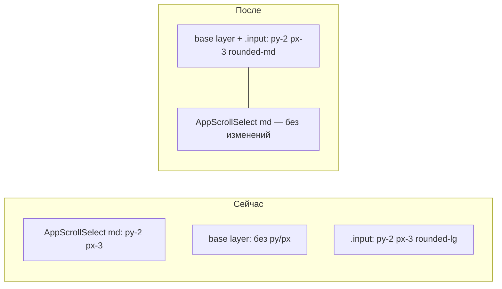

# Fix: единая высота полей ввода

**Дата:** 25.07.2026  
**Статус:** implemented  
**Контекст:** Карточка заказа (`Orders/Show.vue`) — поля ввода визуально ниже селекта «Изменить статус» (`AppScrollSelect`). Связано с [`dark-theme-field-contrast.md`](../features/dark-theme-field-contrast.md) (контраст фона уже реализован).

## Симптом

В карточке заказа при редактировании поля ФИО, телефон, адрес и нативный `<select>` «Вид доставки» **ниже**, чем кастомный селект статуса в блоке «Изменить статус». Форма выглядит неровно.

## Причина

Эталон высоты — триггер [`AppScrollSelect.vue`](../resources/js/Components/AppScrollSelect.vue) size `md`:

```
text-sm px-3 py-2 rounded-md + border
```

Base layer в [`app.css`](../resources/css/app.css) задаёт цвета и `text-sm`, но **без `px-3 py-2`** — высота определяется браузером (~30–34px).

Поля в [`Orders/Show.vue`](../resources/js/Pages/Orders/Show.vue) и [`Orders/Create.vue`](../resources/js/Pages/Orders/Create.vue) используют `class="w-full mt-1"` без класса `.input`. Класс `.input` уже содержит `px-3 py-2`, но имеет `rounded-lg` вместо `rounded-md` у AppScrollSelect.



## Решение (вариант A — централизованно)

Изменения только в [`app.css`](../resources/css/app.css), без правок Vue-страниц.

### Шаг 1: Base layer

В `@layer base` (селекторы `[type='text']` … `textarea`) добавить **`px-3 py-2`**:

```css
[type='text'],
[type='email'],
[type='password'],
[type='tel'],
[type='date'],
[type='number'],
[type='month'],
select,
textarea {
    @apply ... px-3 py-2 ...;
}
```

**Затронуто автоматически:**

- input/select в Show, Create, Index (фильтры дат);
- Login, Register, Settings, Users, Finance и др.

**Исключения (намеренно компактные — не трогать):**

| Место | Переопределение | Поведение |
|-------|-----------------|-----------|
| [`Products/Index.vue`](../resources/js/Pages/Products/Index.vue) | `class="input ... py-1"` | inline-редактирование в таблице |
| [`AppScrollSelect.vue`](../resources/js/Components/AppScrollSelect.vue) | size `sm`: `py-1 px-2` | компактный селект в таблице заказов |
| [`Finance/Index.vue`](../resources/js/Pages/Finance/Index.vue) | `class="input py-1.5"` | month picker в header |

Utility-классы `py-1` / `py-1.5` на элементе перекрывают base layer — регрессий не будет.

### Шаг 2: Класс `.input`

| Свойство | Сейчас | Нужно |
|----------|--------|-------|
| padding | `px-3 py-2` | без изменений |
| radius | `rounded-lg` | **`rounded-md`** (как AppScrollSelect) |

### Шаг 3: Связанная документация

После реализации — краткая секция «Единая высота полей» в [`dark-theme-field-contrast.md`](../features/dark-theme-field-contrast.md).

---

## Проверка

```bash
cd hosting && npm run build
```

**Ручной чеклист:**

1. `/orders/{id}` → «Редактировать»: ФИО, телефон, адрес — та же высота, что «Изменить статус»
2. Блок «Доставка» → select вида доставки
3. `/orders/create` — поля клиента и адреса
4. Readonly Город/Улица (Белпочта) — уже `px-3 py-2`, должны совпадать
5. Склад → inline edit (`py-1`) — остаётся компактным
6. Светлая и тёмная тема

## Критерии приёмки

- Стандартные поля: `text-sm` + `px-3 py-2` + `rounded-md` — как AppScrollSelect md
- Изменения только в `app.css` (+ doc)
- Компактные поля с явным `py-1` / `py-1.5` не затронуты
- Сборка без ошибок

## Объём

1 файл CSS + обновление doc. ~10 минут.

## Checklist

- [x] `px-3 py-2` в base layer `app.css`
- [x] `.input`: `rounded-lg` → `rounded-md`
- [x] Секция в `dark-theme-field-contrast.md`
- [x] npm run build
