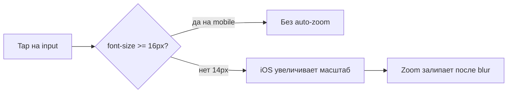

# Fix: zoom при фокусе на input (iOS)

**Дата:** 29.07.2026  
**Статус:** implemented  
**Контекст:** iPhone 13 Pro — при tap по полю ввода Safari/Chrome увеличивают масштаб; после blur масштаб не возвращается, страница не помещается в viewport.

## Симптом

На мобильном устройстве (iPhone 13 Pro) при клике по полю ввода происходит **приближение (auto-zoom)**. При выходе из поля **отдаление не происходит** — окно не входит в рамки экрана. Воспроизводится в Safari и Chrome (оба используют WebKit на iOS).

## Причина

iOS Safari автоматически увеличивает масштаб, если у `input`, `textarea` или `select` **`font-size < 16px`**. После blur масштаб иногда **не возвращается** — известное поведение WebKit, особенно в модалках с `position: fixed`.

В проекте все поля ввода получают **`text-sm` (14px)** из глобальных стилей в [`app.css`](../resources/css/app.css):

```css
@layer base {
    [type='text'],
    [type='email'],
    /* ... */
    select,
    textarea {
        @apply ... text-sm ...;
    }
}

.input {
    @apply ... text-sm ...;
}
```

Дополнительный риск: textarea в [`Settings/Index.vue`](../resources/js/Pages/Settings/Index.vue) с явным **`text-xs` (12px)**:

```
class="input mt-1 font-mono text-xs resize-y"
```

Viewport в [`app.blade.php`](../resources/views/app.blade.php) корректен (`initial-scale=1`, без `maximum-scale=1`) — менять его **не нужно**.



## Решение (вариант A — централизованно)

**`text-base md:text-sm`** для всех полей ввода на уровне глобальных стилей.

- Мобильный (`< md`, < 768px): **16px** — iOS не зумит
- Десктоп (`≥ md`): **14px** — текущий вид сохраняется
- Без JS-хаков и без `user-scalable=no` (сохраняем доступность)

### 1. Центральный фикс в CSS

Файл: [`app.css`](../resources/css/app.css)

| Блок | Было | Станет |
|------|------|--------|
| `@layer base` — `[type='text']`, `email`, `password`, `tel`, `date`, `number`, `month`, `select`, `textarea` | `text-sm` | `text-base md:text-sm` |
| `.input` | `text-sm` | `text-base md:text-sm` |

Покрывает все страницы и компоненты, где поля используют:
- только `w-full` / `w-full mt-1` (Login, Register, Orders/Create, Orders/Show, DateInput и т.д.)
- класс `.input` (Users, Finance, Products, AddressSearchModal, AddressInlinePicker)

**Не требует правок** в десятках Vue-файлов — стили наследуются из base layer.

### 2. Убрать override с меньшим шрифтом

Файл: [`Settings/Index.vue`](../resources/js/Pages/Settings/Index.vue)

- Удалить `text-xs` с textarea (строка ~102)
- Оставить `input font-mono ...` — размер возьмётся из `.input` (16px на mobile)

### 3. Что сознательно не трогаем

| Компонент | Причина |
|-----------|---------|
| [`AppScrollSelect.vue`](../resources/js/Components/AppScrollSelect.vue) | `<button>`, не `<input>` — iOS auto-zoom не срабатывает |
| [`app.blade.php`](../resources/views/app.blade.php) viewport | Менять на `maximum-scale=1` не нужно (anti-pattern) |
| JS `focusout` + `scrollTo(0,0)` | Избыточно, если font-size исправлен; добавлять только если баг останется в модалках |

## Сборка

После правки CSS пересобрать assets:

```bash
cd hosting && npm run dev
# или для prod: npm run production
```

Laravel Mix компилирует `resources/css/app.css` → `public/css/app.css`.

## Проверка (Acceptance Criteria)

На **iPhone 13 Pro** (Safari + Chrome):

1. **Login** — tap по email/password: нет auto-zoom
2. **Orders/Create** — поля ФИО, телефон, адрес: нет zoom, после blur страница в viewport
3. **Users / Finance / Products** — input в модалке: нет zoom, модалка не «уезжает»
4. **Settings** — textarea с API-ключами: нет zoom
5. **Belpost → AddressSearchModal** — поиск адреса: нет zoom
6. **Desktop (≥768px)** — поля визуально как раньше (14px)

## Риски

- **Минимальный:** на мобильном поля станут на ~2px крупнее — ожидаемый компромисс, улучшает читаемость
- **Нет регрессий на desktop:** breakpoint `md` сохраняет текущий размер

## Альтернатива (не используем)

`maximum-scale=1, user-scalable=no` в viewport — блокирует pinch-to-zoom, ухудшает a11y, не рекомендуется Apple.

## Задачи

- [x] В `app.css` заменить `text-sm` на `text-base md:text-sm` в `@layer base` и в `.input`
- [x] Убрать `text-xs` override с textarea в `Settings/Index.vue`
- [x] Пересобрать CSS через `npm run dev` / `production`
- [ ] Проверить на iPhone: Login, Create order, модалки Users/Finance, Settings textarea, AddressSearchModal
