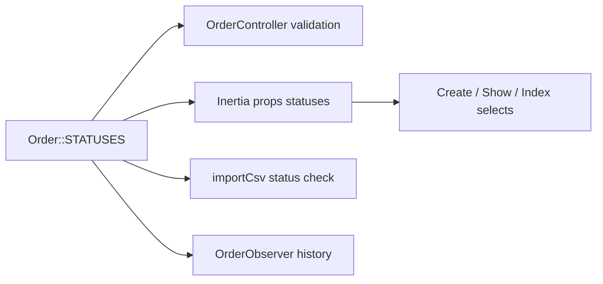

# Статусы обзвона в заявках

**Дата:** 23.07.2026  
**Статус:** done  
**Контекст:** В Google Sheets и CSV-импорте используются статусы `Недозвон`, `Недозвон1`, `Недозвон2`, `Отдал заявку`, `Сомнения`, но в CRM они отсутствуют в whitelist и сбрасываются на «Позвонить».

## Цель

Добавить 5 статусов обзвона в единый whitelist `Order::STATUSES`, обновить цвета бейджей и покрыть тестами. Миграции БД и изменения бизнес-логики не требуются — UI и валидация подхватят статусы автоматически.

## Текущее состояние

Whitelist статусов — только [`Order.php`](../app/Models/Order.php) (`Order::STATUSES`). Все dropdown'ы и валидация идут оттуда:

- [`OrderController.php`](../app/Http/Controllers/OrderController.php) — `store`, `updateStatus`, `importCsv`
- [`Create.vue`](../resources/js/Pages/Orders/Create.vue), [`Show.vue`](../resources/js/Pages/Orders/Show.vue), [`Index.vue`](../resources/js/Pages/Orders/Index.vue) — prop `statuses` с бэкенда

При CSV-импорте неизвестные статусы (в т.ч. `Недозвон1`, `Отдал заявку`) сбрасываются на «Позвонить» с warning — см. [`csv-import-variant-a.md`](../features/csv-import-variant-a.md).

Поле `orders.status` — `string(50)`, не enum → **миграция не нужна**.

## Поток данных



## Реализация

### 1. Расширить `Order::STATUSES`

**Файл:** [`app/Models/Order.php`](../app/Models/Order.php)

Добавить после «Перезвонить»:

```php
'Позвонить',
'Перезвонить',
'Недозвон',
'Недозвон1',
'Недозвон2',
'Сомнения',
'Отдал заявку',
'Заказать',
// ... без изменений
```

Обновить docblock над константой — отразить этап обзвона.

### 2. Цвета бейджей

**Файл:** [`resources/js/Components/OrderStatusBadge.vue`](../resources/js/Components/OrderStatusBadge.vue)

Добавить в `colorMap` (с `dark:` по паттерну существующих):

| Статус | Стиль |
|--------|-------|
| Недозвон, Недозвон1, Недозвон2 | orange (отличить от жёлтого «Перезвонить») |
| Сомнения | purple |
| Отдал заявку | sky/cyan |

Без этого новые статусы будут серыми (fallback).

### 3. Тесты

**Новый файл:** [`tests/Unit/OrderStatusesTest.php`](../tests/Unit/OrderStatusesTest.php)

- Assert: все 5 статусов присутствуют в `Order::STATUSES`
- Assert: порядок — после «Перезвонить», перед «Заказать»

**Расширить:** [`tests/Feature/OrderCsvImportTest.php`](../tests/Feature/OrderCsvImportTest.php)

- Новый кейс: CSV со статусом `Недозвон1` → `created=1`, `order.status = Недозвон1`, `warnings` пуст

**Feature-тест:** смена статуса через `PATCH /orders/{id}/status` на `Отдал заявку` → успех, запись в `order_status_history`.

### 4. Связанная документация

**Файл:** [`docs/features/csv-import-variant-a.md`](../features/csv-import-variant-a.md)

- Убрать/обновить пункт в «Риски» про fallback для `Недозвон1` и `Отдал заявку`

## Затронутые файлы

| Файл | Изменение |
|------|-----------|
| [`app/Models/Order.php`](../app/Models/Order.php) | +5 статусов в `STATUSES`, docblock |
| [`resources/js/Components/OrderStatusBadge.vue`](../resources/js/Components/OrderStatusBadge.vue) | цвета для новых статусов |
| [`tests/Unit/OrderStatusesTest.php`](../tests/Unit/OrderStatusesTest.php) | новый — whitelist и порядок |
| [`tests/Feature/OrderCsvImportTest.php`](../tests/Feature/OrderCsvImportTest.php) | кейс импорта `Недозвон1` |
| [`tests/Feature/OrderStatusUpdateTest.php`](../tests/Feature/OrderStatusUpdateTest.php) | новый (опционально) — PATCH `Отдал заявку` |
| [`docs/features/csv-import-variant-a.md`](../features/csv-import-variant-a.md) | убрать устаревший риск |

## Что не меняем

| Компонент | Причина |
|-----------|---------|
| [`OrderObserver.php`](../app/Observers/OrderObserver.php) | Логика только для Отправлено / Возврат / Завершен |
| [`SyncSalesRenderJob.php`](../app/Jobs/SyncSalesRenderJob.php) | Синхронизация только для «Позвонить» — осознанно |
| Belpost / Evropost controllers | Фильтр по «Отправить» |
| Миграции, `.env`, cron | Не затронуты |

## Деплой на prod

1. `php vendor/bin/phpunit` (новые + существующие тесты)
2. `npm run build` — пересборка после `OrderStatusBadge.vue`
3. Залить PHP + `public/` на сервер
4. `composer install --no-dev` + `php artisan config:cache` + `route:cache`
5. Smoke: смена статуса в карточке + CSV со статусом `Недозвон1`

## Acceptance Criteria

| # | Критерий |
|---|----------|
| AC1 | Все 5 статусов в dropdown create/show/filter |
| AC2 | Смена статуса сохраняется и пишется в историю |
| AC3 | CSV-импорт с `Недозвон1` / `Отдал заявку` — без fallback на «Позвонить» |
| AC4 | Бейджи с читаемыми цветами (не серый fallback) |

## Порядок реализации

- [x] `Order::STATUSES` + docblock
- [x] `OrderStatusBadge.vue` — цвета
- [x] `OrderStatusesTest` — unit
- [x] `OrderCsvImportTest` + PATCH status — feature
- [x] Обновить `csv-import-variant-a.md`
- [ ] `npm run build` + smoke на prod
