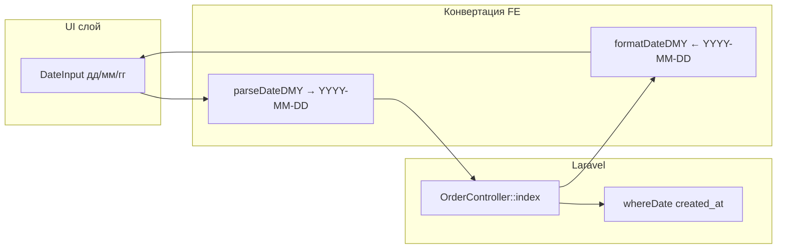

# Fix: формат дд/мм/гг в фильтрах поиска заказов

**Дата:** 25.07.2026  
**Статус:** implemented  
**Контекст:** Фильтры «Дата от» / «Дата до» на странице [`Orders/Index.vue`](../../resources/js/Pages/Orders/Index.vue) используют `<input type="date">`. Браузер показывает дату в своём формате (часто `гггг-мм-дд`), а не требуемый `дд/мм/гг`.

## Симптом

- Поля «Дата от» и «Дата до» отображают дату в формате браузера, а не `дд/мм/гг`.
- Пользователь ожидает единый формат ввода: `25/07/26`.

## Выбранное решение

**Вариант 1:** текстовое поле с маской `дд/мм/гг`, без сторонних date-picker библиотек.

Конвертация в ISO `YYYY-MM-DD` выполняется на фронтенде перед запросом. Бэкенд остаётся без изменений.

**Область изменений:** только поля фильтра на странице заказов. Колонка «Дата» в таблице и страница Finance не затрагиваются.

---

## Архитектура

### 1. Утилита [`resources/js/utils/date.js`](../../resources/js/utils/date.js)

По аналогии с [`resources/js/utils/phone.js`](../../resources/js/utils/phone.js) — чистые функции без зависимостей:

| Функция | Назначение |
|---------|------------|
| `maskDateInput(raw)` | Оставляет только цифры, вставляет `/` после 2-й и 4-й цифры, макс. 8 цифр → `дд/мм/гг` |
| `isValidDateDMY(str)` | Проверка полной даты (день 1–31, месяц 1–12, реальная календарная дата) |
| `parseDateDMY(str)` | `25/07/26` → `2026-07-25` (2-значный год: 00–69 → 2000+, 70–99 → 1900+) |
| `formatDateDMY(iso)` | `2026-07-25` → `25/07/26` (для инициализации из props/URL) |

### 2. Компонент [`resources/js/Components/DateInput.vue`](../../resources/js/Components/DateInput.vue)

Обёртка над `<input type="text">`:

- `v-model` — строка в формате `дд/мм/гг`
- `placeholder="дд/мм/гг"`
- `inputmode="numeric"`, `maxlength="10"` (8 цифр + 2 разделителя)
- `@input` — применяет `maskDateInput`
- `@change` — эмитит `change` (для debounced `applyFilters`)
- При неполном/невалидном значении — поле остаётся как есть, фильтр не применяется

Стили: класс `w-full`, как у текущих полей фильтра.

### 3. Изменения в [`resources/js/Pages/Orders/Index.vue`](../../resources/js/Pages/Orders/Index.vue)

**Шаблон:** заменить два `<input type="date">` на `<DateInput v-model="filters.date_from" @change="applyFilters" />` (и аналогично для `date_to`).

**Логика фильтров:**

- При инициализации `filters`: конвертировать `props.filters.date_from/date_to` из ISO в `дд/мм/гг` через `formatDateDMY` (обратная совместимость со старыми URL вида `?date_from=2026-07-25`).
- В `applyFilters()`: перед `Inertia.get` собрать query-параметры:
  - если `isValidDateDMY(filters.date_from)` → `date_from: parseDateDMY(...)`
  - иначе → `date_from: ''` (не отправлять частичный ввод)
  - то же для `date_to`
- `hasActiveFilters` и `resetFilters` — без изменений в поведении.

---

## Бэкенд

**Изменений не требуется.** [`OrderController::index()`](../../app/Http/Controllers/OrderController.php) продолжает получать ISO `YYYY-MM-DD` и фильтровать через `whereDate`.

Опционально (не в первой итерации): валидация `'date_from' => ['nullable', 'date']` — защита от некорректных query-параметров в URL.

---

## Тестирование

### Feature-тест [`tests/Feature/OrderIndexFilterTest.php`](../../tests/Feature/OrderIndexFilterTest.php)

Паттерн setup — как в [`tests/Feature/OrderDestroyTest.php`](../../tests/Feature/OrderDestroyTest.php):

1. Создать tenant + user + 2 заказа с разными `created_at`.
2. `GET /orders?date_from=2026-07-01&date_to=2026-07-31` — в ответе только заказы в диапазоне.
3. `GET /orders` без фильтров — оба заказа видны.

Frontend-утилиты — без отдельного test runner (в проекте нет Vitest/Jest); покрытие через ручную проверку AC.

---

## Затронутые файлы

| Файл | Изменение |
|------|-----------|
| [`resources/js/utils/date.js`](../../resources/js/utils/date.js) | **новый** — mask, parse, format, validate |
| [`resources/js/Components/DateInput.vue`](../../resources/js/Components/DateInput.vue) | **новый** — masked input |
| [`resources/js/Pages/Orders/Index.vue`](../../resources/js/Pages/Orders/Index.vue) | DateInput вместо `type="date"`, конвертация ISO ↔ дд/мм/гг |
| [`tests/Feature/OrderIndexFilterTest.php`](../../tests/Feature/OrderIndexFilterTest.php) | **новый** — фильтрация по date_from/date_to |

---

## Риски и ограничения

- **Частичный ввод** (`25/07`) — фильтр не применяется до полной валидной даты (8 цифр).
- **URL** — в адресной строке останется ISO (`date_from=2026-07-25`), пользователь видит `дд/мм/гг` только в полях ввода. Это упрощает бэкенд и совместимость.
- **2-значный год** — стандартная эвристика 1970/2000; для CRM с заказами 2020+ достаточно.

---

## План реализации

- [x] Создать `resources/js/utils/date.js` (`maskDateInput`, `isValidDateDMY`, `parseDateDMY`, `formatDateDMY`)
- [x] Создать `resources/js/Components/DateInput.vue` с маской и `v-model`
- [x] Обновить `Orders/Index.vue`: DateInput вместо `type="date"`, конвертация ISO ↔ дд/мм/гг в `applyFilters` и init
- [x] Добавить `OrderIndexFilterTest.php` — фильтрация по `date_from`/`date_to`
- [ ] `npm run build` — пересборка фронта для деплоя

---

## Acceptance Criteria

- [ ] Поля «Дата от» / «Дата до» отображают placeholder и ввод в формате `дд/мм/гг`
- [ ] Маска автоматически расставляет `/` при наборе
- [ ] Фильтрация по диапазону дат работает корректно
- [ ] Старые ссылки с ISO-датами в URL корректно отображаются в полях
- [ ] «Сбросить фильтры» очищает поля дат
- [ ] Feature-тест на фильтрацию по датам проходит
