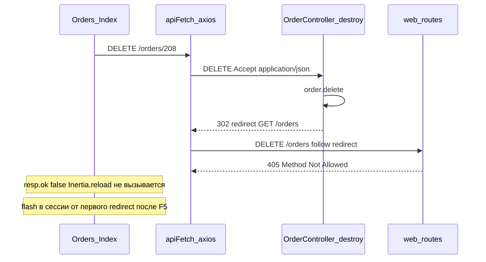

# Fix: удаление заказа из списка — 405 и UI не обновляется

**Дата:** 24.07.2026  
**Статус:** planned  
**Контекст:** Удаление заказа из [`Orders/Index.vue`](../../resources/js/Pages/Orders/Index.vue) через `apiFetch DELETE`. Удаление из карточки [`Orders/Show.vue`](../../resources/js/Pages/Orders/Show.vue) через `Inertia.delete()` работает корректно.

## Симптомы

1. **Список заказов:** после подтверждения в модалке `DELETE /orders/{id}` уходит, заказ **остаётся в таблице**.
2. **Network:** следом появляется **`DELETE /orders` → 405 Method Not Allowed**.
3. **После F5:** flash «Заказ удалён», заказа в списке нет — в БД он уже удалён.
4. **Карточка заказа:** `Inertia.delete` + redirect на `/orders` — без этой проблемы.

## Причина



- [`OrderController::destroy()`](../../app/Http/Controllers/OrderController.php) всегда возвращает `redirect()->route('orders.index')->with('message', ...)`.
- [`apiFetch`](../../resources/js/utils/api.js) (axios) шлёт `Accept: application/json` и **следует за redirect**, повторяя **DELETE** на `/orders`.
- Маршрут `DELETE /orders` не существует ([`routes/web.php`](../../routes/web.php) — только `GET /orders`) → **405**.
- В [`Index.vue`](../../resources/js/Pages/Orders/Index.vue) обновление списка только при `resp.ok` — после 405 reload не выполняется.

Для сравнения: [`ProductController::destroy()`](../../app/Http/Controllers/ProductController.php) возвращает JSON `{ success: true }` — redirect нет, проблемы нет.

## Решение

**Выбранный подход:** backend — `204 JSON` для AJAX, redirect для Inertia (как у Products и существующих 204 в OrderController: `cancelTracking`, `dismissTrackingNotice`).

### Backend — `OrderController::destroy()`

Добавить параметр `Request $request`. После `$order->delete()`:

```php
if ($request->wantsJson()) {
    return response()->json(null, 204);
}

return redirect()->route('orders.index')->with('message', 'Заказ удалён.');
```

- `apiFetch` → `wantsJson() === true` → **204**, axios не получает redirect → нет `DELETE /orders`.
- `Inertia.delete()` из Show → redirect + flash (без изменений).

### Frontend — Index.vue

Текущая логика **достаточна** после backend-фикса:

```javascript
const resp = await apiFetch(`/orders/${orderToDelete.value.id}`, 'DELETE')
if (resp.ok) {
    closeDeleteModal()
    Inertia.reload({ only: ['orders'] })
}
```

При **204** `resp.ok === true` → строка исчезает без F5.

Опционально (не в scope минимального фикса): локальный toast «Заказ удалён» — при 204 flash в сессию не пишется.

### Тесты — `OrderDestroyTest.php`

| Тест | Ожидание |
|------|----------|
| Существующий `test_admin_deletes_deletable_order` | redirect `/orders` (Inertia / обычный DELETE) |
| Новый `test_admin_deletes_deletable_order_via_json` | `deleteJson` или `Accept: application/json` → **204**, заказ удалён из БД |

## Затронутые файлы

| Файл | Изменение |
|------|-----------|
| [`app/Http/Controllers/OrderController.php`](../../app/Http/Controllers/OrderController.php) | `wantsJson()` → 204 / иначе redirect |
| [`tests/Feature/OrderDestroyTest.php`](../../tests/Feature/OrderDestroyTest.php) | +1 тест JSON 204 |
| [`resources/js/Pages/Orders/Index.vue`](../../resources/js/Pages/Orders/Index.vue) | без изменений (или опциональный toast) |

## Деплой (crm-gs.pro)

1. Залить обновлённый `OrderController.php`.
2. `php artisan route:cache` (если используется кэш маршрутов).
3. Сброс opcache при необходимости.
4. **Фронт не меняется** — пересборка `npm run build` для этого фикса не нужна.

## Acceptance Criteria

- [ ] DELETE из списка: **204**, без запроса `DELETE /orders`
- [ ] Строка заказа исчезает сразу после подтверждения в модалке
- [ ] DELETE из карточки: redirect на `/orders` + flash «Заказ удалён»
- [ ] Operator / read-only / non-deletable status — 403 / 422 без изменений

## Связанные документы

- [`features/tracking-cancel-order-delete.md`](../features/tracking-cancel-order-delete.md) — исходная фича удаления
- [`fix/csrf-spa-inertia-419.md`](csrf-spa-inertia-419.md) — паттерн `apiFetch` + axios
