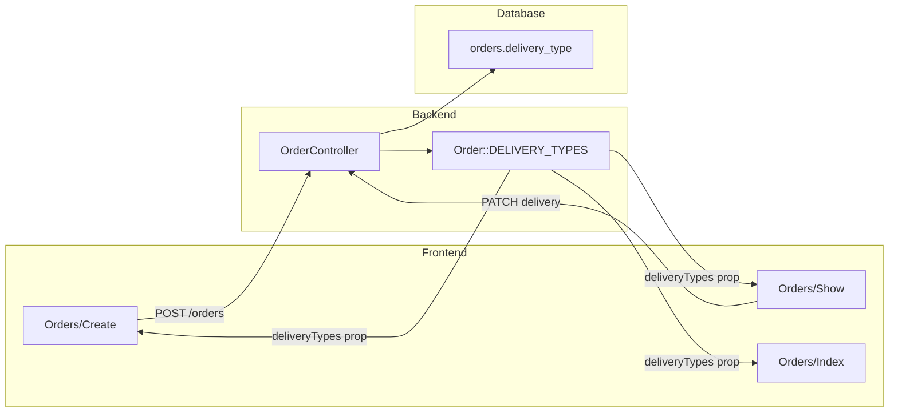

# Выбор вида доставки в заявках

**Дата:** 27.06.2026  
**Статус:** done  
**Контекст:** В заявке невозможно выбрать вид доставки. Требуются 5 типов: Белпочта, Европочта, Курьер, Самовывоз, Лично.

## Цель

Добавить выбор вида доставки (5 типов) в заявках: расширить схему БД и модель, подключить валидацию на бэкенде, добавить select в формы создания и карточки заказа с отдельным сохранением в блоке «Доставка».

## Контекст проблемы

Сейчас тип доставки хранится в `orders.delivery_type`, но:

- в UI нет элемента выбора ([`Create.vue`](../resources/js/Pages/Orders/Create.vue), [`Show.vue`](../resources/js/Pages/Orders/Show.vue));
- БД и валидация допускают только `belpost` / `europochta` ([migration](../database/migrations/2026_06_27_000004_create_orders_table.php), [`OrderController`](../app/Http/Controllers/OrderController.php));
- подписи захардкожены в Vue ([`Index.vue`](../resources/js/Pages/Orders/Index.vue), [`Show.vue`](../resources/js/Pages/Orders/Show.vue)).

Интеграции Белпочты/Европочты **не меняем** — они по-прежнему фильтруют только `belpost` / `europochta`.

## Поток данных



## Единый справочник типов

Расширить [`Order.php`](../app/Models/Order.php):

```php
public const DELIVERY_TYPES = [
    'belpost'    => 'Белпочта',
    'europochta' => 'Европочта',
    'courier'    => 'Курьер',
    'pickup'     => 'Самовывоз',
    'personal'   => 'Лично',
];
```

Добавить вспомогательный метод для валидации (DRY):

```php
public static function deliveryTypeRule(): string
{
    return 'in:' . implode(',', array_keys(self::DELIVERY_TYPES));
}
```

## Затронутые файлы

| Файл | Изменение |
|------|-----------|
| `hosting/database/migrations/2026_06_27_000016_expand_orders_delivery_type.php` | enum → VARCHAR(30) |
| [`hosting/app/Models/Order.php`](../app/Models/Order.php) | `DELIVERY_TYPES` (5 типов) + `deliveryTypeRule()` |
| [`hosting/app/Http/Controllers/OrderController.php`](../app/Http/Controllers/OrderController.php) | store/update/import + `updateDeliveryType()` |
| [`hosting/routes/web.php`](../routes/web.php) | `PATCH /orders/{order}/delivery-type` |
| [`hosting/resources/js/Pages/Orders/Create.vue`](../resources/js/Pages/Orders/Create.vue) | prop `deliveryTypes` + select |
| [`hosting/resources/js/Pages/Orders/Show.vue`](../resources/js/Pages/Orders/Show.vue) | always-visible select + PATCH |
| [`hosting/resources/js/Pages/Orders/Index.vue`](../resources/js/Pages/Orders/Index.vue) | подписи из prop |
| [`hosting/resources/js/Pages/Orders/Import.vue`](../resources/js/Pages/Orders/Import.vue) | подсказка — все 5 типов |

## 1. Миграция БД

Новый файл: `hosting/database/migrations/2026_06_27_000016_expand_orders_delivery_type.php`

- Заменить `enum('belpost','europochta')` на `VARCHAR(30) NULL` через raw SQL (без `doctrine/dbal`, которого нет в проекте):

```php
DB::statement("ALTER TABLE `orders` MODIFY `delivery_type` VARCHAR(30) NULL");
```

- Существующие значения `belpost` / `europochta` сохраняются без конвертации.

После деплоя: `php artisan migrate`.

## 2. Backend — OrderController

| Метод | Изменение |
|-------|-----------|
| `create()` | Передать `'deliveryTypes' => Order::DELIVERY_TYPES` |
| `store()` | Добавить `'delivery_type' => ['nullable', Order::deliveryTypeRule()]` |
| `show()` / `index()` | Передать `deliveryTypes` |
| `update()` | Заменить `in:belpost,europochta` на `Order::deliveryTypeRule()` |
| `importCsv()` | Расширить маппинг русских названий |

Маппинг для CSV-импорта:

```php
$map = [
    'белпочта' => 'belpost', 'belpost' => 'belpost',
    'европочта' => 'europochta', 'europochta' => 'europochta',
    'курьер' => 'courier', 'courier' => 'courier',
    'самовывоз' => 'pickup', 'pickup' => 'pickup',
    'лично' => 'personal', 'personal' => 'personal',
];
```

**Новый endpoint** для UX «всегда доступный select» на Show (по аналогии со сменой статуса):

- `PATCH /orders/{order}/delivery-type` → метод `updateDeliveryType()`
- Валидация: `delivery_type` required + `Order::deliveryTypeRule()`
- Маршрут в [`web.php`](../routes/web.php) рядом с `updateStatus`

## 3. Frontend — Create

- Prop `deliveryTypes: Object`
- В форму: `delivery_type: ''` (пусто = не выбрано)
- Блок «Доставка» в правой колонке (над «Итог») с `<select>`:
  - placeholder «— выберите —»
  - options из `deliveryTypes`
- Отображать выбранный тип в блоке «Итог»

## 4. Frontend — Show

Выбранный UX: select **всегда доступен** в блоке «Доставка» (как смена статуса), без входа в режим «Редактировать».

- Prop `deliveryTypes: Object`
- Убрать локальный `deliveryLabels` — использовать prop
- В карточке «Доставка»:
  - `<select v-model="selectedDelivery">` + кнопка «Применить»
  - Отдельный `useForm({ delivery_type })` + `PATCH /orders/{id}/delivery-type`
  - Кнопка disabled, если значение не изменилось
- Поле `delivery_type` убрать из общего `form` редактирования (избежать дублирования)

## 5. Frontend — Index и Import

- Колонка «Доставка» берёт подпись из prop `deliveryTypes` вместо hardcoded map
- Подсказка импорта — перечислить все 5 типов

## 6. Сборка фронтенда

```bash
cd hosting && npm run dev   # или npm run production
```

## Что сознательно не трогаем

| Файл | Причина |
|------|---------|
| [`BelpostController.php`](../app/Http/Controllers/BelpostController.php) | Только `belpost` |
| [`EvropostController.php`](../app/Http/Controllers/EvropostController.php) | Только `europochta` |
| [`UpdateTrackingJob.php`](../app/Jobs/UpdateTrackingJob.php) | Трекинг только для почты |
| [`OrderObserver.php`](../app/Observers/OrderObserver.php) | sumOrder только для почты |
| [`MailBatch::DELIVERY_TYPES`](../app/Models/MailBatch.php) | Типы отправления Белпочты API, не вид доставки заказа |

## Acceptance Criteria

- [x] При создании заказа можно выбрать один из 5 типов доставки
- [x] На карточке заказа select в блоке «Доставка» всегда доступен и сохраняет значение отдельной кнопкой
- [x] В списке заказов отображаются русские подписи всех типов
- [x] CSV-импорт принимает русские и латинские названия всех 5 типов
- [x] Белпочта / Европочта продолжают показывать только «свои» заявки
- [ ] `php artisan migrate` проходит без ошибок *(локально не проверено — БД недоступна)*

## Риски

- **MySQL ENUM → VARCHAR**: безопасно, обратимая миграция; откат — вернуть enum (только если нет новых значений)
- **Заказы без типа**: `nullable` сохраняется; пустой select = `null`

## Чеклист реализации

- [x] Миграция: `orders.delivery_type` enum → VARCHAR(30)
- [x] `Order::DELIVERY_TYPES` (5 типов) + `deliveryTypeRule()`
- [x] `OrderController`: store/update/import + `updateDeliveryType` + route
- [x] `Create.vue`: prop `deliveryTypes` + select в форме
- [x] `Show.vue`: always-visible select + PATCH delivery-type
- [x] `Index.vue` и `Import.vue`: подписи из `deliveryTypes`
- [x] `npm run production` — сборка успешна
