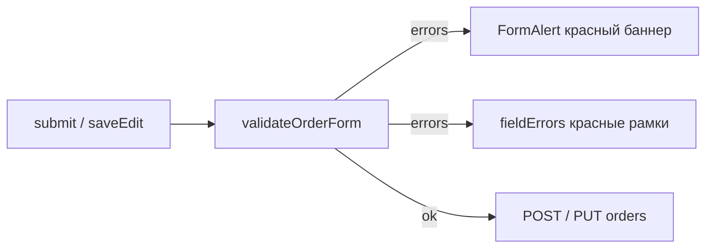

# Fix: валидация формы заказа — ФИО и in-app алерты

**Дата:** 09.08.2026  
**Статус:** implemented  
**Контекст:** Доработка после [`order-form-enhancements.md`](../features/order-form-enhancements.md). Client-side валидация обязательных полей (ФИО, телефон, товар) работает неполно; сообщения об ошибках показываются через нативный `alert()`.

**Связанные файлы:** [`orderFormValidation.js`](../../resources/js/utils/orderFormValidation.js), [`Create.vue`](../../resources/js/Pages/Orders/Create.vue), [`Show.vue`](../../resources/js/Pages/Orders/Show.vue), [`FullNameTwoParts.php`](../../app/Rules/FullNameTwoParts.php)

**См. также:** [`client-phone-format-validation.md`](client-phone-format-validation.md) — client-side проверка формата телефона (375XXXXXXXXX).

---

## Симптомы

| Симптом | Пример |
|---------|--------|
| Неполное ФИО проходит без предупреждения | `"Иванов "` (одно слово + пробел) — submit без алерта |
| Нет in-app сообщения для ФИО и телефона | Пользователь не видит ошибку до ответа сервера (или не видит вовсе) |
| Товар — нативное окно браузера | `window.alert('Заполните обязательные поля: …')` вместо UI приложения |
| Устаревшая подпись под полем ФИО | «Фамилия и имя через пробел (требование Белпочты)» |

---

## Корневая причина

1. **`validateRequiredOrderFields`** проверяет только «не пусто после trim»:

```javascript
if (!full_name?.trim()) {
    missing.push('ФИО')
}
```

Строка `"Иванов "` после `trim()` не пустая → поле не попадает в `missing` → `alert()` не вызывается, `fieldErrors.full_name` остаётся `false`.

2. **Backend** ([`FullNameTwoParts.php`](../../app/Rules/FullNameTwoParts.php)) уже делает `trim()` и отклоняет одно слово — расхождение только на клиенте.

3. **UI:** `alert()` в `submit()` / `saveEdit()` — не соответствует паттерну flash-сообщений в [`AppLayout.vue`](../../resources/js/Layouts/AppLayout.vue) (зелёный `flash.message`, красный `flash.error`).

---

## Целевое поведение



---

## Шаг 1 — Расширить валидацию на клиенте

**Файл:** [`resources/js/utils/orderFormValidation.js`](../../resources/js/utils/orderFormValidation.js)

Заменить `validateRequiredOrderFields` на `validateOrderForm`, возвращающий объект ошибок:

```javascript
// { full_name?: string, phone?: string, goods?: string }
```

Логика:

- **ФИО:** `normalizeName(full_name)` = `trim()` + collapse spaces
  - пусто → «Укажите ФИО»
  - `!isFullNameComplete(name)` → «Введите фамилию и имя (минимум два слова)»
- Reuse [`isFullNameComplete()`](../../resources/js/utils/phone.js)
- **Телефон:** `!phone?.trim()` → «Укажите телефон»; неверный формат → «Укажите корректный белорусский номер (375XXXXXXXXX)» (см. [`client-phone-format-validation.md`](client-phone-format-validation.md))
- **Товар:** нет непустого элемента в `goods` → «Добавьте хотя бы один товар»

Helper `normalizeOrderFormFields(data)` для `form.transform`:

```javascript
full_name: normalizeName(data.full_name),
phone: data.phone?.trim() ?? '',
```

Обновить 2 call site: `Create.vue`, `Show.vue`. Старый экспорт удалить или оставить alias.

---

## Шаг 2 — Компонент in-app алерта

**Новый файл:** [`resources/js/Components/FormAlert.vue`](../../resources/js/Components/FormAlert.vue)

Стили скопировать из [`AppLayout.vue`](../../resources/js/Layouts/AppLayout.vue) (блок `flash.error`, ~строки 160–165):

- Props: `message` (string)
- Классы: `bg-red-50 dark:bg-red-900/30 border border-red-200 dark:border-red-800 text-red-800 dark:text-red-200 …`
- Иконка warning — та же SVG что в AppLayout
- Без auto-dismiss; скрывается при успешном submit или при повторной валидации без ошибок

---

## Шаг 3 — Create.vue

**Файл:** [`resources/js/Pages/Orders/Create.vue`](../../resources/js/Pages/Orders/Create.vue)

1. **Подпись под ФИО:**
   > Обязательно введите Фамилию и Имя, отчество необязательно.

2. **Баннер:** `<FormAlert v-if="formAlert" :message="formAlert" />` над grid, `formAlert = ref('')`

3. **`submit()`** — без `alert()`:

```javascript
const errors = validateOrderForm(form)
fieldErrors.value = {
    full_name: !!errors.full_name,
    phone:     !!errors.phone,
    goods:     !!errors.goods,
}
if (Object.keys(errors).length) {
    formAlert.value = Object.values(errors).join('. ')
    return
}
formAlert.value = ''
```

4. **`form.transform`** — `normalizeOrderFormFields`
5. **`onSuccess`** — сброс `formAlert` и `fieldErrors`

---

## Шаг 4 — Show.vue (режим редактирования)

**Файл:** [`resources/js/Pages/Orders/Show.vue`](../../resources/js/Pages/Orders/Show.vue)

- Подпись ФИО в edit mode — та же что в Create
- `<FormAlert>` над grid (при `editing`)
- `saveEdit()` — та же логика без `alert()`
- Сброс `formAlert` в `onSuccess` и `cancelEdit()`

---

## Шаг 5 — Backend message (опционально)

**Файл:** [`app/Rules/FullNameTwoParts.php`](../../app/Rules/FullNameTwoParts.php)

Обновить `message()`:

> Обязательно введите фамилию и имя через пробел (отчество необязательно)

---

## Acceptance Criteria

| # | Критерий |
|---|----------|
| AC-1 | Подпись: «Обязательно введите Фамилию и Имя, отчество необязательно.» |
| AC-2 | `"Иванов "`, `"Иванов"`, `"И Иванов"` — красный баннер + рамка на ФИО, submit блокируется |
| AC-3 | Пустой телефон — красный баннер + рамка, без `alert()` |
| AC-3a | Неверный формат телефона (`123`, `3751416`) — баннер «Укажите корректный белорусский номер (375XXXXXXXXX)» + рамка, без запроса на сервер |
| AC-3b | Валидные форматы (`291234567`, `+375…`, `80…`) проходят; при submit телефон нормализуется в `375XXXXXXXXX` |
| AC-4 | Нет товара — красный баннер + рамка на select, без `alert()` |
| AC-5 | Баннер визуально совпадает со стилем `flash.error` в AppLayout |
| AC-6 | При успешном сохранении баннер исчезает |

---

## Объём

~5 файлов, ~80 строк. Без миграций, без изменений API.

| Действие | Файл |
|----------|------|
| Изменить | `resources/js/utils/orderFormValidation.js` |
| Создать | `resources/js/Components/FormAlert.vue` |
| Изменить | `resources/js/Pages/Orders/Create.vue` |
| Изменить | `resources/js/Pages/Orders/Show.vue` |
| Опционально | `app/Rules/FullNameTwoParts.php` |

---

## Checklist реализации

- [x] `validateOrderForm` + `normalizeOrderFormFields` в `orderFormValidation.js`
- [x] `FormAlert.vue` со стилями `flash.error`
- [x] `Create.vue`: подпись, баннер, без `alert()`
- [x] `Show.vue`: подпись, баннер, без `alert()`
- [x] `FullNameTwoParts::message()`
