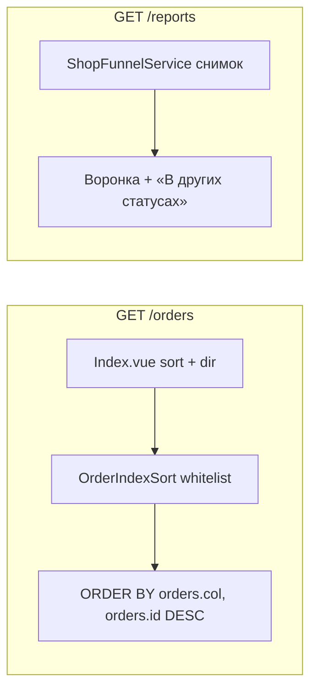

# Fix: сортировка заказов, снятие чипов, снимок воронки

**Дата:** 16.09.2026  
**Статус:** implemented  
**Проект:** hosting (Laravel 8 + Inertia + Vue 3)  
**Контекст:** Список `/orders` и магазинная воронка `/reports`. Чипы сегментов дублировали фильтры и блок «Сейчас» на отчётах. Таблица заказов всегда шла по `created_at desc`. Воронка считала шаги накопительно («и все после»), из‑за чего «Оформлено» включало уже выкупленные заказы.

**Связанные файлы:** [`Orders/Index.vue`](../../resources/js/Pages/Orders/Index.vue), [`OrderController.php`](../../app/Http/Controllers/OrderController.php), [`OrderIndexSort.php`](../../app/Support/OrderIndexSort.php), [`ShopFunnelService.php`](../../app/Services/ShopFunnelService.php), [`Reports/Index.vue`](../../resources/js/Pages/Reports/Index.vue)

**См. также:** [`trendovik-parity-p1.md`](../../../docs/feature/trendovik-parity-p1.md) — этап 2 (сегменты) и этап 4b (воронка магазина).

---

## Симптомы

| Симптом | Пример |
|---------|--------|
| Чипы очередей над таблицей заказов | «к отправке Бел», «>5 дней», «Мои» — дубль штатных фильтров и `/reports` |
| Нет сортировки по столбцам | список всегда `ORDER BY created_at DESC` |
| Воронка завышает ранние шаги | 10 заявок, 1 «Оформлен», 5 «Отправлено» → «Оформлено» показывало 1+5+ОПС+выкуп |

---

## Выбранные решения

1. **Чипы** — убрать ряд как до их появления. Поиск, статус, доставка, даты остаются. Query `?segment=` и `?assignee=mine` на бэкенде сохранены (drill-down из отчётов, round-robin).
2. **Сортировка** — клик по заголовку: А→Я → Я→А → сброс к дате (новые). На мобилке — select. Server-side, потому что пагинация 50.
3. **Воронка** — снимок текущего статуса. Каждый заказ в одном шаге.  
   **Оформлено + Отправлено + ОПС + Выкуп = Заявка − статусы вне шагов.**

---

## 1. Чипы на `/orders`

**Было:** ряд `mt-3 flex flex-wrap gap-2` — сегменты `OrderSegment::labels()` и кнопка «Мои».

**Стало:** ряда нет. `filters.segment` / `filters.assignee` по-прежнему уходят в query, «Сбросить фильтры» их очищает.

`OrderSegment`, ссылки `/orders?segment=stuck` из [`ShopFunnelService::liveSlice`](../../app/Services/ShopFunnelService.php) и `assignee=mine` **не удалялись**.

---

## 2. Сортировка столбцов

**Контракт query:** `sort`, `dir` (`asc`|`desc`). Невалидные значения → `created_at desc`, HTTP 200.

**Whitelist** ([`OrderIndexSort`](../../app/Support/OrderIndexSort.php)): `id`, `created_at`, `full_name`, `status`, `phone`, `city`, `track_number`, `delivery_type`.

Не сортируются: чекбокс, товары (JSON), партия, «Обработали», магазин КЦ.

| Колонка | Первый клик | Второй | Третий |
|---------|-------------|--------|--------|
| Дата, № | desc | asc | дефолт (дата desc) |
| Текст | А→Я (asc) | Я→А (desc) | дефолт |

Дефолт в URL не пишется. Стабильный вторичный ключ: `orders.id DESC`. «Сбросить фильтры» сортировку не трогает.

**FE:** кликабельный header + стрелка; `md:hidden` select «Сортировка».

**BE:** [`OrderController::index`](../../app/Http/Controllers/OrderController.php) снимает жёсткий `orderByDesc('created_at')`, вызывает `OrderIndexSort::apply` после фильтров; `filters` отдаёт resolved `sort`/`dir`.

---

## 3. Воронка — снимок, не накопитель

**Было:** шаг = текущий статус **и все последующие** (выкуп попадал в «Оформлено»).

**Стало:** только текущий статус.

| Шаг | Статусы |
|-----|---------|
| Заявка | `funnelBaseQuery` за период (без `Дубль` / `funnel_exclude`) |
| Оформлено | только `Оформлен` |
| Отправлено | только `Отправлено` |
| ОПС | только `В отделении` |
| Выкуп | `Завершен`, `Посчитан` |

Вне шагов (в «Заявка», не в четырёх строках): `Позвонить`, `Отправить`, `Отказ`, `Возврат`, `Забрать деньги`, `Передан на почту` и остальные.

Пример: 10 заявок, 1 «Оформлен», 5 «Отправлено», 1 ОПС, 1 выкуп, 2 прочих → **1, 5, 1, 1**; сумма шагов 8; «В других статусах: 2».

Ширина полосы = count / заявки. Под карточкой воронки: «В других статусах: N», если N > 0.

Live-срез «Сейчас» не менялся.

---

## Затронутые файлы

| Файл | Изменение |
|------|-----------|
| [`app/Support/OrderIndexSort.php`](../../app/Support/OrderIndexSort.php) | **новый** — whitelist, resolve, apply |
| [`app/Http/Controllers/OrderController.php`](../../app/Http/Controllers/OrderController.php) | сортировка после фильтров; `filters.sort`/`dir` |
| [`resources/js/Pages/Orders/Index.vue`](../../resources/js/Pages/Orders/Index.vue) | без чипов; header-sort; mobile select |
| [`app/Services/ShopFunnelService.php`](../../app/Services/ShopFunnelService.php) | снимок статуса, без «и все после» |
| [`resources/js/Pages/Reports/Index.vue`](../../resources/js/Pages/Reports/Index.vue) | leftover, полоса от count/заявки |
| [`tests/Feature/OrderIndexFilterTest.php`](../../tests/Feature/OrderIndexFilterTest.php) | дефолт newest-first; ФИО А→Я / Я→А; неизвестный sort |
| [`tests/Unit/OrderIndexSortTest.php`](../../tests/Unit/OrderIndexSortTest.php) | **новый** — resolve whitelist |
| [`tests/Feature/ReportsAccessTest.php`](../../tests/Feature/ReportsAccessTest.php) | 10/1/5 и инвариант суммы |

---

## Риски

- Sort по `full_name` без индекса — filesort в рамках `tenant_id`; для текущих объёмов ок.
- Кириллица А→Я зависит от collation MySQL (`utf8mb4_unicode_ci`).
- `Передан на почту`, `Возврат в пути`, `Забрать деньги` сознательно **не** в шагах воронки.
- Feature-тесты в этой среде могут быть skip без `pdo_sqlite`; unit `OrderIndexSortTest` автономен.
- На проде цифры воронки обновятся только после деплоя PHP + `public/js/app.js`.

---

## План реализации

- [x] Снять чипы сегментов и «Мои» с `Orders/Index.vue`; сохранить `segment`/`assignee` в query
- [x] Добавить `OrderIndexSort` и подключить в `OrderController::index`
- [x] Кликабельные заголовки + mobile select; дефолт дата desc вне URL
- [x] Тесты сортировки (`OrderIndexSortTest`, `OrderIndexFilterTest`)
- [x] Воронка: снимок текущего статуса, инвариант суммы шагов
- [x] Подпись «В других статусах» на `/reports`
- [x] Тест 10 заявок / 1 оформлен / 5 отправлено в `ReportsAccessTest`
- [x] `npm run production`

---

## Acceptance Criteria

- [x] На `/orders` нет ряда чипов сегментов
- [x] КЦ round-robin: UI «Мои» нет; `?assignee=mine` на бэкенде работает
- [x] `?segment=stuck` с `/reports` по-прежнему режет список
- [x] Клик «ФИО»: А→Я, повтор — Я→А; URL `sort`+`dir`; пагинация не сбрасывает сортировку
- [x] Неизвестный `sort`/`dir` → дата убыв., 200
- [x] Мобильные карточки сортируются тем же query
- [x] Воронка: 1 в «Оформлен» → «Оформлено» = 1; 5 в «Отправлено» → «Отправлено» = 5
- [x] Оформлено + Отправлено + ОПС + Выкуп = Заявка − статусы вне шагов
- [x] Выкуп не увеличивает «Оформлено» / «Отправлено» / «ОПС»
)