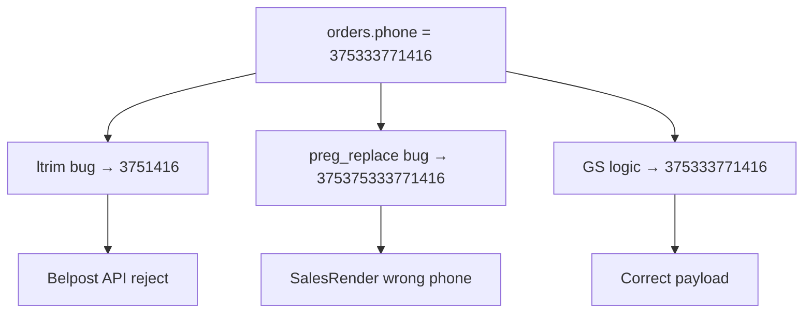

# Fix: форматирование телефона для интеграций (Белпочта, Европочта, SalesRender, SMS)

**Дата:** 26.07.2026  
**Статус:** implemented  
**Контекст:** Номера вида `+375333771416` корректно работали в Google Sheets, но в Laravel при оформлении бланка Белпочты API отклоняет номер. Аналогичные ошибки форматирования есть в Европочте, SalesRender и SMS.

## Симптомы

1. **Белпочта:** заказ с телефоном `+375333771416` не проходит оформление бланка; в GS тот же номер работал.
2. **Европочта:** тот же баг — `'375' . ltrim(..., '+375')` искажает уже нормализованный номер.
3. **SalesRender / SMS:** при номере `375333771416` в БД получается двойной префикс (`375375333771416`, `+375375333771416`).

## GS-эталон

В Google Sheets телефон всегда брался как **9 локальных цифр** из колонки N (`row[13]`), к которым добавлялся нужный префикс:

| Интеграция | GS | Файл | Пример для `333771416` |
|---|---|---|---|
| Белпочта | `"375" + row[13]` | [`backend/General.gs`](../../backend/General.gs) строка 143 | `375333771416` |
| Европочта (PutOrder) | `'375' + row[13]` | [`backend/General.gs`](../../backend/General.gs) строка 1054 | `375333771416` |
| Европочта (create) | `'375' + row[13]` | [`backend/General.gs`](../../backend/General.gs) строка 1293 | `375333771416` |
| SalesRender | `"375" + phone` | [`backend/SalesRender.gs`](../../backend/SalesRender.gs) строка 387 | `375333771416` |
| SMS | `'+375' + row[13]` | [`backend/General.gs`](../../backend/General.gs) строка 1473 | `+375333771416` |

## Корневая причина

В Laravel заказ хранит телефон нормализованным через [`PhoneNormalizer::normalize()`](../app/Support/PhoneNormalizer.php) → `375333771416`. При отправке в API используется **ошибочная** логика:

```php
'375' . ltrim((string)$order->phone, '+375')  // PHP ltrim — маска символов, не префикс!
```

Для `375333771416` PHP `ltrim(..., '+375')` удаляет **все ведущие** символы из набора `+`, `3`, `7`, `5`:

| Шаг | Значение |
|---|---|
| Исходник в БД | `375333771416` |
| После `ltrim(..., '+375')` | `1416` |
| После `'375' . ...` | **`3751416`** (невалидный номер) |

Аналогично в [`SalesRenderService`](../app/Services/SalesRenderService.php) и [`SmsService`](../app/Services/SmsService.php):

```php
'375' . preg_replace('/\D/', '', (string) $order->phone)   // → 375375333771416
'+375' . preg_replace('/\D/', '', (string) $order->phone)  // → +375375333771416
```



## Решение

Добавить в [`PhoneNormalizer`](../app/Support/PhoneNormalizer.php) два явных метода, повторяющих GS-контракт:

```php
// Для Belpost, Evropost, SalesRender: 375XXXXXXXXX (12 цифр, без +)
public static function toInternationalDigits(?string $phone): string

// Для SMS: +375XXXXXXXXX
public static function toInternationalPlus(?string $phone): string
```

**Логика `toInternationalDigits`:**

1. `$normalized = self::normalize($phone)`
2. Если пусто → `''`
3. Если уже `375` + 9 цифр (12 символов) → вернуть как есть
4. Иначе → `'375' . self::lastNineDigits($normalized)` (fallback для legacy-данных в 9-значном формате)

**Логика `toInternationalPlus`:** `'+' . toInternationalDigits($phone)` (или `''` если номер пуст).

Покрывает все входные форматы (`333771416`, `+375333771416`, `375333771416`, `80333771416`) и даёт тот же результат, что GS.

---

## Изменения по файлам

### 1. [`hosting/app/Support/PhoneNormalizer.php`](../app/Support/PhoneNormalizer.php)

- Добавить `toInternationalDigits()` и `toInternationalPlus()`

### 2. [`hosting/app/Services/BelpostService.php`](../app/Services/BelpostService.php) (строка 151)

Заменить:

```php
'phone' => '375' . ltrim((string)$order->phone, '+375'),
```

На:

```php
'phone' => PhoneNormalizer::toInternationalDigits($order->phone),
```

### 3. [`hosting/app/Services/EvropostService.php`](../app/Services/EvropostService.php) (строки 174, 305)

Заменить оба `$phone = '375' . ltrim(...)` на `PhoneNormalizer::toInternationalDigits($order->phone)`.

### 4. [`hosting/app/Services/SalesRenderService.php`](../app/Services/SalesRenderService.php) (строка 60)

Заменить `'375' . preg_replace(...)` на `PhoneNormalizer::toInternationalDigits($order->phone)`.

### 5. [`hosting/app/Services/SmsService.php`](../app/Services/SmsService.php) (строка 61)

Заменить `'+375' . preg_replace(...)` на `PhoneNormalizer::toInternationalPlus($order->phone)`.

### 6. [`hosting/tests/Unit/PhoneNormalizerTest.php`](../tests/Unit/PhoneNormalizerTest.php)

- Data provider: `+375333771416` → `375333771416`
- Регрессия: `375333771416` **не** должен превращаться в `3751416`
- Тесты `toInternationalPlus`: `+375333771416` для SMS

**Не трогаем:** [`BlacklistService`](../app/Services/BlacklistService.php) — свой формат `80` + 9 цифр, уже корректно использует `normalize` + `lastNineDigits`.

---

## Acceptance Criteria

| # | Критерий |
|---|---|
| AC-1 | `+375333771416` в Belpost payload → `person.phone = 375333771416` |
| AC-2 | `375333771416` из БД не искажается (не `3751416`, не `375375333771416`) |
| AC-3 | Evropost `receiver_phone_number` / `PhoneNumberReciever` = `375333771416` |
| AC-4 | SalesRender mutation value = `375333771416` |
| AC-5 | SMS query param `phone` = `+375333771416` |
| AC-6 | Legacy 9-значный `333771416` → `375333771416` (как GS) |
| AC-7 | Unit-тесты `PhoneNormalizerTest` проходят |

**Ручная проверка:** оформить бланк Белпочты для заказа с телефоном `+375333771416` — API принимает номер, трек присваивается.

---

## Риски

- **Минимальные:** изменения локализованы в форматировании строк, без изменения API-контрактов и БД.
- **Legacy-данные:** если в БД лежат «битые» номера (не BY), `toInternationalDigits` вернёт `'375' + last 9 digits` — поведение согласовано с GS, где в ячейке всегда 9 цифр.

## Объём

~6 файлов, ~40 строк кода + тесты. Один атомарный PR.

## Checklist реализации

- [x] `PhoneNormalizer`: `toInternationalDigits()`, `toInternationalPlus()`
- [x] `BelpostService`: заменить `ltrim`
- [x] `EvropostService`: исправить 2 места с `ltrim`
- [x] `SalesRenderService`, `SmsService`: использовать новые методы
- [x] Расширить `PhoneNormalizerTest`
- [ ] `phpunit` + ручная проверка бланка Белпочты
