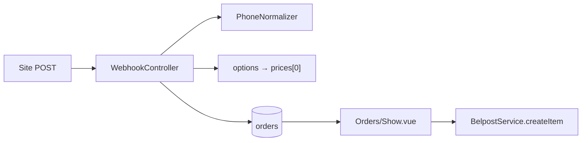

# Заявки с сайта: телефон, цена, товары, ФИО

**Дата:** 19.07.2026  
**Статус:** implemented  
**Контекст:** При приходе заявки с сайта через webhook: телефон приходит в формате 9 цифр без +375; цена из поля `options` не попадает в `prices`; при редактировании пропадает название товара, если его нет в каталоге; Белпочта не принимает неполное ФИО.

## Цель

Исправить приём заявок с сайта: нормализация телефона (+375), перенос цены из `options` в `prices` (как в GAS), UX для товаров вне каталога при редактировании, валидация ФИО из трёх слов при ручном сохранении и перед отправкой в Белпочту.

## Контекст и регрессия

В GAS ([`backend/Order.gs`](../../backend/Order.gs)) поле `options` записывалось в колонку **O (цены)**, а не в комментарий:

```javascript
sheet.getRange("O3").setValue(data.options);
```

В Laravel webhook это сломано: `options` → `sms_log`, `prices` → `[]`:

```php
// hosting/app/Http/Controllers/WebhookController.php
'goods'      => $data['offer'] ? [$data['offer']] : [],
'quantities' => [1],
'prices'     => [],
'sms_log'    => $data['options'] ?? null,
```

**Решения пользователя:**

1. Цена передаётся в поле `options` (только число, как в GAS).
2. Если товара нет на складе — предложить добавить в каталог или перевыбрать правильный из списка.
3. ФИО — одно поле с проверкой на 3 слова.

## Поток данных



---

## 1. Нормализация телефона (+375)

**Файл:** [`hosting/app/Support/PhoneNormalizer.php`](../app/Support/PhoneNormalizer.php) (новый)

Логика (единая для всего приложения):

- Убрать всё кроме цифр
- Если 9 цифр → префикс `375` → хранить `375XXXXXXXXX` (12 цифр)
- Если начинается с `80` и 11 цифр → заменить `80` на `375`
- Если уже 12 цифр с `375` → оставить
- Иначе — вернуть как есть (для ручного исправления оператором)

**Применить в:**

- [`WebhookController::lead`](../app/Http/Controllers/WebhookController.php) — при создании
- [`OrderController::store`](../app/Http/Controllers/OrderController.php) и `update` — при сохранении вручную
- [`BlacklistService::check`](../app/Services/BlacklistService.php) — перед форматированием в `80...` брать **последние 9 цифр** (сейчас при `375...` получается неверный `80375...`)

**UI:** в [`Show.vue`](../resources/js/Pages/Orders/Show.vue) и [`Create.vue`](../resources/js/Pages/Orders/Create.vue) — placeholder «375291234567»; опционально helper `formatPhone()` для отображения `+375 XX XXX-XX-XX` (паттерн уже есть в [`Europochta/Create.vue`](../resources/js/Pages/Europochta/Create.vue)).

---

## 2. Цена из `options` → `prices`

**Файл:** [`WebhookController.php`](../app/Http/Controllers/WebhookController.php)

Поле `options` — **только число (цена)**.

Изменения:

- Валидация: `'options' => ['nullable', 'numeric', 'min:0']`
- При создании заказа:

```php
'prices'  => $data['offer'] ? [(float)($data['options'] ?? 0)] : [],
'sms_log' => null,  // options больше не комментарий
```

- Обновить docblock и [`hosting/README.md`](../README.md): `"options": "49.90"` — цена товара в руб.

**Зависимости:** `BelpostService::calculateWeightAndCod`, `SalesRenderService`, `OrderObserver` уже читают `prices` — доп. изменений не нужно.

---

## 3. Товар вне каталога при редактировании

**Проблема:** в [`Show.vue`](../resources/js/Pages/Orders/Show.vue) edit-режим использует `<select>` только из каталога — если `offer` с сайта не совпадает с `products.name`, Vue сбрасывает значение.

**Backend:** в [`OrderController::show`](../app/Http/Controllers/OrderController.php) передать список «несопоставленных» товаров:

```php
'unknownGoods' => array_values(array_diff($order->goods ?? [], Product::pluck('name')->all())),
```

**Frontend — [`Show.vue`](../resources/js/Pages/Orders/Show.vue):**

Для каждой строки товара в edit-режиме:

1. **Orphan `<option>`** — если `form.goods[i]` не в каталоге, добавить option с меткой «{название} (нет на складе)», чтобы имя не пропадало
2. **Предупреждение** под строкой (amber badge): «Товар не найден на складе»
3. **Две явные кнопки/ссылки:**
   - «Выбрать из каталога» — пользователь меняет select (если название ошибочное)
   - «Добавить на склад» — ссылка `/products?suggest_name={encodeURIComponent(name)}` в новой вкладке

**Frontend — [`Products/Index.vue`](../resources/js/Pages/Products/Index.vue):**

- При монтировании: если есть query `suggest_name`, открыть модалку создания с предзаполненным `name`

**View-режим:** если товар не в каталоге — показать badge «Не на складе» рядом с названием (read-only).

**Create.vue:** тот же orphan-option паттерн для консистентности (на случай ручного ввода названия, не совпадающего с каталогом).

---

## 4. Валидация ФИО — три слова

**Файл:** [`hosting/app/Rules/FullNameThreeParts.php`](../app/Rules/FullNameThreeParts.php) (новый)

Правило:

- `trim`, сжать множественные пробелы
- Разбить по пробелу → минимум **3 непустых части**
- Каждая часть: минимум 2 символа (отсечь «И. И. И.»)
- Сообщение: «Укажите Фамилию, Имя и Отчество через пробел (как требует Белпочта)»

**Применить в:**

- [`OrderController::store`](../app/Http/Controllers/OrderController.php) — `'full_name' => ['required', 'string', 'max:255', new FullNameThreeParts]`
- [`OrderController::update`](../app/Http/Controllers/OrderController.php) — то же для `full_name`
- **Не** блокировать webhook (с сайта часто приходит неполное имя) — оператор дополняет при обработке

**Safety net для Белпочты:** в [`BelpostController::processOrder`](../app/Http/Controllers/BelpostController.php) перед `createItem` — если ФИО не проходит правило, вернуть 422 с понятным текстом (не отправлять в API).

**UI:**

- [`Create.vue`](../resources/js/Pages/Orders/Create.vue) — placeholder «Иванов Иван Иванович», hint под полем
- [`Show.vue`](../resources/js/Pages/Orders/Show.vue) — то же в edit-режиме; в view-режиме badge «ФИО неполное» если < 3 слов (предупреждение до отправки)

---

## 5. Документация

Обновить:

- [`hosting/README.md`](../README.md) — формат webhook: `options` = цена, телефон 9 или 12 цифр
- [`migration-plan.md`](../migration-plan.md) — исправить описание `options` (с «Комментарий» на «Цена»)

---

## Порядок реализации

1. `PhoneNormalizer` + unit-тесты на edge cases (9 цифр, 80..., 375..., с `+`)
2. `FullNameThreeParts` rule
3. `WebhookController` — phone + options→prices
4. `OrderController` — phone normalize + FIO rule; `unknownGoods` в show
5. `BlacklistService` — fix для normalized phone
6. `BelpostController` — pre-check FIO
7. `Show.vue`, `Create.vue`, `Products/Index.vue` — UX товаров + FIO hints
8. README / migration-plan

---

## Acceptance Criteria

- [x] Webhook с `"phone": "291234567"` сохраняет `375291234567`
- [x] Webhook с `"options": "49.90"` и `"offer": "Товар А"` → `prices: [49.90]`, `sms_log: null`
- [x] Редактирование заявки с товаром вне каталога — название видно, badge «Не на складе», ссылка на добавление товара
- [x] Оператор может перевыбрать товар из select, если название ошибочное
- [x] Ручное создание/редактирование заказа не сохраняется без ФИО из 3 слов
- [x] Создание бланка Белпочты блокируется с понятной ошибкой, если ФИО неполное
- [x] Blacklist корректно проверяет номер после нормализации

---

## Риски

- **Старые заявки:** телефоны 9 цифр и цены в `sms_log` (ошибочно сохранённые) — не мигрировать автоматически; при следующем редактировании телефон нормализуется
- **Webhook ФИО:** с сайта может прийти «Иван Иванов» — заявка создаётся, но оператор видит предупреждение и не сможет отправить без дополнения
- **Товар вне каталога:** вес для Белпочты = 0, пока товар не добавлен в каталог с weight — предупреждение в UI (не блокер в этом таске)

---

## Задачи

| ID | Задача |
|----|--------|
| phone-normalizer | Создать PhoneNormalizer и применить в webhook, OrderController, BlacklistService |
| webhook-price | Исправить WebhookController: options → prices[0], sms_log = null, валидация numeric |
| fio-rule | Создать FullNameThreeParts rule; подключить в store/update и BelpostController |
| goods-ux-show | Show.vue: orphan option, badge, ссылка /products?suggest_name, unknownGoods с backend |
| goods-ux-products | Products/Index.vue: автооткрытие create modal по suggest_name query |
| goods-ux-create | Create.vue: orphan option + FIO hint (консистентность) |
| docs | Обновить README и migration-plan: options=цена, формат телефона |
