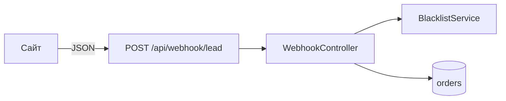

# BaseCRM: план миграции на hoster.by

**Дата:** 27.06.2026  
**Целевая среда:** hoster.by — «Хостинг для персональных данных» (Республика Беларусь)  
**Источник:** Google Apps Script + Google Sheets → Laravel 8 + Inertia.js + Vue 3 + MySQL 5.7

---

## Контекст и ограничения

### Требования

| Требование | Решение |
|------------|---------|
| Персональные данные только в РБ | hoster.by, аттестованный контур |
| Соответствие закону о ПД (99-З) | тариф «Хостинг для персональных данных», не базовый Unix |
| Технический стек хостинга | PHP 7.4, MySQL 5.7, Apache/Nginx, cron |
| Multi-tenant | архитектура с `tenant_id` с первого дня; сейчас одна тестовая компания |

### Что не используем

- Node.js, Redis, PostgreSQL, Docker
- PythonAnywhere и другие зарубежные PaaS для prod-данных
- Google Sheets / GAS для хранения ПД

### Тариф hoster.by (ориентир)

- 5 ГБ SSD, 5 сайтов, 5 БД, SSL — достаточно для MVP и одной компании при политике очистки PDF и ротации логов
- Уточнить у провайдера: `max_execution_time`, `memory_limit`, интервал cron (1 мин), исходящий HTTP к внешним API

---

## Стек

| Слой | Технология |
|------|------------|
| Backend | PHP 7.4 + Laravel 8 |
| Frontend | Inertia.js + Vue 3 + TanStack Table v8 + shadcn-vue |
| БД | MySQL 5.7 |
| Очереди | Laravel Queue, driver=`database`, cron каждую минуту |
| Auth | Laravel Session, роли через Gates/Policies |
| Файлы | `/storage/belpost/pdf/`, удаление через 7 дней |

---

## Архитектура

```mermaid
flowchart LR
  Browser[Браузер оператора]
  subgraph hoster [hoster.by — PHP 7.4]
    Nginx[Nginx/Apache]
    Laravel["Laravel 8 (Inertia)"]
    Queue[Laravel Queue\ncron 1 min]
    DB[(MySQL 5.7)]
    Files[/storage/belpost]
  end
  Ext[Belpost v1/v2\nEvropochta\nSalesRender\nblacks.by\nsms.by]

  Browser --> Nginx --> Laravel
  Laravel --> DB
  Laravel --> Files
  Queue --> Laravel
  Laravel --> Ext
```

---

## Маппинг GAS → Laravel

| GAS | Laravel |
|-----|---------|
| `backend/General.gs` — `createList`, `createItem`, commit, download | `app/Services/BelpostService.php` |
| `backend/General.gs` — `getStatus`, `loadBelpostMap` | `app/Services/BelpostTrackingService.php` + `app/Jobs/UpdateTrackingJob.php` |
| `backend/General.gs` — `createItemEuro`, `createItemEuroNew` | `app/Services/EvropostService.php` |
| `backend/General.gs` — `sendSms` | `app/Services/SmsService.php` |
| `backend/ScSA.gs` — dictionary-list | `app/Services/AddressService.php` |
| `frontend/SearchAddress.html` | `resources/js/Components/AddressSearchModal.vue` |
| `backend/SalesRender.gs` | `app/Services/SalesRenderService.php` + `app/Jobs/SyncSalesRenderJob.php` |
| `backend/Blacks.by.gs` | `app/Services/BlacklistService.php` |
| `backend/OnEdit.gs` | `app/Observers/OrderObserver.php` |
| `backend/Property.gs` | `app/Models/TenantSetting.php` (encrypted cast) |
| `backend/Order.gs` — `doPost` | `app/Http/Controllers/WebhookController.php` |
| `backend/SaveItems.gs` | `app/Services/BelpostBatchService.php` |

---

## Схема БД

### tenants
`id`, `name`, `created_at`

### users
`id`, `tenant_id`, `name`, `email`, `password`, `role` (admin | manager | operator)

### tenant_settings
`id`, `tenant_id`, `key`, `value` (encrypted)

Ключи: `auth_token_bp`, `elc`, `active_list`, `id_to_download`, `api_token_call_centr`, `id_project_in_call_centr`, `api_key_blacks_by`, `token_sms_by`, `alphaname_id`, `token_ep`, `contractor_unn`, `tracking_checkpoint`, `webhook_secret`, …

### orders
`id`, `tenant_id`, `external_id`, `full_name`, `status`, `status_changed_at`, `goods` (JSON), `quantities` (JSON), `city`, `street`, `building`, `housing`, `apartment`, `phone`, `prices` (JSON), `track_number`, `delivery_type` (belpost | europochta | null), `sms_log`, `source`, `ops_id`, `created_at`

Соответствие листу «Заказы»:

| Колонка | Поле |
|---------|------|
| A | external_id |
| B | created_at |
| C | full_name |
| D | status |
| E | status_changed_at |
| F | goods |
| G | quantities |
| H–L | city, street, building, housing, apartment |
| N | phone |
| O | prices |
| R | track_number |
| S | delivery_type |
| T | sms_log |

### products
`id`, `tenant_id`, `name`, `stock`, `weight`, `sold_count`, `sold_amount`

### mail_batches
`id`, `tenant_id`, `batch_id`, `type`, `status`, `id_to_download`, `created_at`

### order_status_history
`id`, `order_id`, `from_status`, `to_status`, `created_at`

### jobs, failed_jobs
Стандартные таблицы Laravel Queue

---

## Webhook: заявки с сайта

### Текущее поведение (GAS)

`backend/Order.gs` — `doPost(e)` принимает JSON и создаёт строку в листе «Заказы»:

```json
{
  "name": "Иван Иванов",
  "phone": "291234567",
  "offer": "Название товара",
  "options": "Комментарий"
}
```

### Новое поведение

**Endpoint:** `POST https://crm.ваш-домен.by/api/webhook/lead`

**Заголовки:**

```
Content-Type: application/json
X-Webhook-Token: <секрет из tenant_settings.webhook_secret>
```

**Тело запроса** — совместимо с текущим форматом (можно расширить полем `source`):

```json
{
  "name": "Иван Иванов",
  "phone": "291234567",
  "offer": "Название товара",
  "options": "Комментарий",
  "source": "site"
}
```

**Обработка (`WebhookController`):**

1. Проверка `X-Webhook-Token`
2. Создание заказа со статусом «Позвонить»
3. Запись `source` (site, landing, …)
4. Вызов `BlacklistService` (blacks.by)
5. Опционально — отправка в SalesRender (если настроено)

**Ответ:**

```json
{ "result": "success", "order_id": 123 }
```

**Миграция на сайте:** заменить URL GAS Web App на новый endpoint и добавить заголовок с секретом.



---

## Структура проекта

```
/home/user/crm/                    ← вне webroot
  app/Http/Controllers/
    OrderController.php
    BelpostController.php
    AddressController.php
    WebhookController.php
    TenantSettingController.php
  app/Services/
    BelpostService.php
    BelpostTrackingService.php
    EvropostService.php
    AddressService.php
    SalesRenderService.php
    BlacklistService.php
    SmsService.php
  app/Jobs/
    UpdateTrackingJob.php
    SyncSalesRenderJob.php
    DownloadBelpostPdfJob.php
  app/Models/
  app/Observers/OrderObserver.php
  resources/js/Pages/
    Orders/Index.vue
    Orders/Show.vue
    Belpost/Batch.vue
    Products/Index.vue
    Settings/Index.vue
  resources/js/Components/
    AddressSearchModal.vue
    OrderStatusBadge.vue
  database/migrations/
  routes/web.php
  routes/api.php

/home/user/public_html/            ← только public/ Laravel
```

---

## Фазы реализации

### Фаза 1 — Фундамент (2–3 нед.)

- [ ] Laravel 8 + Inertia + Vue 3, структура проекта
- [ ] Миграции: tenants, users, orders, products, tenant_settings
- [ ] Auth (login/logout), seed одного tenant
- [ ] Grid заказов (`Orders/Index.vue`) — TanStack Table, фильтры
- [ ] Карточка заказа (`Orders/Show.vue`) — статус, редактирование
- [ ] Webhook `POST /api/webhook/lead`
- [ ] `OrderObserver` — учёт склада при «Отправлено» / «Возврат»

### Фаза 2 — Белпочта (2–3 нед.)

- [ ] `BelpostService` — `createList`, `createItem` (v2), `commitActiveList`
- [ ] `AddressService` — dictionary-list, нормализация адресов
- [ ] `AddressSearchModal.vue`
- [ ] `DownloadBelpostPdfJob` — фоновое скачивание ZIP
- [ ] `Belpost/Batch.vue` — партии, commit, polling статуса PDF

### Фаза 3 — Фоновые процессы (2 нед.) ✅

- [x] `UpdateTrackingJob` — трекинг Белпочта + Европочта
- [x] `SyncSalesRenderJob` — GraphQL sync
- [x] `BlacklistService` — при создании заказа
- [x] `SmsService` — sms.by по правилам статусов
- [x] Cron в `app/Console/Kernel.php`

### Фаза 4 — Европочта + склад (2 нед.) ✅

- [x] `EvropostService` — `createItem()` JWT API + `createItemNew()` v1.8.2
- [x] Категории веса — `tenant_settings.ep_weight_categories` (JSON), используются только JWT API
- [x] `Products/Index.vue` — CRUD товаров, приход товара, статистика склада и выручки
- [x] `sumOrder` — `OrderObserver` (на «Завершен») + `artisan crm:sum-orders` (по расписанию 00:05)
- [x] `EvropostController` — `GET /europochta`, `POST /europochta/orders/{id}/register`, `POST /europochta/register-all`
- [x] `ProductController` — CRUD `/products`
- [x] Статусы `Завершен` / `Посчитан` добавлены в `Order::STATUSES`

### Фаза 5 — Финансы, CSV, multi-tenant (2 нед.) ✅

- [x] Таблицы expenses, income
- [x] Импорт CSV (`csvToOrders`)
- [x] `Settings/Index.vue` — credentials tenant
- [x] Multi-tenant middleware, управление пользователями и ролями

---

## Ключевые технические решения

| Задача | Решение |
|--------|---------|
| Checkpoint трекинга | `tracking_checkpoint` в `tenant_settings` (аналог `jsonObject.number`) |
| PDF pipeline | `DownloadBelpostPdfJob` → disk → polling `/api/batches/{id}/status` |
| Секреты API | `tenant_settings.value` с `encrypted:string` cast |
| Webhook security | `X-Webhook-Token` из `tenant_settings.webhook_secret` |
| Multi-tenant | Middleware `SetTenant` + GlobalScope на Eloquent |
| Очереди без Redis | Laravel Queue driver=`database` + cron `schedule:run` |

---

## Чеклист перед деплоем на hoster.by

- [ ] Подтверждена география серверов и бэкапов (РБ)
- [ ] Тариф «Хостинг для персональных данных» (не базовый Unix для prod)
- [ ] `max_execution_time` ≥ 120 с (PDF/ZIP)
- [ ] `memory_limit` ≥ 256 МБ
- [ ] Cron: интервал 1 мин, `php artisan schedule:run`
- [ ] Исходящий HTTP: api.belpost.by, salesrender.com, blacks.by, sms.by, evropochta.by
- [ ] SSH для `php artisan migrate`, `composer install`
- [ ] SSL для CRM и webhook
- [ ] Документы ИБ / аттестация ИС (с hoster.by)

---

## Связанные документы

- [`README.md`](../../docs/gas-export/README.md) — экспорт GAS
- [`2026-06-24-belpost-integration.md`](../../docs/deploy/2026-06-24-belpost-integration.md) — интеграция Белпочты
- [`dictionary-list-migration.md`](../../docs/feature/dictionary-list-migration.md) — поиск адресов
- [`batch-mailing-v2-item.md`](../../docs/feature/batch-mailing-v2-item.md) — batch-mailing v2
